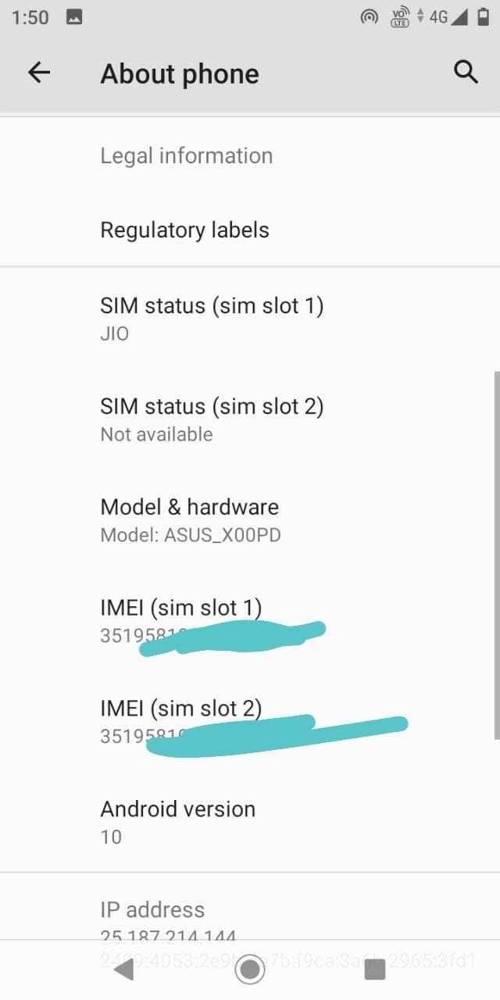
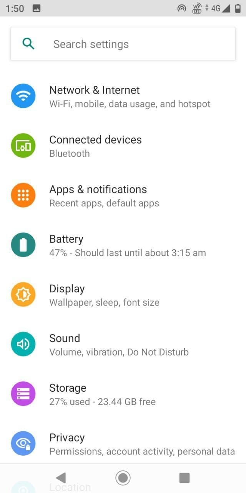
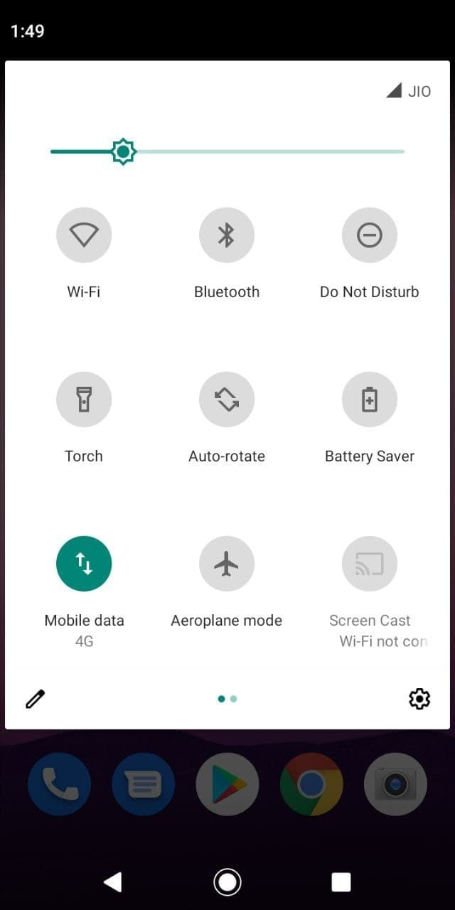
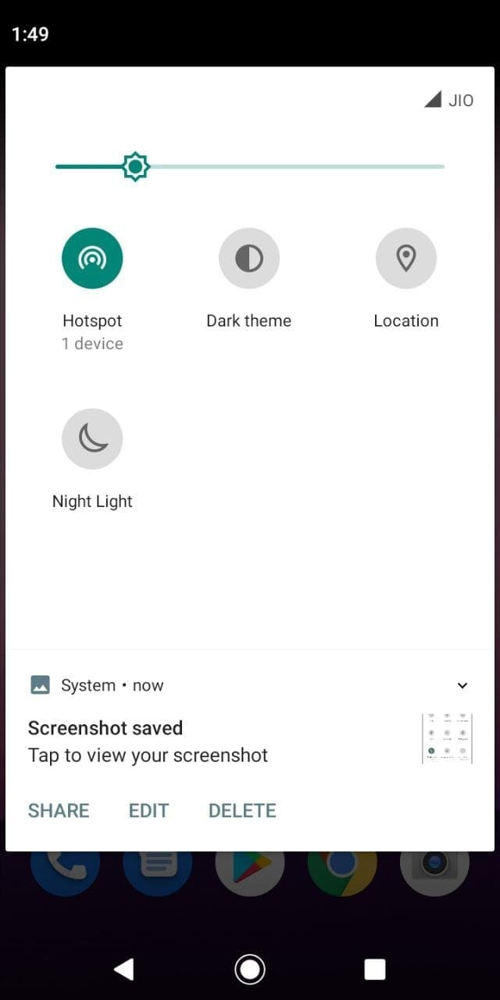
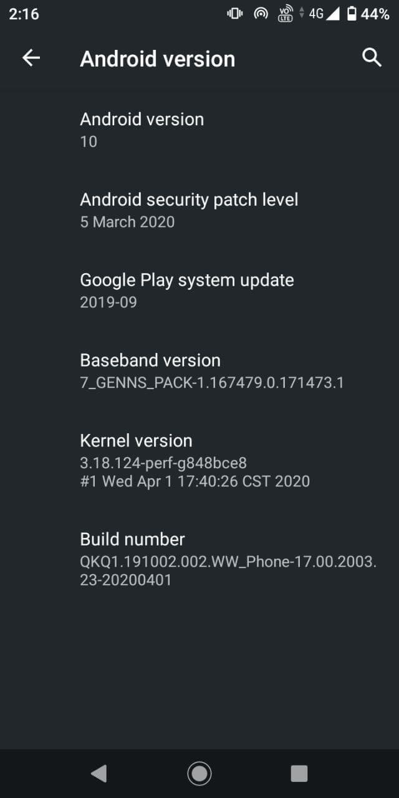

# Stock ROM for ASUS Zenfone Max M1 (X00P/X00PD)

## Downloads

| Device       | Codename | Version       | Android | Downloads |
| :----------- | :------- | :------------ | :------ | :-------- |
| X00PINGlobal | X00P     | 17.00.2003.23 | 10      | [Internet Archive](https://archive.org/download/x00p-archive/firmwares/stock-rom/UL-ASUS_X00P-WW-AOSP-17.00.2003.23-user.zip)

<strong>Changelog</strong>

- Android 10 Developer version is now available for downloaded.
- This is the Android 10 AOSP version, so the user experience will be very different from Android 8 (Oreo) and 9(Pie). If you are used to Android 8 (Oreo)/Android 9 (Pie) system, we will recommend that you use the current device version.
- Please back up your data before upgrading to Android 10. System will factory reset after upgrade process completed.
- If you want to downgrade software to previous OS by official package, please factory reset your device after downgrade process completed.
- Updated Android security patch

<strong>Screenshot</strong>

<table>
  <tr>
    <td colspan="1"></td>
    <td colspan="1"></td>
    <td colspan="1"></td>
  </tr>
  <tr>
    <td colspan="1"></td>
    <td colspan="1"></td>
    <td colspan="1"></td>
  </tr>
</table>

## Credits

This archive simply preserves for future.