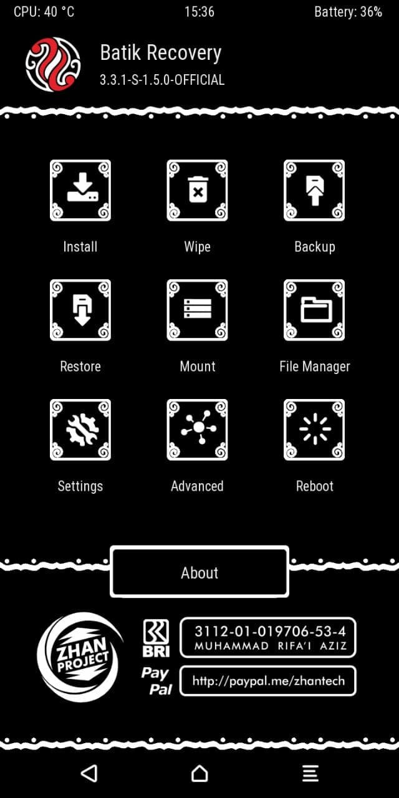
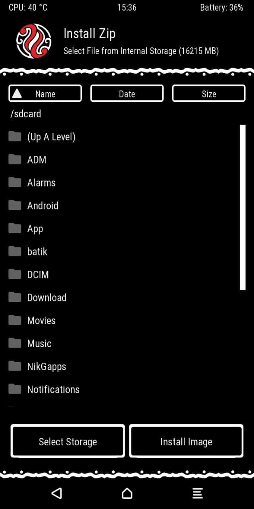
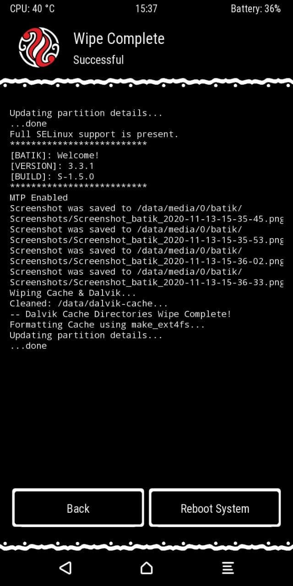
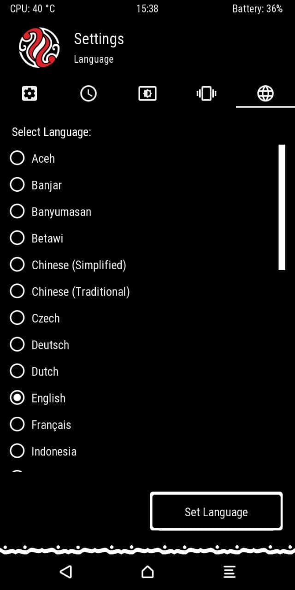

# Batik Recovery Project (BRP) for ASUS Zenfone Max M1 (X00P/X00PD)

> ***Disclaimer***
>
> *Your warranty is now void. We're not responsible for bricked devices, dead SD cards, thermonuclear war, or you getting fired because the alarm app failed. Please do some research if you have any concerns about features included in this RECOVERY before flashing it! YOU are choosing to make these modifications, and if you point the finger at us for messing up your device, we will laugh at you.*

## Introduction

Batik Recovery is Project Recovery developed by Batik Recovery Teamwork from Indonesia, this Batik Recovery is a derivative of the Official TWRP that was modified by the developer in accordance with the Indonesian characteristics. In Indonesia, batik is a motif that is considered quite famous for the beauty of its art. Therefore, the developer gave the name Batik Recovery and a touch of batik motifs in the Recovery, including splash, background, and icon. The goal of the developer to release the project is to further popularize batik, and especially to popularize the name of Indonesia.

## Installation Instructions
### Fastboot Method
- Go to TWRP and flash this
- Or, unpack the file get the recovery.img file, flash at adb on Fastboot Mode

## Downloads

| Version | Build Date | Status           | Maintainer                                        | Downloads |
| :------ | :--------- | :--------------- | :------------------------------------------------ | :-------- |
| S.1.5.0 | 24/11/2020 | UNOFFICIAL(PORT) | [@NewbieDeveloper](https://t.me/NewbieDevProject) | [Internet Archive](https://archive.org/download/x00p-archive/recoveries/brp/Batik-Recovery-X00P-20202411-UNOFFICIAL.zip)

<strong>Changelog</strong>

- Initial release for X00P
- Base on TWRP 3.3.1

<strong>Screenshot</strong>

<table>
  <tr>
    <td colspan="1"></td>
    <td colspan="1"></td>
    <td colspan="1"></td>
    <td colspan="1"></td>
  </tr>
</table>

## Credits

Special thanks to [@NewbieDeveloper](https://t.me/NewbieDevProject) as maintainer and contributor of [Batik Recovery Project (BRP)](https://github.com/BatikRecovery) who helped the ASUS Zenfone Max M1 alive throughout the Android development community.

This archive simply preserves their work for future.