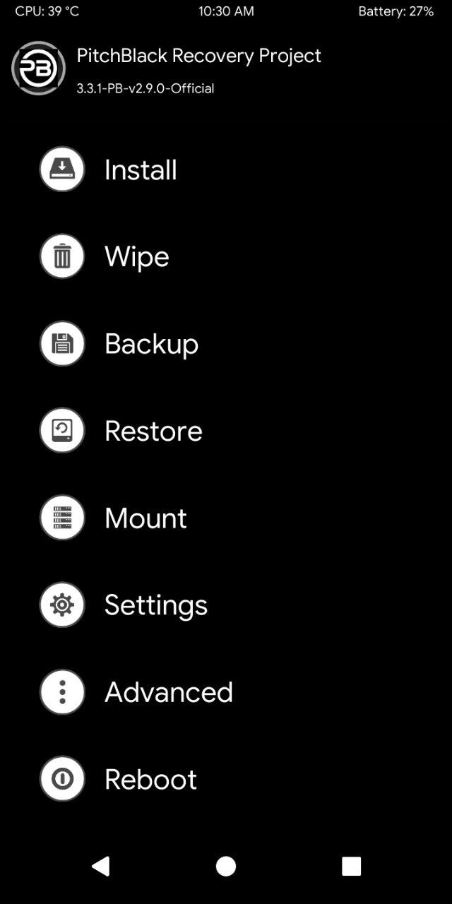
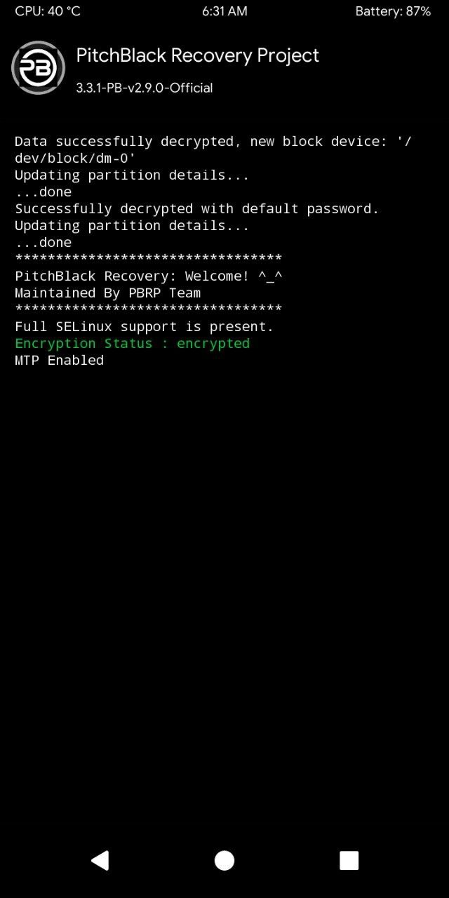

# PitchBlack Recovery Project (PBRP) for ASUS Zenfone Max M1 (X00P/X00PD)

> ***Disclaimer***
>
> *Your warranty is now void. We're not responsible for bricked devices, dead SD cards, thermonuclear war, or you getting fired because the alarm app failed. Please do some research if you have any concerns about features included in this RECOVERY before flashing it! YOU are choosing to make these modifications, and if you point the finger at us for messing up your device, we will laugh at you.*

## Introduction

Pitch Black Recovery is a fork of TWRP with many improvements to make your experience better. It's more flexible & easy to use.

## Features

- Supports Treble and non-Treble ROMs
- Up-to-date Oreo kernel, built from sources
- Full dark theme with changeable accents
- Reorganized menus
- MIUI OTA support
- Disable DM Verity
- Use AromaFM as default file manager
- Various tools are include
- Universal flash-able file for all variant of a device
- Many bug fixes & optimization & much more

## Installation Instructions
### From previous version or other recovery
- Download the PitchBlack zip to your device
- Reboot to your current custom recovery
- Flash the PitchBlack zip
- The device will automatically reboot into PitchBlack Recovery after installation
- Enjoy

### From PC(Windows & Linux)

- Download PBRP PC Installer zip from bellow
- Download PitchBlack Recovery flashable zip from bellow
- Extract the PBRP PC installer zip & copy the flashable zip to the installer folder
- Goto fastboot mode in your device
- Windows users open pbinstaller.bat file
- Linux users execute pbinstaller.sh in a terminal
- Follow the introductions on the installer from there
- Enjoy

*(Linux users will need unzip, adb & fastboot installed on their system)*

## Downloads

| Version | Build Date | Status   | Maintainer                                   | Downloads |
| :------ | :--------- | :------- | :------------------------------------------- | :-------- |
| 2.9.0   | 24/06/2019 | OFFICIAL | [@RazaDroid](https://github.com/DelightReza) | [Sourceforge](https://sourceforge.net/projects/pbrp/files/X00P/PitchBlack-X00PD-2.9.0-20190624-0434-OFFICIAL.zip/download)  [Internet Archive](https://archive.org/download/x00p-archive/recoveries/pbrp/PitchBlack-X00PD-2.9.0-20190624-0434-OFFICIAL.zip)

<strong>Changelog</strong>

- Based on TWRP 3.3.1
- Initial Official Build
- Support EDL
- Use Busybox instead toolbox

<strong>Screenshot</strong>

<table>
  <tr>
    <td colspan="1"></td>
  </tr>
</table>

 

| Version | Build Date | Status   | Maintainer                                   | Downloads |
| :------ | :--------- | :------- | :------------------------------------------- | :-------- |
| 2.9.0   | 30/06/2019 | OFFICIAL | [@RazaDroid](https://github.com/DelightReza) | [Sourceforge](https://sourceforge.net/projects/pbrp/files/X00P/PitchBlack-X00PD-2.9.0-20190630-0023-OFFICIAL.zip/download)  [Internet Archive](https://archive.org/download/x00p-archive/recoveries/pbrp/PitchBlack-X00PD-2.9.0-20190630-0023-OFFICIAL.zip)

<strong>Changelog</strong>

- Fixed Decryption

<strong>Screenshot</strong>

<table>
  <tr>
    <td colspan="1"></td>
  </tr>
</table>

 

| Version | Build Date | Status   | Maintainer                                   | Downloads |
| :------ | :--------- | :------- | :------------------------------------------- | :-------- |
| 2.9.0   | 15/07/2019 | OFFICIAL | [@RazaDroid](https://github.com/DelightReza) | [Sourceforge](https://sourceforge.net/projects/pbrp/files/X00P/PitchBlack-X00P-2.9.0-20190715-0514-OFFICIAL.zip/download)  [Internet Archive](https://archive.org/download/x00p-archive/recoveries/pbrp/PitchBlack-X00P-2.9.0-20190715-0514-OFFICIAL.zip)

<strong>Changelog</strong>

N/A

 

| Version | Build Date | Status   | Maintainer                                   | Downloads |
| :------ | :--------- | :------- | :------------------------------------------- | :-------- |
| 2.9.0   | 04/12/2019 | OFFICIAL | [@RazaDroid](https://github.com/DelightReza) | [Sourceforge](https://sourceforge.net/projects/pbrp/files/X00P/PitchBlack-X00P-2.9.0-20191204-0512-OFFICIAL.zip/download)  [Internet Archive](https://archive.org/download/x00p-archive/recoveries/pbrp/PitchBlack-X00P-2.9.0-20191204-0512-OFFICIAL.zip)

<strong>Changelog</strong>

- Fixed Decrytion On Pie
- Updated Blobs To Pie
- Use ToolBox instead for BusyBox
- Enable System-As-Root

 

| Version | Build Date | Status   | Maintainer                                   | Downloads |
| :------ | :--------- | :------- | :------------------------------------------- | :-------- |
| 2.9.0   | 05/02/2020 | OFFICIAL | [@RazaDroid](https://github.com/DelightReza) | [Sourceforge](https://sourceforge.net/projects/pbrp/files/X00P/PitchBlack-X00P-2.9.0-20200205-1902-OFFICIAL.zip/download)  [Internet Archive](https://archive.org/download/x00p-archive/recoveries/pbrp/PitchBlack-X00P-2.9.0-20200205-1902-OFFICIAL.zip)

<strong>Changelog</strong>

- Add Support To Flash Stock ROM
- PitchBlack Changes

 

| Version | Build Date | Status   | Maintainer                                   | Downloads |
| :------ | :--------- | :------- | :------------------------------------------- | :-------- |
| 2.9.1   | 18/04/2020 | OFFICIAL | [@RazaDroid](https://github.com/DelightReza) | [Sourceforge](https://sourceforge.net/projects/pbrp/files/X00P/PitchBlack-X00P-2.9.1-20200418-0617-OFFICIAL.zip/download)  [Internet Archive](https://archive.org/download/x00p-archive/recoveries/pbrp/PitchBlack-X00P-2.9.1-20200418-0617-OFFICIAL.zip)

<strong>Changelog</strong>

- Rebase Tree To Pie Base
- Support To Decrypt Android 10
- Source Upstream

 

| Version | Build Date | Status   | Maintainer                                   | Downloads |
| :------ | :--------- | :------- | :------------------------------------------- | :-------- |
| 2.9.1   | 22/04/2020 | OFFICIAL | [@RazaDroid](https://github.com/DelightReza) | [Sourceforge](https://sourceforge.net/projects/pbrp/files/X00P/PitchBlack-X00P-2.9.1-20200422-0352-OFFICIAL.zip/download)  [Internet Archive](https://archive.org/download/x00p-archive/recoveries/pbrp/PitchBlack-X00P-2.9.1-20200422-0352-OFFICIAL.zip)

<strong>Changelog</strong>

- Fixed Firmware Flashing

 

| Version | Build Date | Status   | Maintainer                                   | Downloads |
| :------ | :--------- | :------- | :------------------------------------------- | :-------- |
| 2.9.1   | 09/06/2020 | OFFICIAL | [@RazaDroid](https://github.com/DelightReza) | [Sourceforge](https://sourceforge.net/projects/pbrp/files/X00P/PitchBlack-X00P-2.9.1-20200609-0528-OFFICIAL.zip/download)  [Internet Archive](https://archive.org/download/x00p-archive/recoveries/pbrp/PitchBlack-X00P-2.9.1-20200609-0528-OFFICIAL.zip)

<strong>Changelog</strong>

- Based on TWRP 3.4.0

 

| Version | Build Date | Status     | Maintainer                                   | Downloads |
| :------ | :--------- | :--------- | :------------------------------------------- | :-------- |
| 2.9.1   | 12/06/2020 | UNOFFICIAL | [@RazaDroid](https://github.com/DelightReza) | [Internet Archive](https://archive.org/download/x00p-archive/recoveries/pbrp/PitchBlack_X00P_2.9.1_20200612_2312_UNOFFICIAL.zip)

<strong>Changelog</strong>

- N/A

<strong>Notes</strong>

PitchBlack V2.9.1 for Android 8 Oreo

 

| Version | Build Date | Status   | Maintainer                                   | Downloads |
| :------ | :--------- | :------- | :------------------------------------------- | :-------- |
| 2.9.1   | 13/06/2020 | OFFICIAL | [@RazaDroid](https://github.com/DelightReza) | [Sourceforge](https://sourceforge.net/projects/pbrp/files/X00P/PitchBlack-X00P-2.9.1-20200613-0011-OFFICIAL.zip/download)  [Internet Archive](https://archive.org/download/x00p-archive/recoveries/pbrp/PitchBlack-X00P-2.9.1-20200613-0011-OFFICIAL.zip)

<strong>Changelog</strong>

- Fixed flashlight

 

| Version | Build Date | Status   | Maintainer                                   | Downloads |
| :------ | :--------- | :------- | :------------------------------------------- | :-------- |
| 2.9.1   | 15/07/2020 | OFFICIAL | [@RazaDroid](https://github.com/DelightReza) | [Sourceforge](https://sourceforge.net/projects/pbrp/files/X00P/PitchBlack-X00P-2.9.1-20200715-1222-OFFICIAL.zip/download)  [Internet Archive](https://archive.org/download/x00p-archive/recoveries/pbrp/PitchBlack-X00P-2.9.1-20200715-1222-OFFICIAL.zip)

<strong>Changelog</strong>

- Disable Treble Compatibility Check By Default

 

| Version | Build Date | Status   | Maintainer                                   | Downloads |
| :------ | :--------- | :------- | :------------------------------------------- | :-------- |
| 3.0     | 28/07/2020 | OFFICIAL | [@RazaDroid](https://github.com/DelightReza) | [Sourceforge](https://sourceforge.net/projects/pbrp/files/X00P/PBRP-X00P-3.0-20200728-2144-OFFICIAL.zip/download)  [Internet Archive](https://archive.org/download/x00p-archive/recoveries/pbrp/PBRP-X00P-3.0-20200728-2144-OFFICIAL.zip)

<strong>Changelog</strong>

- Bringup 3.0 
- Source side changes 
- Fully Redesigned UI 
- New Android like Power Menu (Activated via power key hold) 
- Flashlight toggled by Vol up(+) on hold 
- Flashlight toggle on Lockscreen 
- Etc.

 

| Version | Build Date | Status   | Maintainer                                   | Downloads |
| :------ | :--------- | :------- | :------------------------------------------- | :-------- |
| 3.0     | 04/08/2020 | OFFICIAL | [@RazaDroid](https://github.com/DelightReza) | [Sourceforge](https://sourceforge.net/projects/pbrp/files/X00P/PBRP-X00P-3.0.0-20200804-1432-OFFICIAL.zip/download)  [Internet Archive](https://archive.org/download/x00p-archive/recoveries/pbrp/PBRP-X00P-3.0.0-20200804-1432-OFFICIAL.zip)

<strong>Changelog</strong>

- Add nano Editor

## Credits

Special thanks to [@RazaDroid](https://github.com/DelightReza) as maintainer and contributor of [PitchBlack Recovery Project (PBRP)](https://github.com/PitchBlackRecoveryProject) who helped the ASUS Zenfone Max M1 alive throughout the Android development community.

This archive simply preserves their work for future.