# AncientOS for ASUS Zenfone Max M1 (X00P/X00PD)

> ***Disclaimer***
>
> *Your warranty is now void. We're not responsible for bricked devices, dead SD cards, thermonuclear war, or you getting fired because the alarm app failed. Please do some research if you have any concerns about features included in this ROM before flashing it! YOU are choosing to make these modifications, and if you point the finger at us for messing up your device, we will laugh at you.*

## Introduction

AncientOS is Custom ROM based on AOSP that aims to provide a unique UI with some useful feautures for customization.

## Installation Instructions
- Wipe System, Vendor, Data, Cache and Dalvik. Also, Format Data.
- Flash ROM
- Reboot

## Downloads
### Android 10
| Version | Build Date | Status     | Maintainer                       | Downloads |
| :------ | :--------- | :--------- | :------------------------------- | :-------- |
| 3.5     | 28/04/2020 | UNOFFICIAL | [@Rohieth](https://t.me/Rohieth) | [Internet Archive](https://archive.org/download/x00p-archive/roms/ancient/AncientOS_CIVILIZATION_v3_5_X00P_PREHISTORIC_20200428_0242_Vanilla.zip)

<strong>Changelog</strong>

- Initial build

<strong>Notes</strong>

- USE LATEST TWRP ONLY
- If you faced any issue or Bug, report it in main group with a logcat attached ( go to google and search matlog or adb and learn how to take logs)
- ROM does have GAPPS, so don't flash any other gapps.

<strong>Screenshot</strong>

<table>
  <tr>
    <td colspan="1"><a href="assets/img/28042020/1.jpg">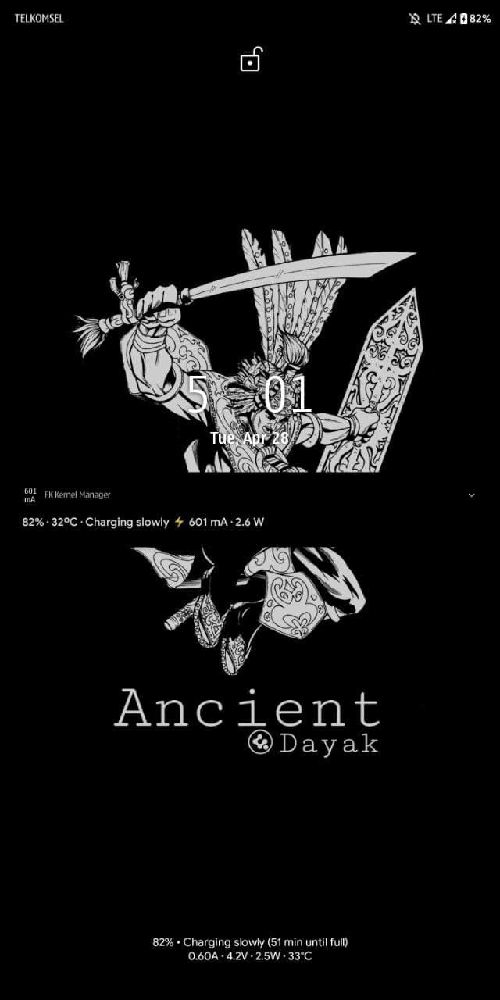</a></td>
    <td colspan="1"><a href="assets/img/28042020/2.jpg">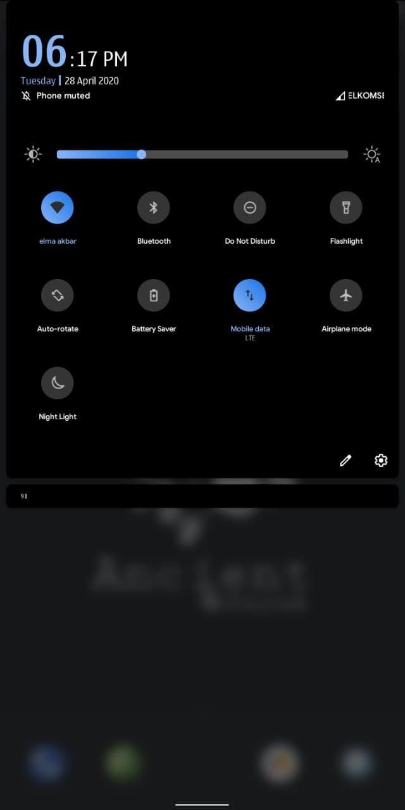</a></td>
    <td colspan="1"><a href="assets/img/28042020/4.jpg">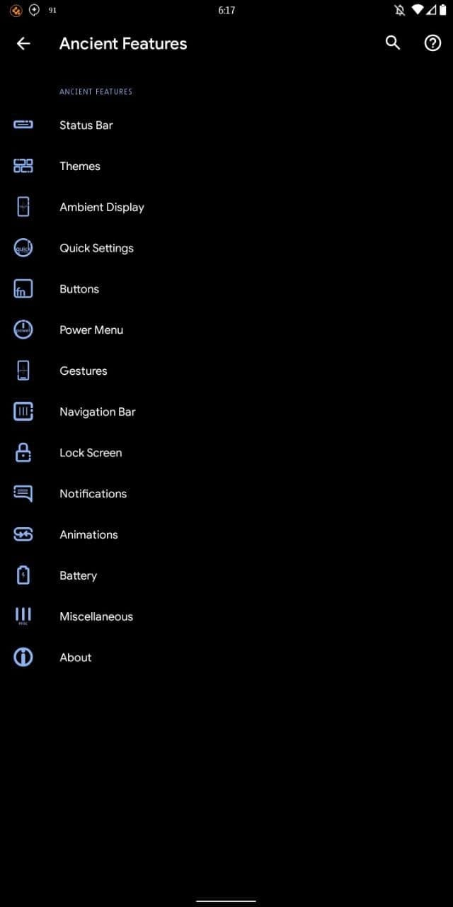</a></td>
  </tr>
  <tr>
    <td colspan="1"></td>
    <td colspan="1"><a href="assets/img/28042020/5.jpg">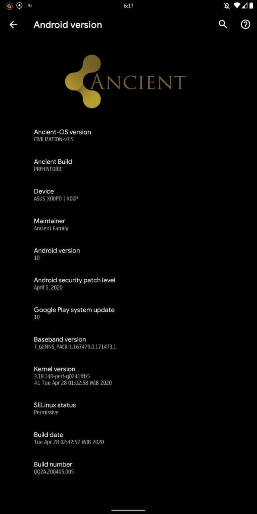</a></td>
  </tr>
</table>

 

| Version | Build Date | Status     | Maintainer                         | Downloads |
| :------ | :--------- | :--------- | :--------------------------------- | :-------- |
| 3.7     | 25/05/2020 | UNOFFICIAL | [@Inder864](https://t.me/Inder864) | [Internet Archive](https://archive.org/download/x00p-archive/roms/ancient/AncientOS_CIVILIZATION_v3_7_X00P_PREHISTORIC_20200523_0528_GApps.zip)

<strong>Changelog</strong>

- Initial build

<strong>Notes</strong>

- USE LATEST TWRP ONLY
- If you faced any issue or Bug, report it in main group with a logcat attached ( go to google and search matlog or adb and learn how to take logs)
- ROM does have GAPPS, so don't flash any other gapps.

<strong>Screenshot</strong>

<table>
  <tr>
    <td colspan="1"></td>
    <td colspan="1"><a href="assets/img/25052020/2.jpg">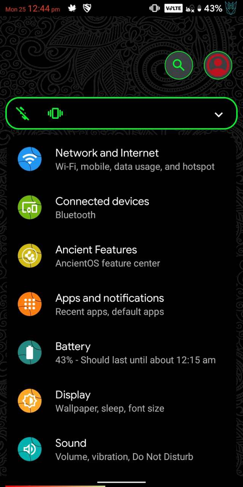</a></td>
    <td colspan="1"><a href="assets/img/25052020/3.jpg">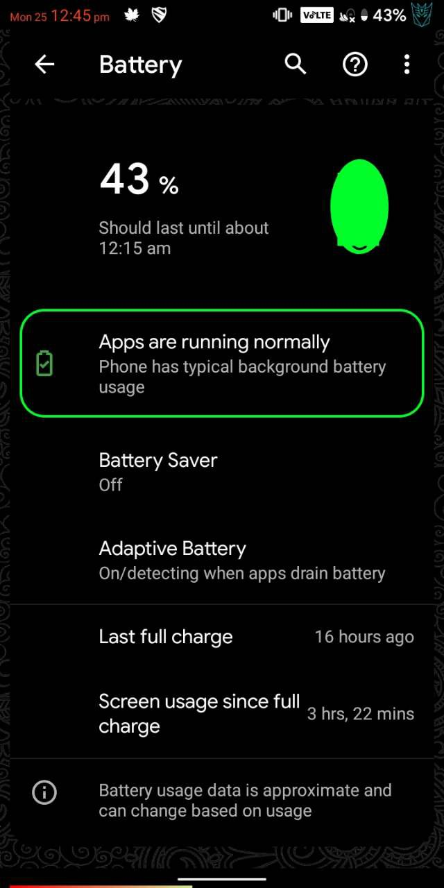</a></td>
    <td colspan="1"><a href="assets/img/25052020/4.jpg">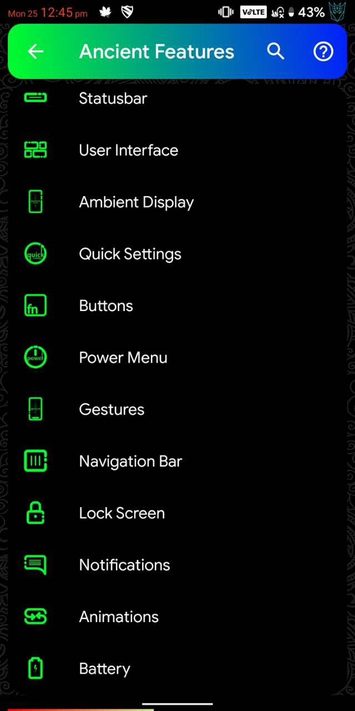</a></td>
    <td colspan="1"><a href="assets/img/25052020/5.jpg">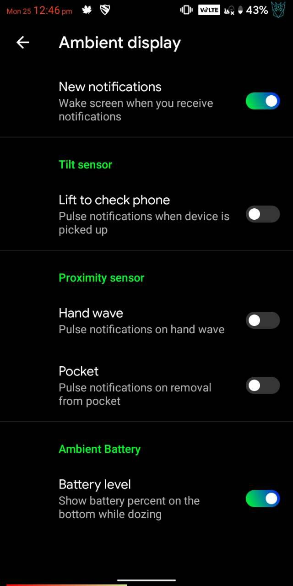</a></td>
  </tr>
  <tr>
    <td colspan="1"><a href="assets/img/25052020/6.jpg">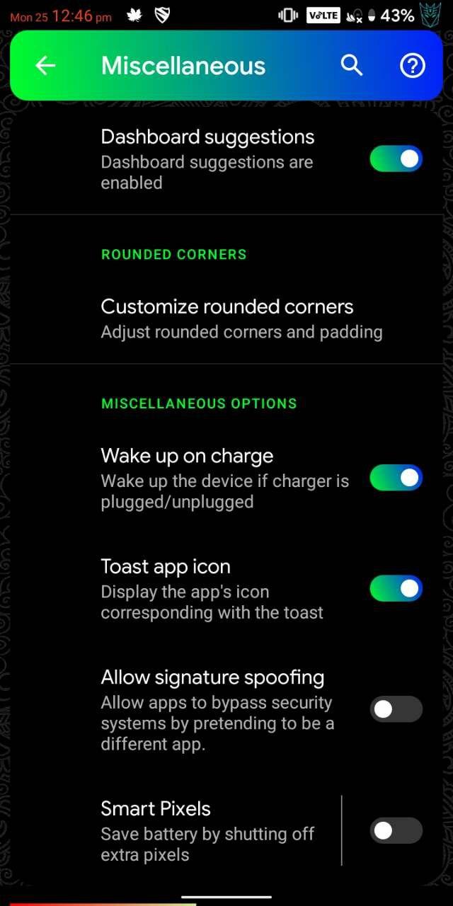</a></td>
    <td colspan="1"><a href="assets/img/25052020/7.jpg">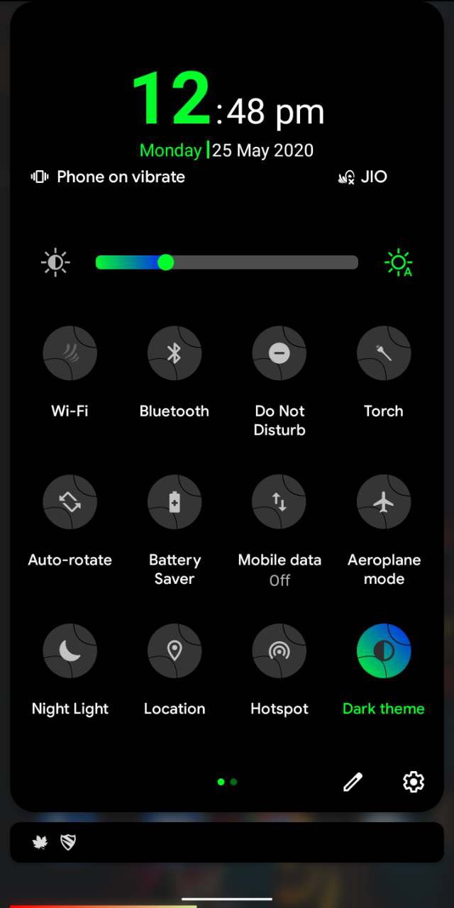</a></td>
    <td colspan="1"><a href="assets/img/25052020/8.jpg">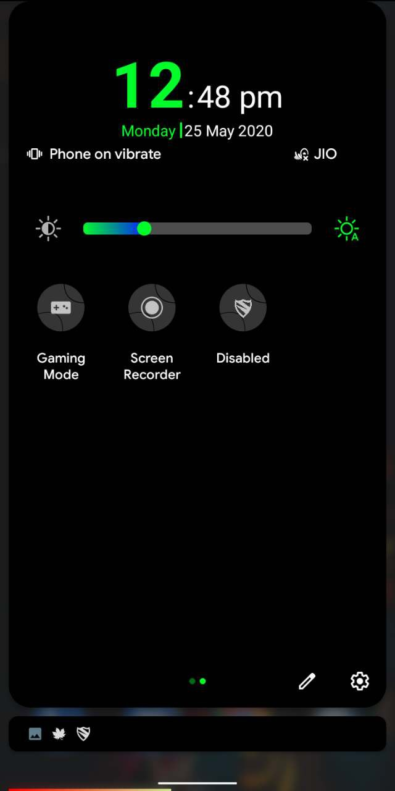</a></td>
    <td colspan="1"><a href="assets/img/25052020/9.jpg">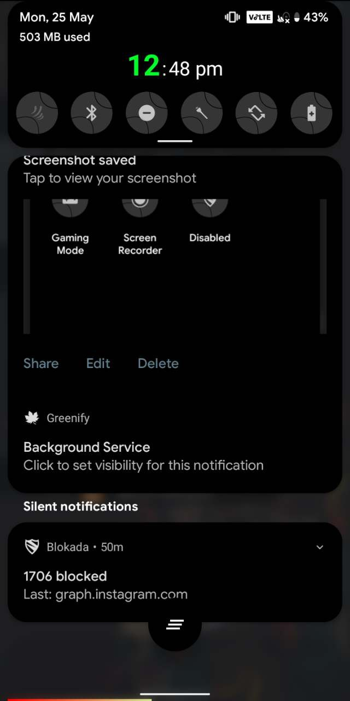</a></td>
    <td colspan="1"><a href="assets/img/25052020/10.jpg">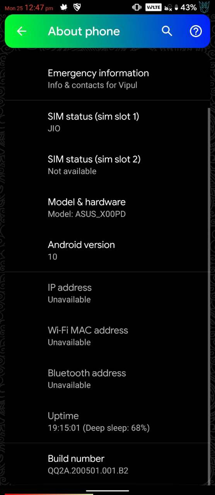</a></td>
  </tr>
  <tr>
    <td colspan="1"></td>
    <td colspan="1"></td>
    <td colspan="1"><a href="assets/img/25052020/13.jpg">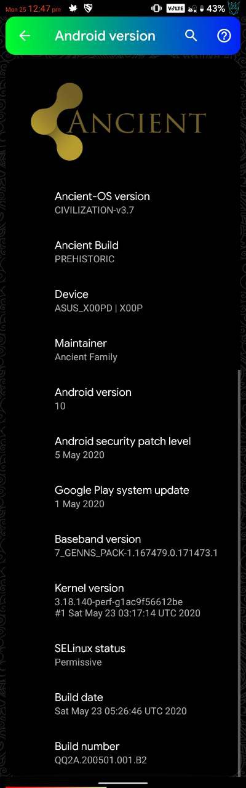</a></td>
  </tr>
</table>

## Credits

Special thanks to [@Rohieth](https://t.me/Rohieth), [@Inder864](https://t.me/Inder864) as maintainer and contributor of [AncientOS](https://github.com/Ancient-ROMS) who helped the ASUS Zenfone Max M1 alive throughout the Android development community.

This archive simply preserves their work for future.