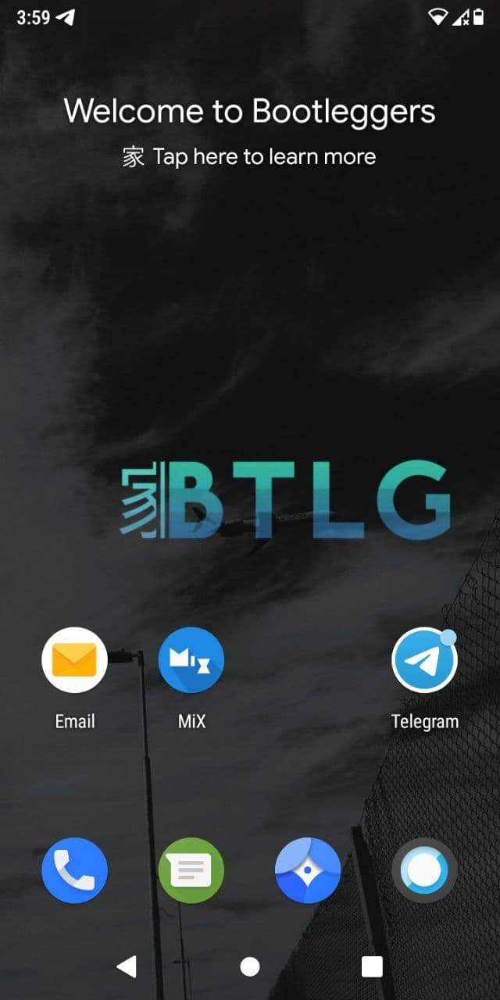
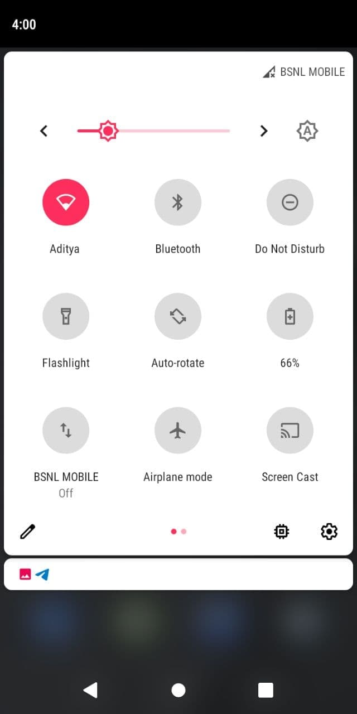
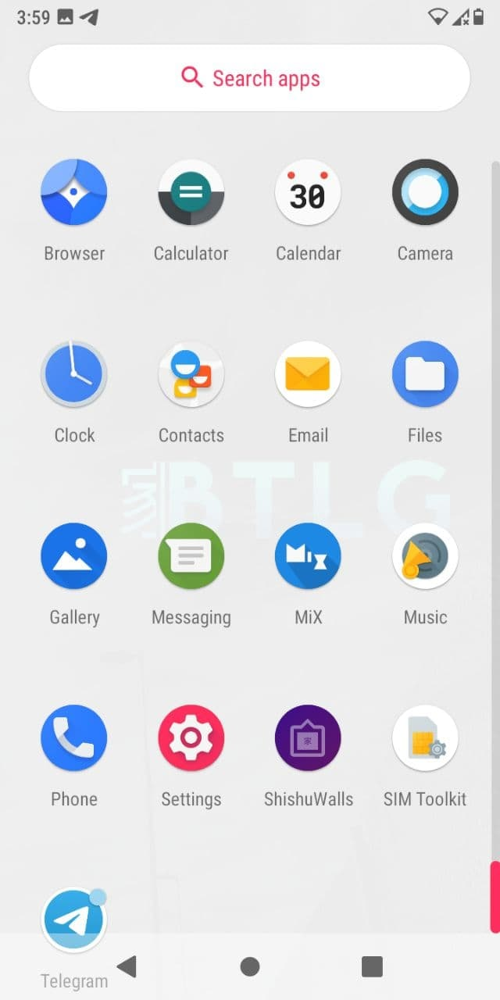
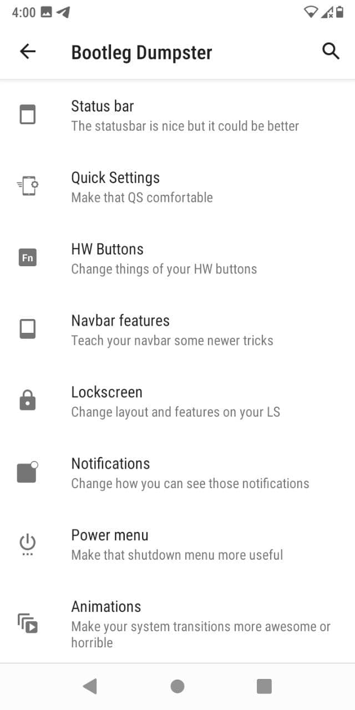
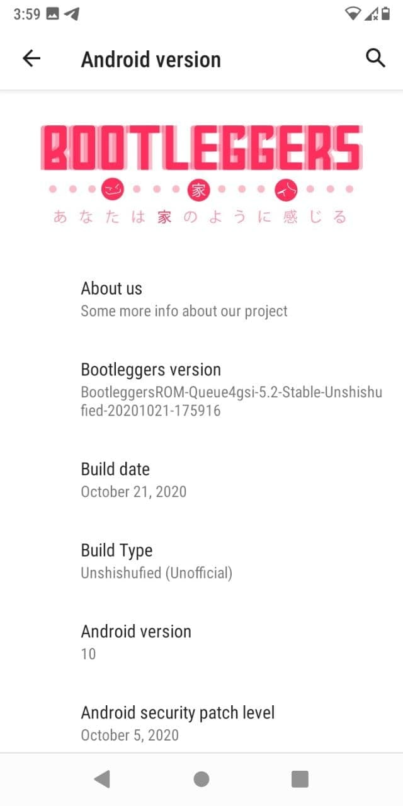

# Bootleggers ROM for ASUS Zenfone Max M1 (X00P/X00PD)

> ***Disclaimer***
>
> *Your warranty is now void. We're not responsible for bricked devices, dead SD cards, thermonuclear war, or you getting fired because the alarm app failed. Please do some research if you have any concerns about features included in this ROM before flashing it! YOU are choosing to make these modifications, and if you point the finger at us for messing up your device, we will laugh at you.*

## Introduction

Bootleggers ROM is an aftermarket firmware based on AOSP with some patches and fixes from LineageOS and various other projects. The idea is to bring custom features and some of the most useful apps on your device, with the goal of Making you feel like **家**.

## Installation Instructions
-  Wipe 5 (system, cache, data, dalvik, vendor)
-  Flash Firmware 8 (Oreo), **[HERE](./assets/04122020/Firmware_Only_Oreo_X00P.zip)**
-  Flash ROM
-  Flash Decrypt (important), **[HERE](./assets/04122020/Decrypt%20oreo%20Internal.zip)** 
-  Reboot system

## Downloads
### Android 10
| Version | Build Date | Status           | Maintainer                                        | Downloads |
| :------ | :--------- | :--------------- | :------------------------------------------------ | :-------- |
| 5.2     | 04/12/2020 | UNOFFICIAL(PORT) | [@NewbieDeveloper](https://t.me/NewbieDevProject) | [Internet Archive](https://archive.org/download/x00p-archive/roms/btlg/Bootleggers-X00P-20201204-UNOFFICIAL.zip)

<strong>Changelog</strong>

- Initial Porting
- October Sec Patch

<strong>Notes</strong>

- Ported from GSI to be Package
- Flash this for Magisk (important), **[HERE](./assets/04122020/Magisk%20V23.0/)**
- Flash gapps, after first booting, don't when finished flashing ROM !

<strong>Screenshot</strong>

<table>
  <tr>
    <td colspan="1"></td>
    <td colspan="1"></td>
    <td colspan="1"></td>
  </tr>
    <td colspan="1"></td>
    <td colspan="1"></td>
  <tr>
  </tr>
</table>

## Credits

Special thanks to [@NewbieDeveloper](https://t.me/NewbieDevProject) as maintainer and contributor of [Bootleggers ROM](https://github.com/bootleggersrom) who helped the ASUS Zenfone Max M1 alive throughout the Android development community.

This archive simply preserves their work for future.