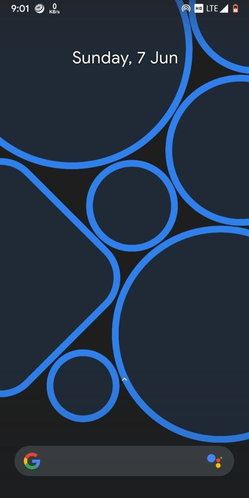
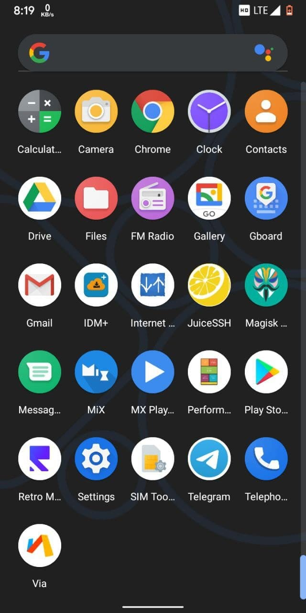
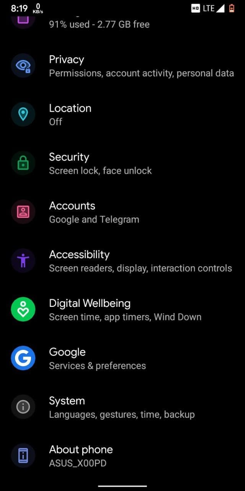
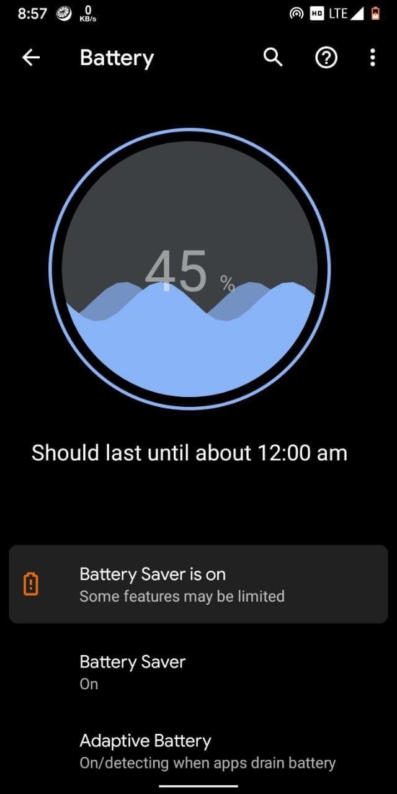
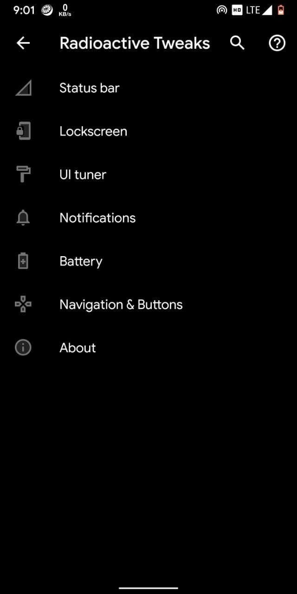
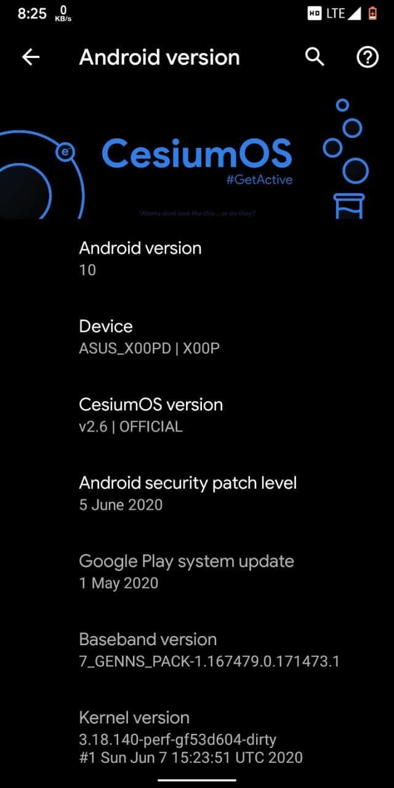

# CesiumOS for ASUS Zenfone Max M1 (X00P/X00PD)

> ***Disclaimer***
>
> *Your warranty is now void. We're not responsible for bricked devices, dead SD cards, thermonuclear war, or you getting fired because the alarm app failed. Please do some research if you have any concerns about features included in this ROM before flashing it! YOU are choosing to make these modifications, and if you point the finger at us for messing up your device, we will laugh at you.*

## Introduction

CesiumOS is a project that is designed to be exciting. It is something that was born out of a sea of similar-looking AOSP roms. We offer a unique, yet familiar experience for your phone. We cherry-pick features that we think will *actually* be useful in your daily lives, and nothing more. Since this is the beginning of something beautiful and exciting, we will continue to add more features in the future releases. We will strive to keep the ROM bloat-free, yet still have enough features that will keep you satisfied.

## Features

<strong>STATUS BAR</strong>

- Status bar icons
- DT2S on status bar
- QS header data usage
- Network meter customization

<strong>LOCKSCREEN</strong>

- Fingerprint authentication vibration
- DT2S on lockscreen
- Lockscreen shortcut customization
- Pocket mode support
- Media artwork

<strong>NAVIGATION & BUTTONS</strong>

- Invert navigation bar
- Navigation bar layout
- Power menu customization
- Playback control
- Screen-off torch

<strong>UI TUNER</strong>

- Brightness slider customization
- R-style notifications
- Quick Settings panel tweaks

<strong>NOTIFICATIONS</strong>

- Ambient light
- Hide smart replies
- Battery light customization

<strong>BATTERY</strong>

- Aggressive mode
- Smart Pixels

<strong>EXTRAS</strong>

- Three-finger swipe to screenshot
- In-call vibrations
- Built-in App Lock
- Extended Quick Settings tiles for Wi-Fi, Bluetooth, NFC, and Mobile data
- Signature spoofing
- DiracFX support
- Face Unlock
- Data switch tiles
- Call recording
- And much more

## Installation Instructions
### Clean Flash
- Take a backup of your phone
- Boot to TWRP and wipe - System, Data, Vendor and Dalvik Cache
- Flash ROM
- Reboot system, Setup your device
- Flash Gapps & Magisk(optional) after first boot.

### Dirty Flash
- Download Latest build
- Boot to TWRP and Flash build
- Wipe Dalvik Cache
- Reboot System

## Downloads
### Android 10
| Version | Build Date | Status   | Maintainer                                     | Downloads |
| :------ | :--------- | :------- | :--------------------------------------------- | :-------- |
| 2.6     | 08/06/2020 | OFFICIAL | [@flamefusion](https://github.com/Flamefusion) | [Internet Archive](https://archive.org/download/x00p-archive/roms/cesium/CesiumOS-v2.6-X00P-20200607-1504-OFFICIAL.zip)

<strong>Changelog</strong>

- Initial build 

<strong>Notes</strong>

- USE LATEST TWRP ONLY
- If you faced any issue or Bug, report it in main group with a logcat attached ( go to google and search matlog or adb and learn how to take logs)
- ROM does not have GAPPS, so flash Nano or Pico ARM64 Android 10 gapps.

<strong>Screenshot</strong>

<table>
  <tr>
    <td colspan="1"></td>
    <td colspan="1"></td>
    <td colspan="1"></td>
  </tr>
  <tr>
    <td colspan="1"></td>
    <td colspan="1"></td>
    <td colspan="1"></td>
  </tr>
</table>

 

| Version | Build Date | Status   | Maintainer                                     | Downloads |
| :------ | :--------- | :------- | :--------------------------------------------- | :-------- |
| 2.6.1   | 19/06/2020 | OFFICIAL | [@flamefusion](https://github.com/Flamefusion) | [Internet Archive](https://archive.org/download/x00p-archive/roms/cesium/CesiumOS-v2.6.1-X00P-20200619-1007-OFFICIAL.zip)

<strong>Changelog</strong>

- Source Upstream to 2.6.1
- Cool Zenparts (ZenUI features)
- LED fixed
- Screen recorder fixed
- Front flash fixed

<strong>Notes</strong>

- USE LATEST TWRP ONLY
- If you faced any issue or Bug, report it in main group with a logcat attached ( go to google and search matlog or adb and learn how to take logs)
- ROM does not have GAPPS, so flash Nano or Pico ARM64 Android 10 gapps.

 

| Version | Build Date | Status   | Maintainer                                     | Downloads |
| :------ | :--------- | :------- | :--------------------------------------------- | :-------- |
| 2.6.2   | 09/07/2020 | OFFICIAL | [@flamefusion](https://github.com/Flamefusion) | [Internet Archive](https://archive.org/download/x00p-archive/roms/cesium/CesiumOS-v2.6.2-X00P-20200707-1856-OFFICIAL.zip)

<strong>Changelog</strong>

- Merge android-10.0.0_r40 - July security patch
- Fixed some generic bugs
- Added QS Powershare tile
- Added option to configure QS rows and columns
- Added option to reset battery stats
- Added option to allow customizing the length of the navigation handle
- Updated prebuilt apps
- TMP Deprecate AppLock (We may bring a proper app lock in future)
- Initial ZERO kernel (nothing much)

<strong>Notes</strong>

- USE LATEST TWRP ONLY
- If you faced any issue or Bug, report it in main group with a logcat attached (go to Google and search Matlog or ADB and learn how to take logs)
- ROM doesn't have GAPPS, so do flash Nano or Pico OpenGapps.

## Credits

Special thanks to [@flamefusion](https://github.com/Flamefusion) as maintainer and contributor of [CesiumOS](https://github.com/CesiumOS) who helped the ASUS Zenfone Max M1 alive throughout the Android development community.

This archive simply preserves their work for future.