# CherishOS for ASUS Zenfone Max M1 (X00P/X00PD)

> ***Disclaimer***
>
> *Your warranty is now void. We're not responsible for bricked devices, dead SD cards, thermonuclear war, or you getting fired because the alarm app failed. Please do some research if you have any concerns about features included in this ROM before flashing it! YOU are choosing to make these modifications, and if you point the finger at us for messing up your device, we will laugh at you.*

## Introduction

CherishOS is a beautiful ROM based on AOSP and Pixel with good quality of features, clean, customizable, and efficient Android experience that puts you in control of your device.

## Installation Instructions
-  Wipe Dalvik, Cache, Data, System and Vendor from Advanced Wipe in TWRP
-  Flash ROM
-  Reboot

## Downloads
### Android 11
| Version | Build Date | Status   | Maintainer                                         | Downloads |
| :------ | :--------- | :------- | :------------------------------------------------- | :-------- |
| 2.0     | 26/11/2020 | OFFICIAL | [@dhimanparas20](https://github.com/dhimanparas20) | [Internet Archive](https://archive.org/download/x00p-archive/roms/cherish/Cherish-OS-v2.0-20201126-1826-X00P-Official-GApps.zip)

<strong>Changelog</strong>

- Official build
- SELinux permissive 
- November security patch
- CTS profile false for now 

<strong>Notes</strong>

- Use Magisk patch for CTS fix 
- Build only for SD430/MSM8937 users
- Flash Magisk-V21 after 1st boot 
- Join the support group for ss and issues.
- Use PitchBlack Recovery with Pie Beta firmware.

<strong>Screenshot</strong>

_(Screenshots are from X00T, but the ROM looks same on X00P)_
<table>
  <tr>
    <td colspan="1"></td>
    <td colspan="1"><a href="assets/img/26112020/2.jpg">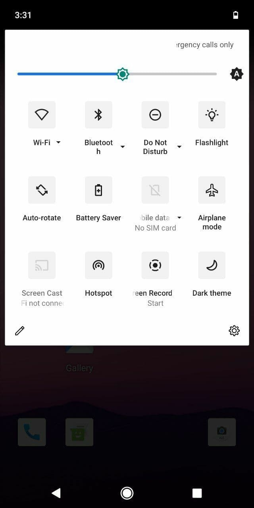</a></td>
    <td colspan="1"><a href="assets/img/26112020/3.jpg">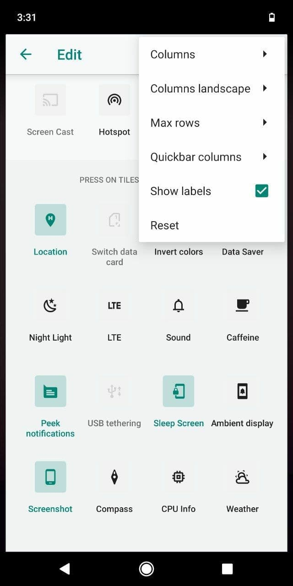</a></td>
    <td colspan="1"></td>
    <td colspan="1"><a href="assets/img/26112020/5.jpg">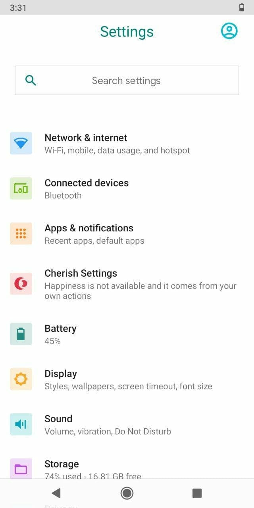</a></td>
  </tr>
    <td colspan="1"><a href="assets/img/26112020/6.jpg">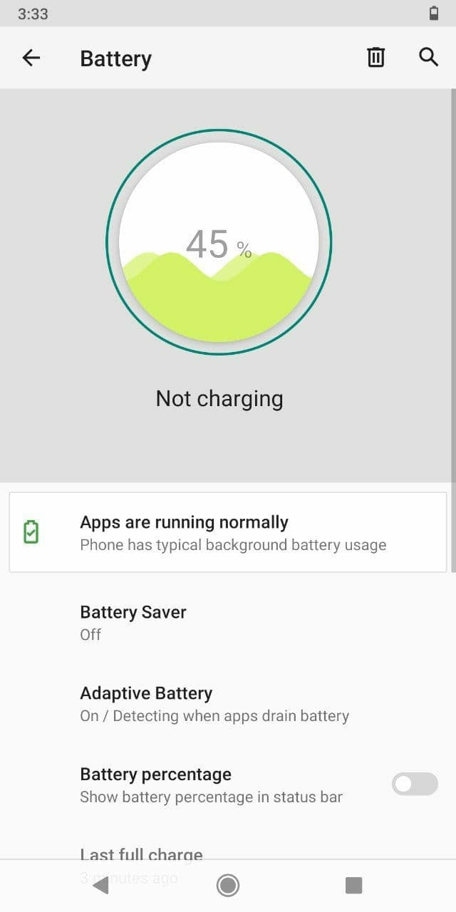</a></td>
    <td colspan="1"><a href="assets/img/26112020/7.jpg">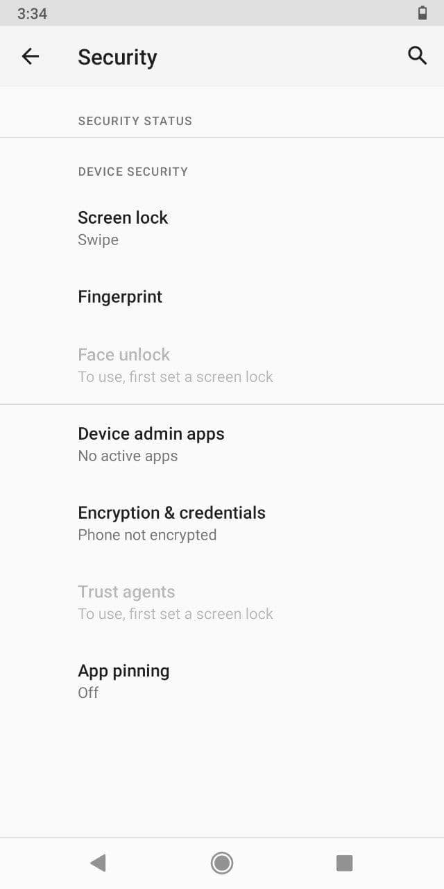</a></td>
    <td colspan="1"><a href="assets/img/26112020/8.jpg">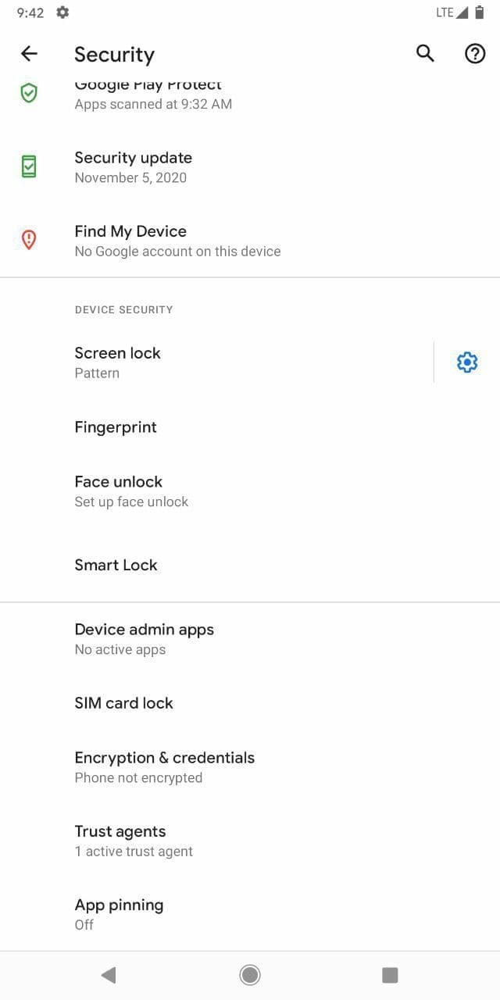</a></td>
    <td colspan="1"><a href="assets/img/26112020/9.jpg">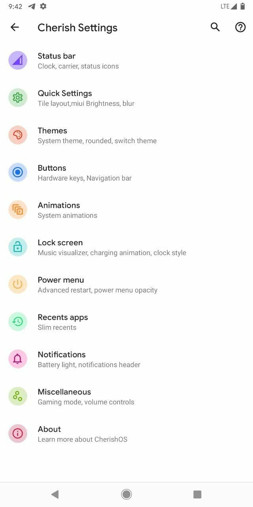</a></td>
    <td colspan="1"><a href="assets/img/26112020/10.jpg">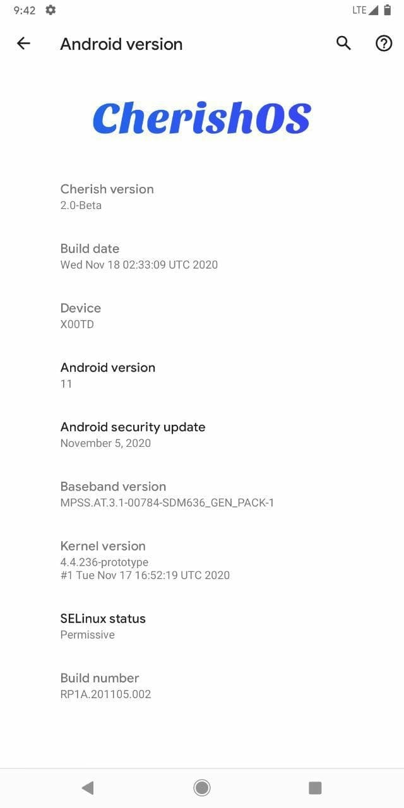</a></td>
  <tr>
  </tr>
</table>

 

| Version | Build Date | Status   | Maintainer                                         | Downloads |
| :------ | :--------- | :------- | :------------------------------------------------- | :-------- |
| 2.3     | 14/03/2021 | OFFICIAL | [@dhimanparas20](https://github.com/dhimanparas20) | [Pling](https://www.pling.com/p/1452076/) [Internet Archive](https://archive.org/download/x00p-archive/roms/cherish/Cherish-OS-v2.3-20210314-1237-X00P-OFFICIAL-GApps.zip)

<strong>Changelog</strong>

- Added ZenParts 
- Stable for daily usage 
- CTS true by default

<strong>Steps to flash (Important)</strong>

1. Download [Pixel Experience 11](/roms/pe/README.md) rom
2. Download CherishOs
3. Reboot to recovery
4. Wipe 5 partions except internal storage and external storage
5. Flash pixel experience 11 rom  (Most important)
6. After flashing manually reboot To recovery again (don't reboot To system)
7. Then hit on backup and take Backup of vendor image
8. Wipe 5 partions again as point (4)
9. Flash CherishOs zip
10. After flashing hit on home  Button and hit on restore
11. Restore your backed-up vendor  Image
12. Now reboot to system
13. After first boot flash magisk Version 21.4 or above if u want Root access.

<strong>Notes</strong>

- Use Magisk patch for CTS fix 
- Recommended to use Gapps build 
- Build only for SD430/MSM8937 users
- flash Magisk-V21 after 1st boot 
- Join the support group for ss and issues.
- Use PitchBlack Recovery with Pie Beta firmware.

<strong>Screenshot</strong>

<table>
  <tr>
    <td colspan="1"><a href="assets/img/14032021/1.jpg">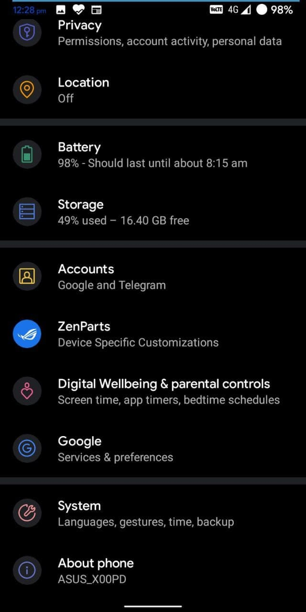</a></td>
    <td colspan="1"><a href="assets/img/14032021/2.jpg">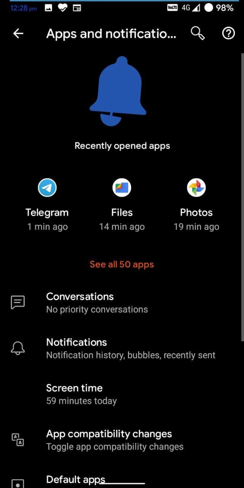</a></td>
    <td colspan="1"><a href="assets/img/14032021/3.jpg">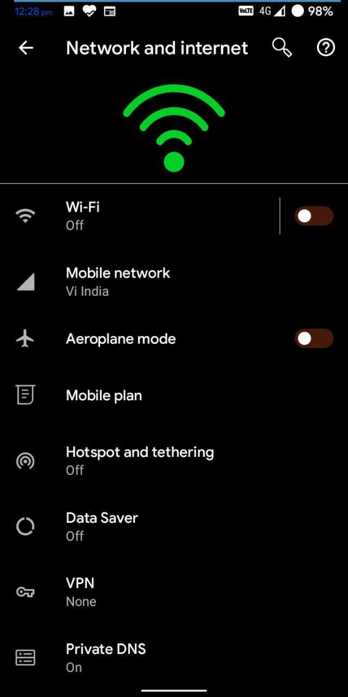</a></td>
    <td colspan="1"><a href="assets/img/14032021/4.jpg">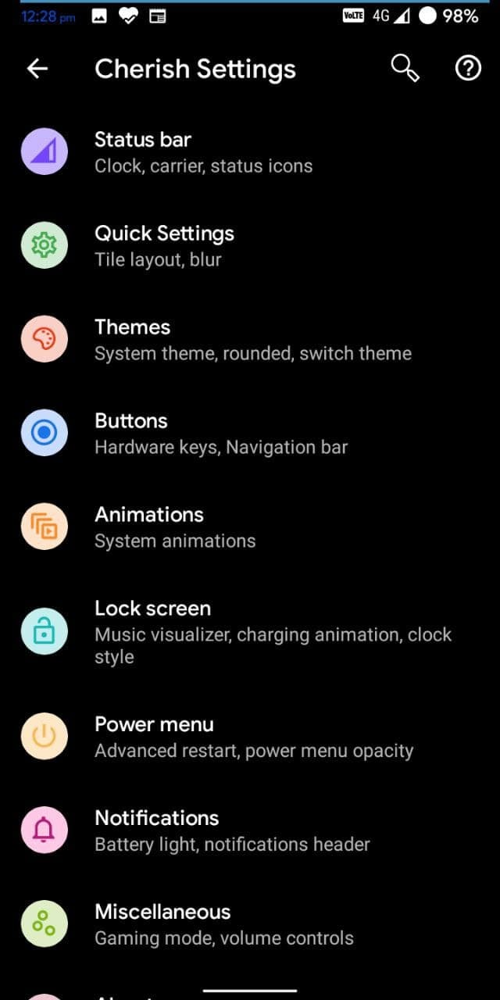</a></td>
    <td colspan="1"><a href="assets/img/14032021/5.jpg">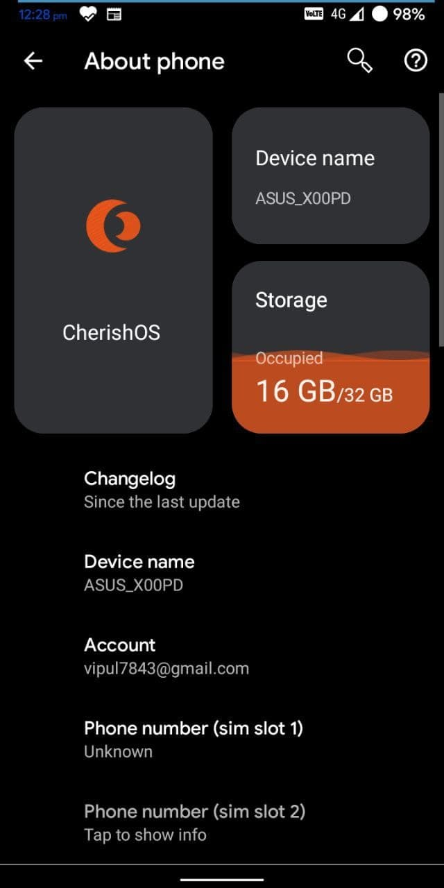</a></td>
  <tr>
  </tr>
</table>

## Credits

Special thanks to [@dhimanparas20](https://github.com/dhimanparas20) as maintainer and contributor of [CherishOS](https://github.com/projectsakura) who helped the ASUS Zenfone Max M1 alive throughout the Android development community.

This archive simply preserves their work for future.