# Corvus OS for ASUS Zenfone Max M1 (X00P/X00PD)

> ***Disclaimer***
>
> *Your warranty is now void. We're not responsible for bricked devices, dead SD cards, thermonuclear war, or you getting fired because the alarm app failed. Please do some research if you have any concerns about features included in this ROM before flashing it! YOU are choosing to make these modifications, and if you point the finger at us for messing up your device, we will laugh at you.*

## Introduction

Corvus OS is another retarded ROM with many retarded Customization. First, it's inspired by Dirty Unicorns (thanks to Alex Cruz), but then we picked many other features too. Our objectives are a stable and feature ROM that can be enjoyed by many devices. We won't say that Corvus is better ROM than others, but we always try to give you the best.

## Features

<strong>THEMES</strong>

- Accent picker
- Theme backup
- Theme styles

<strong>NOTIFICATIONS</strong>

- Heads-up options
- Charging animation
- Edge Lighting
- Blink flashlight on call

<strong>MISCELLANEOUS</strong>

- Rounded corners
- System animations
- Scrolling cache
- Expanded screenshot
- Gaming Mode
- Three-finger swipe
- DT2 Sleep
- Signature spoofing
- Sensor block per app package
- Screen-off animation
- Dashboard conditions
- Dashboard suggestions
- Disable device identifier restrictions

<strong>FINGERPRINT PREFERENCES</strong>

- Fingerprint error vibration
- Fingerprint authentication vibration

<strong>LOCKSCREEN</strong>

- Show status bar on lockscreen
- Disable Quick Settings when locked
- Lockscreen charging info
- Lockscreen album art filter
- Media artwork blur level
- Shortcuts
- Charging animation
- Lockscreen style
- FOD icon picker
- FOD recognizing animations
- FOD pressed state
- Hide lock icon
- DT2Sleep
- Lockscreen visualizer
- Media artwork

<strong>STATUS BAR</strong>

- Battery customization
- Charging LED
- Battery estimates toggle
- Battery icon style
- Battery percentage
- Aggressive Battery
- Battery bar customization

<strong>CARRIER LABEL</strong>

- Custom carrier label
- Carrier label fonts, size, and colors

<strong>CLOCK CUSTOMIZATION</strong>

- Show clock and date toggle
- Auto-hide clock
- Clock style
- AM/PM style
- Show seconds toggle
- Date position, style, format, size, font color, and font style
- Icon manager
- Status bar icons
- Custom logo
- Signal icon switch
- Toast app icon
- Bluetooth battery status

<strong>QUICK SETTINGS</strong>

- Quick QS Pulldown
- Smart Pulldown
- Vibrate on touch
- QS footer text
- Custom footer text
- Settings icon toggle
- Running services icon
- User switch icon
- Edit icon toggle
- QS tint toggle
- Header images
- QS blur
- Background opacity
- QS layout customization
- QS tile animations
- Brightness slider position customization

<strong>TRAFFIC INDICATORS</strong>

- Traffic indicator placement
- Activity layout
- Network type activity
- Network font size customization
- Show/Hide arrows toggle
- Network activity auto-hide threshold

<strong>TICKER</strong>

- Ticker toggle
- Ticker animation
- Ticker duration

<strong>HARDWARE</strong>

- Button customization
- Kill app button
- Screen-off power button torch
- Volume panel customization
- Music control
- Volume rocker wake
- Reorient
- Volume key cursor control

<strong>NAVIGATION</strong>

- On-screen navigation bar
- System navigation
- Full-screen gestures
- Extended swipe action
- Left/Right swipe action

<strong>POWER MENU</strong>

- Power menu animation
- Restart toggle
- Advanced restart toggle
- Lockdown toggle
- Screenshot toggle
- Lockscreen visibility

<strong>DISPLAY</strong>

- Custom options
- Battery level on bottom
- Always on when charging
- New notifications toggle
- Lift to check phone
- Hand wave pulse
- Pocket notifications on removal
- Brightness options on Ambient Display
- Ambient wake gestures
- Ambient music ticker
- Adaptive Brightness
- Styles and wallpapers
- Screen Attention
- Display colors
- Screen savers
- Screen rotation
- Game driver preferences

## Installation Instructions
-  First Important Step is to Backup (though depends on you if you wanna be safe or no)
-  Download Corvus Latest ROM Zip
-  Flash ROM Zip & Vendor (if applicable according to your device manual)
-  Flash any add-ons if you want to like Gapps, Magisk, Etc.
-  Reboot & enjoy!​

## Downloads
### Android 10
| Version | Build Date | Status     | Maintainer                                     | Downloads |
| :------ | :--------- | :--------- | :--------------------------------------------- | :-------- |
| 6.5     | 22/06/2020 | UNOFFICIAL | [@flamefusion](https://github.com/Flamefusion) | [Internet Archive](https://archive.org/download/x00p-archive/roms/corvus/Corvus_v6.5-X00P-22062020-UNOFFICIAL-0311.zip)

<strong>Changelog</strong>

- Initial build 

<strong>Bugs</strong>

- Screen Recorder
- Night Light

<strong>Notes</strong>

- USE LATEST TWRP ONLY
- If you faced any issue or Bug, report it in main group with a logcat attached ( go to google and search matlog or adb and learn how to take logs)
- ROM doesn't have GAPPS, so flash Nano or Pico Gapps.
- If you want best performance, flash latest Storm Breaker
- **[bootanimation-fixer-maybe.zip](./assets/22062020/bootanimation-fixer-maybe.zip)** **>** Necessary to flash in order to get boot animation while booting. Flash this module via TWRP just after flashing ROMs and Gapps.

<strong>Screenshot</strong>

<table>
  <tr>
    <td colspan="1"><a href="assets/img/22062020/1.jpg">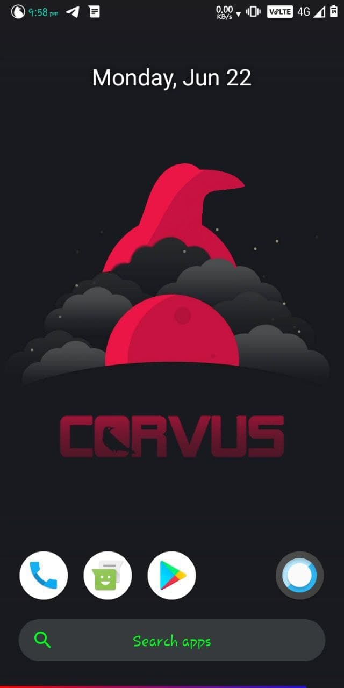</a></td>
    <td colspan="1"><a href="assets/img/22062020/2.jpg">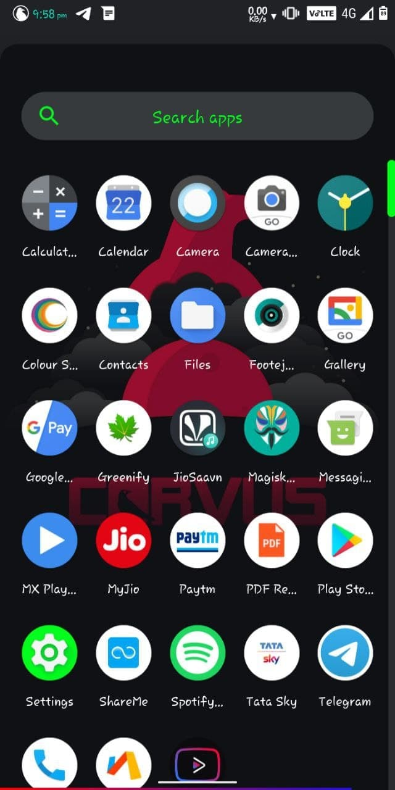</a></td>
    <td colspan="1"><a href="assets/img/22062020/3.jpg">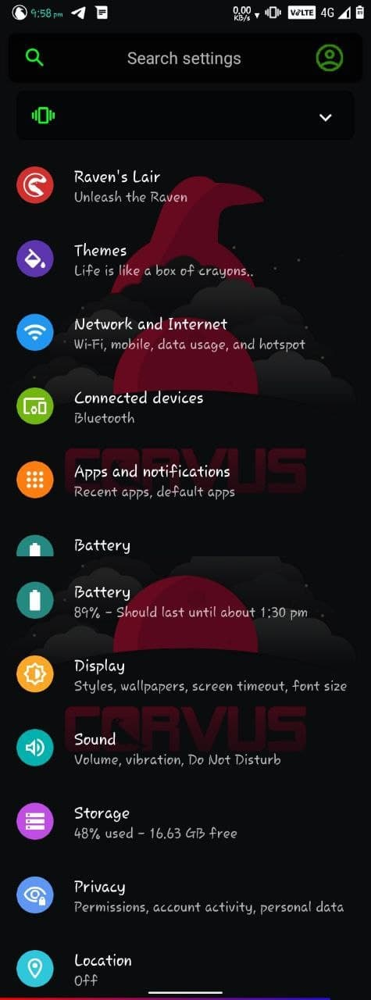</a></td>
    <td colspan="1"><a href="assets/img/22062020/4.jpg">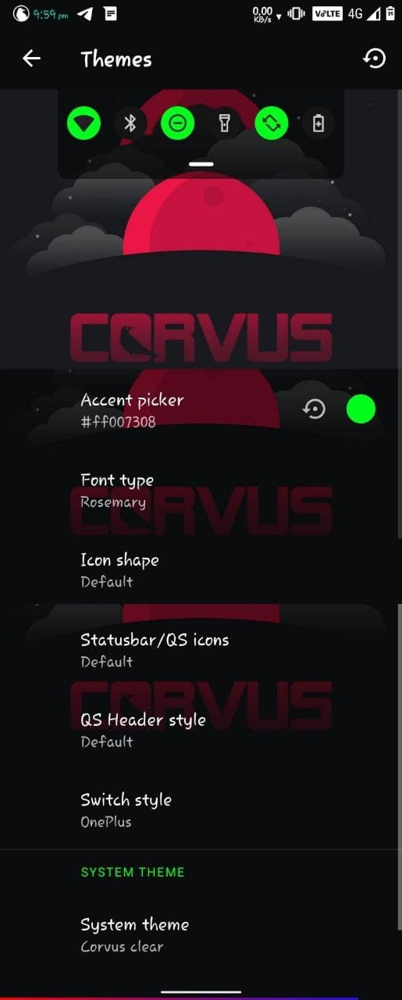</a></td>
    <td colspan="1"><a href="assets/img/22062020/5.jpg">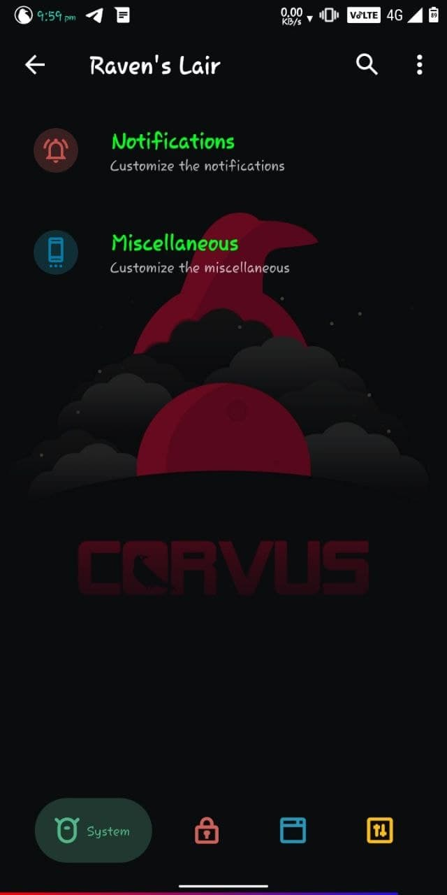</a></td>
  </tr>
  <tr>
    <td colspan="1"><a href="assets/img/22062020/6.jpg">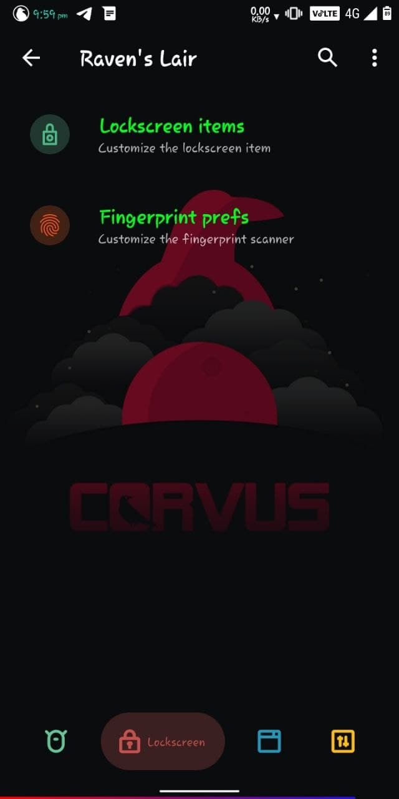</a></td>
    <td colspan="1"><a href="assets/img/22062020/7.jpg">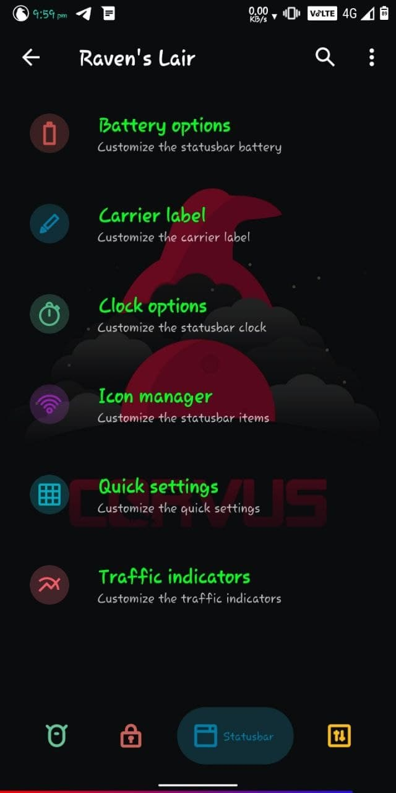</a></td>
    <td colspan="1"><a href="assets/img/22062020/8.jpg">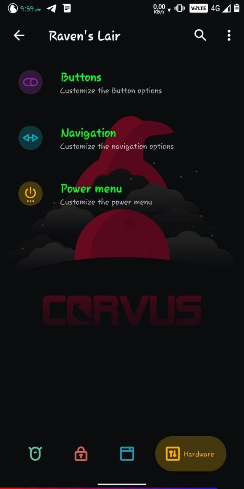</a></td>
    <td colspan="1"><a href="assets/img/22062020/9.jpg">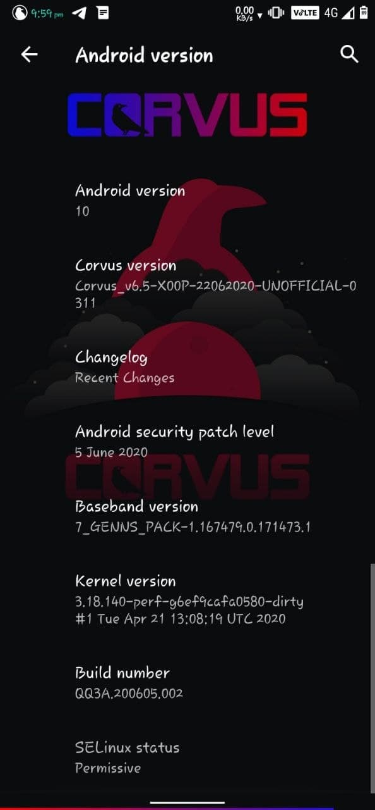</a></td>
  </tr>
</table>

 

| Version | Build Date | Status   | Maintainer                                     | Downloads |
| :------ | :--------- | :------- | :--------------------------------------------- | :-------- |
| 7.5     | 29/07/2020 | OFFICIAL | [@flamefusion](https://github.com/Flamefusion) | [Internet Archive](https://archive.org/download/x00p-archive/roms/corvus/Corvus_v7.5-OMEN-X00P-29072020-OFFICIAL-0316.zip)

<strong>Changelog</strong>

### ROM Changelog
- Source upstream to version 7.5-OMEN
- New System wide animation
- We have DISCO Now
- New lock screen font implementation
- New music QS tile
- Updated volume panel version 1.1
- New icon shapes From Android R 
- Added litto animation

### Device Changelog:
- Fix Nightlight
- Volte Now works on 2nd SIM (thanx to @RazaDroid)
- Added Pixel charging animation
- Fix idle drain (thanx to @danascape)
- Upgraded bofela wake lock in kernel to 1.1
- Added Enhanced sound and optimized sound control to kernel
- Updated IOP and ADSP blobs
- Implementation of Thermal cooling
- Update display config to 1.9
- Add support for 32/48KHz voip
- (Hot-Fix) VOLTE FIX FOR SOME USERS
- (Hot-Fix) Fix No Audio while in call for some carriers

<strong>Notes</strong>

- USE LATEST TWRP ONLY
- If you faced any issue or Bug, report it in main group with a logcat attached (go to Google and search Matlog or ADB and learn how to take logs)
- ROM doesn't have GAPPS, so do flash Nano or Pico OpenGapps.

<strong>Screenshot</strong>

<table>
  <tr>
    <td colspan="1"><a href="assets/img/29072020/1.jpg">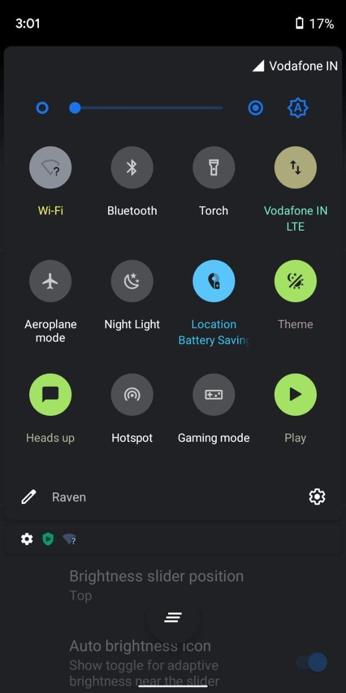</a></td>
    <td colspan="1"><a href="assets/img/29072020/2.jpg">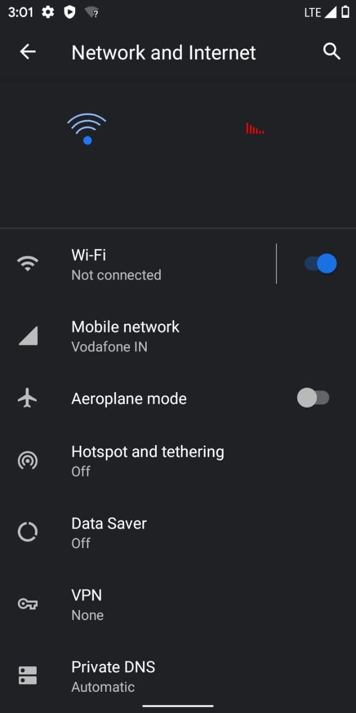</a></td>
    <td colspan="1"><a href="assets/img/29072020/3.jpg">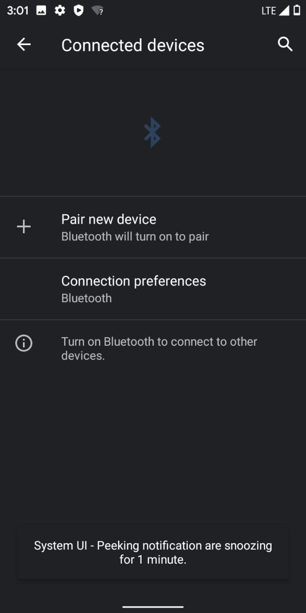</a></td>
    <td colspan="1"><a href="assets/img/29072020/4.jpg">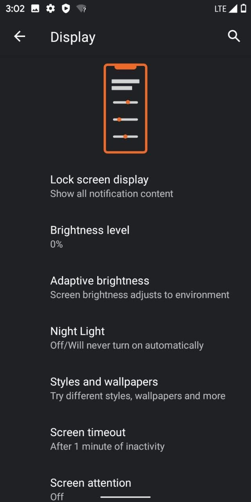</a></td>
    <td colspan="1"><a href="assets/img/29072020/5.jpg">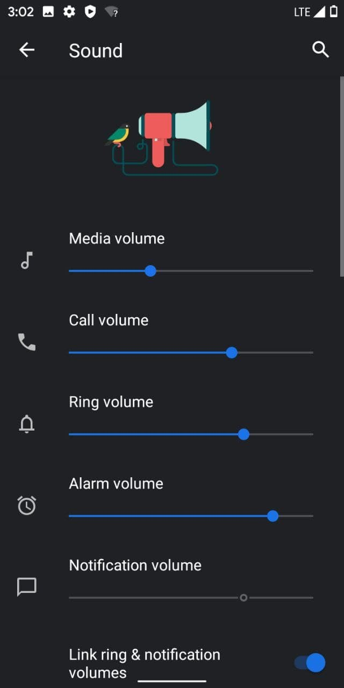</a></td>
  </tr>
  <tr>
    <td colspan="1"><a href="assets/img/29072020/6.jpg">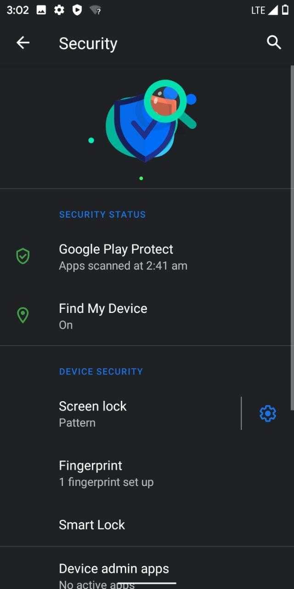</a></td>
    <td colspan="1"><a href="assets/img/29072020/7.jpg">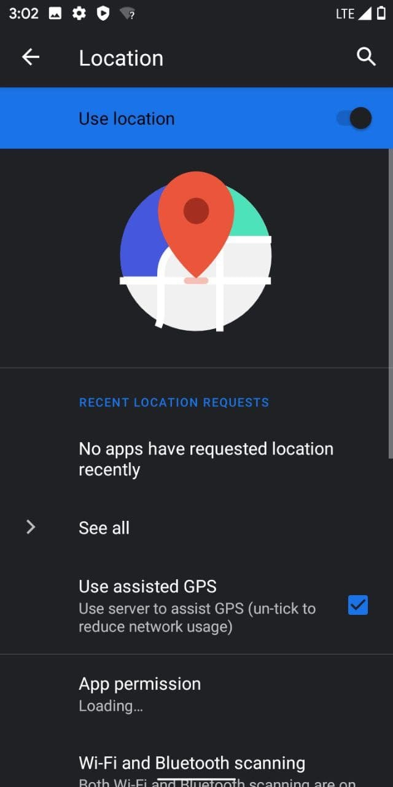</a></td>
    <td colspan="1"><a href="assets/img/29072020/8.jpg">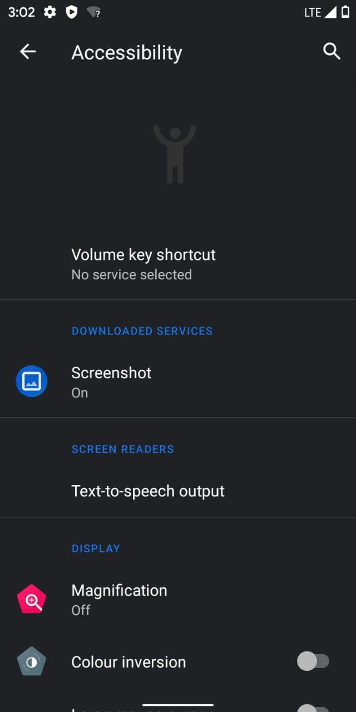</a></td>
    <td colspan="1"><a href="assets/img/29072020/9.jpg">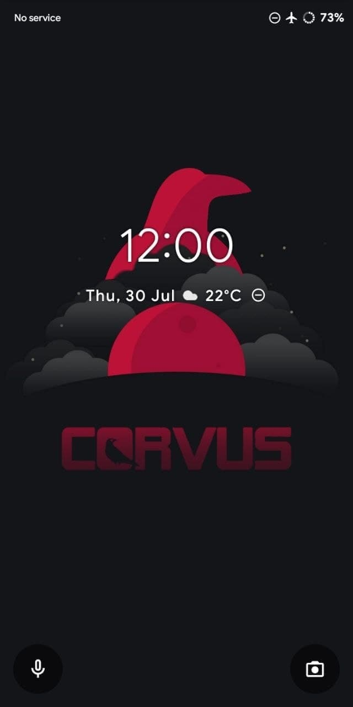</a></td>
  </tr>
</table>

 

| Version | Build Date | Status   | Maintainer                                     | Downloads |
| :------ | :--------- | :------- | :--------------------------------------------- | :-------- |
| 8.0     | 08/08/2020 | OFFICIAL | [@flamefusion](https://github.com/Flamefusion) | [Internet Archive](https://archive.org/download/x00p-archive/roms/corvus/Corvus_v8.0-Tsushima-X00P-Gapps-08082020-OFFICIAL-1316.zip)

<strong>Changelog</strong>

- Fixed Multi-user 
- Fixed some crash reports in logs
- Implemented prebuilt dts
- Builded separate system and vendor HIDL libs
- Implemented full VNDK
- Converted light HALs into a native binderized HAL
- Used AOSP and native audio
- Added support for battery-health
- For better battery-life reverted illegal boosting of Gold cluster and silver cluster
- Reverted remove to jump max
- Updated CAF graphics blob in vendor

<strong>Notes</strong>

- USE LATEST TWRP ONLY
- If you faced any issue or Bug, report it in main group with a logcat attached (go to Google and search Matlog or ADB and learn how to take logs)
- ROM does have GAPPS, so don't flash any Gapps.

<strong>Screenshot</strong>

<table>
  <tr>
    <td colspan="1"><a href="assets/img/08082020/1.jpg">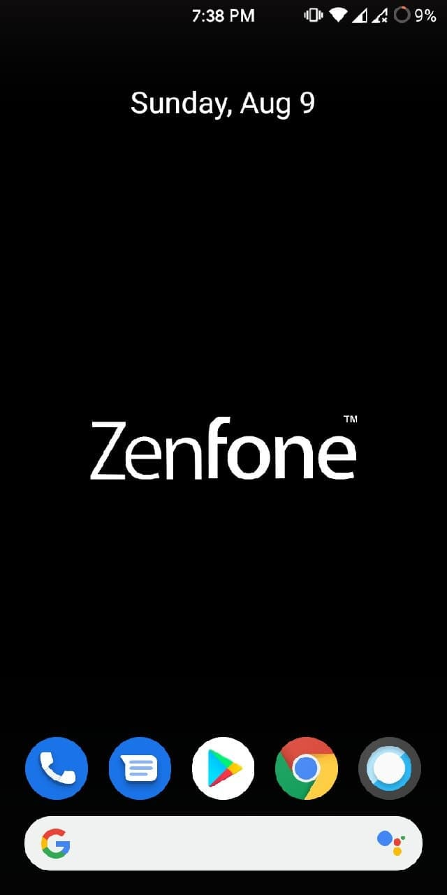</a></td>
    <td colspan="1"><a href="assets/img/08082020/2.jpg">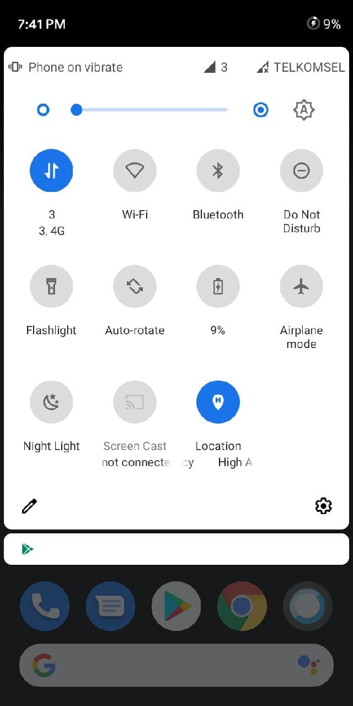</a></td>
    <td colspan="1"><a href="assets/img/08082020/3.jpg">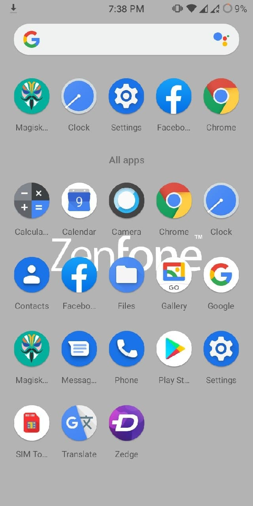</a></td>
    <td colspan="1"><a href="assets/img/08082020/4.jpg">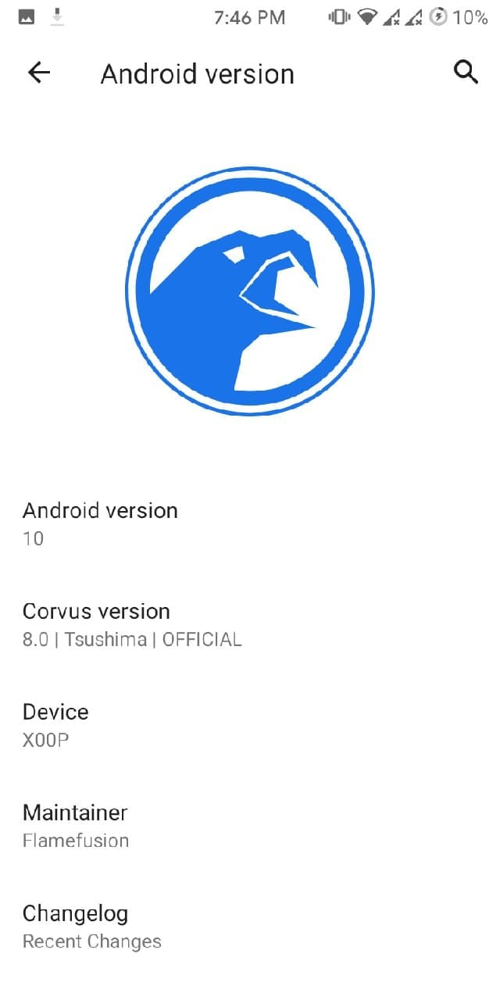</a></td>
  </tr>
</table>

 

| Version | Build Date | Status   | Maintainer                                     | Downloads |
| :------ | :--------- | :------- | :--------------------------------------------- | :-------- |
| 8.5     | 25/08/2020 | OFFICIAL | [@flamefusion](https://github.com/Flamefusion) | [Pling](https://www.pling.com/p/1401370#files-panel) [Internet Archive (Vanilla)](https://archive.org/download/x00p-archive/roms/corvus/Corvus_v8.5-Sage-X00P-25082020-OFFICIAL-1646.zip) [Internet Archive (GApps)](https://archive.org/download/x00p-archive/roms/corvus/Corvus_v8.5-Sage-X00P-Gapps-25082020-OFFICIAL-1526.zip)

<strong>Changelog</strong>

- Source Bump to 8.5-Sage
- Added Prebuilt Moto Dolby
- Force disabled cds module in camera to fix green artifacts in some camera app
- Update ramdisk from UL
- Import FM blobs from UL
- Import hbtp blobs from UL
- Added Prebuilt Pixel 4 live wallpaper
- Enabled Adaptive sleep
- Added support for AudioFX equilizer
- Brought Back ZenParts with Sound Control, Ambient gesture, Spectrum,
- Display Calibration, FPS-info overlay, Vibration control
- Yeah Finally Fixed reboot issue for some users who were facing when connected to WiFi
- Many more performance improvement under the hood

<strong>Notes</strong>

- USE LATEST TWRP ONLY
- If you faced any issue or Bug, report it in main group with a logcat attached 

 

| Version | Build Date | Status   | Maintainer                                     | Downloads |
| :------ | :--------- | :------- | :--------------------------------------------- | :-------- |
| 9.0     | 13/09/2020 | OFFICIAL | [@flamefusion](https://github.com/Flamefusion) | [Internet Archive (Vanilla)](https://archive.org/download/x00p-archive/roms/corvus/Corvus_v9.0-EndGame-X00P-12092020-OFFICIAL-2303.zip) [Internet Archive (GApps)](https://archive.org/download/x00p-archive/roms/corvus/Corvus_v9.0-EndGame-X00P-Gapps-12092020-OFFICIAL-1911.zip)

<strong>Changelog</strong>

- N/A

<strong>Notes</strong>

- USE LATEST TWRP ONLY
- If you faced any issue or Bug, report it in main group with a logcat attached (go to Google and search Matlog or ADB and learn how to take logs)

<strong>Screenshot</strong>

<table>
  <tr>
    <td colspan="1"><a href="assets/img/13092020/1.jpg">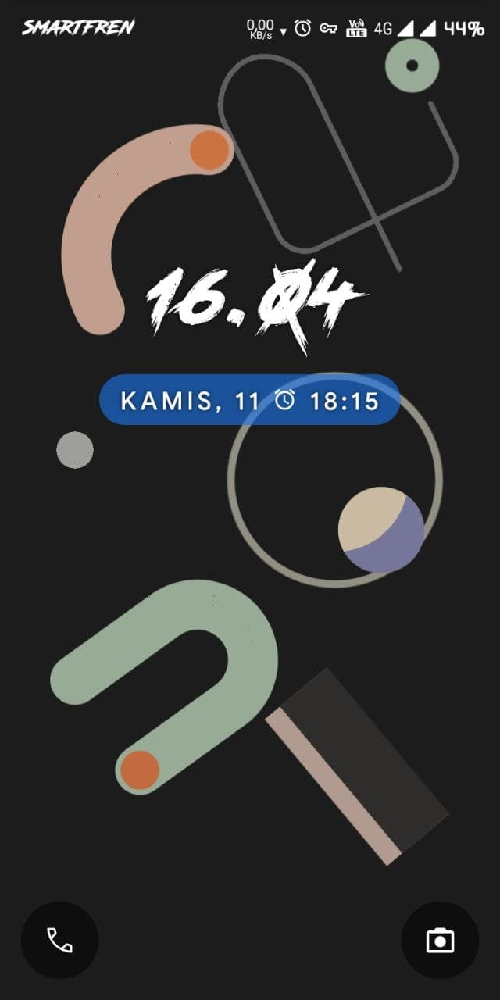</a></td>
    <td colspan="1"><a href="assets/img/13092020/2.jpg">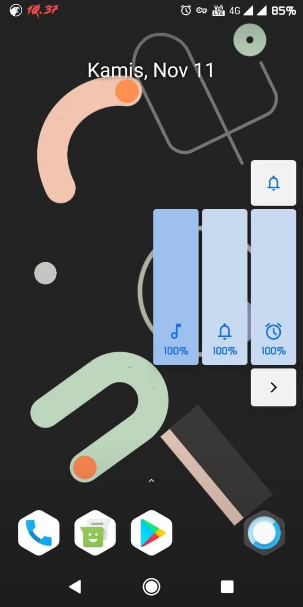</a></td>
    <td colspan="1"><a href="assets/img/13092020/3.jpg">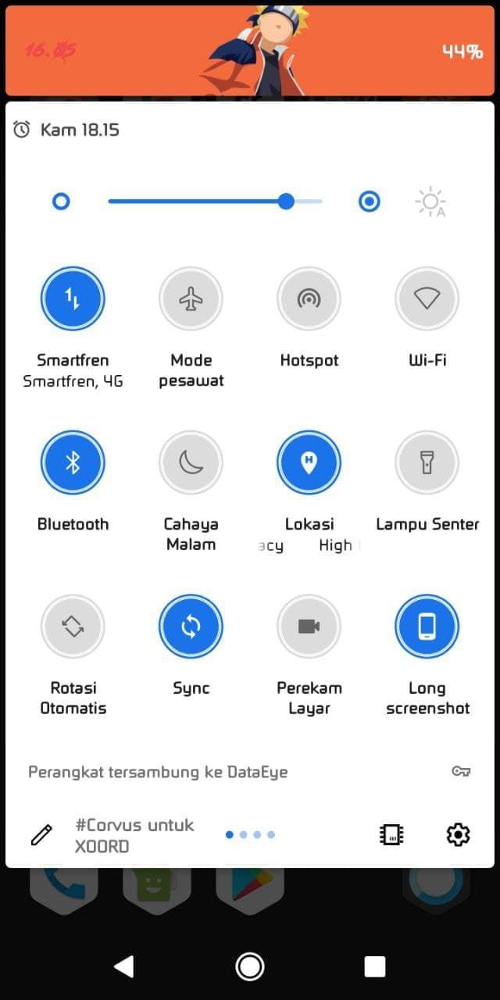</a></td>
    <td colspan="1"><a href="assets/img/13092020/4.jpg">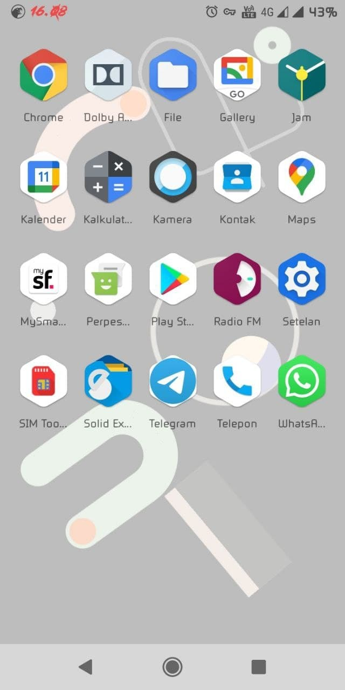</a></td>
  </tr>
    <td colspan="1"><a href="assets/img/13092020/5.jpg">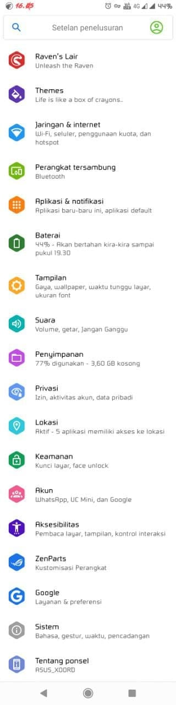</a></td>
    <td colspan="1"><a href="assets/img/13092020/6.jpg">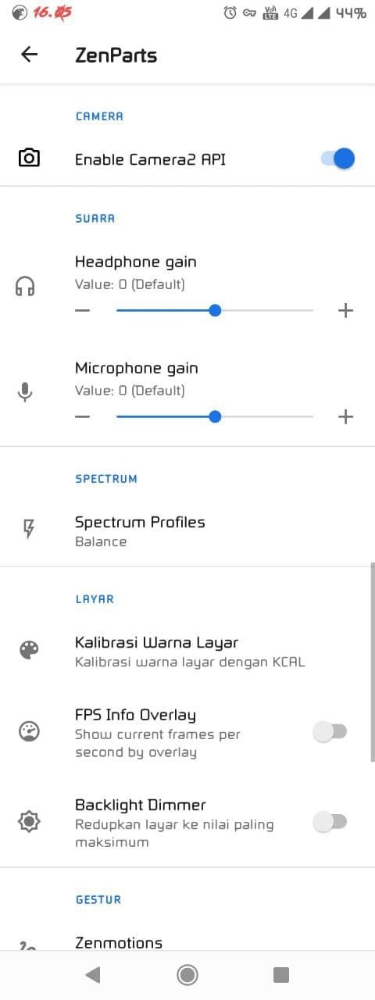</a></td>
    <td colspan="1"><a href="assets/img/13092020/7.jpg">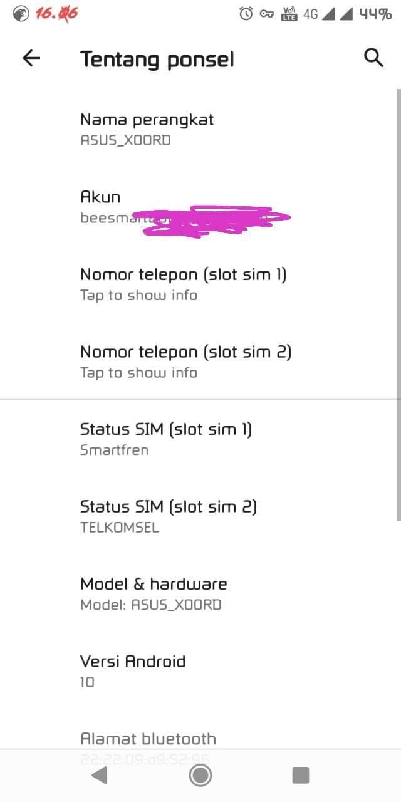</a></td>
    <td colspan="1"><a href="assets/img/13092020/8.jpg">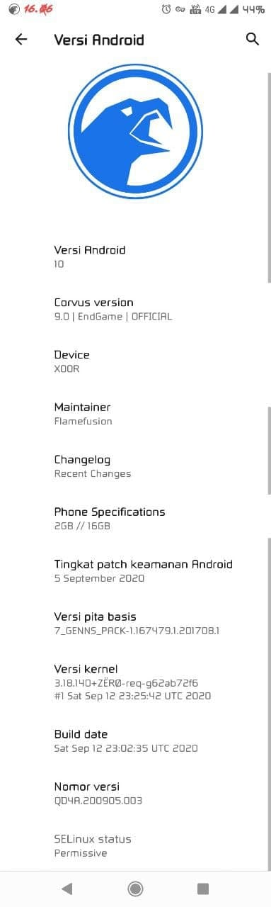</a></td>
  </tr>
</table>

## Credits

Special thanks to [@flamefusion](https://github.com/Flamefusion) as maintainer and contributor of [Corvus OS](https://github.com/Corvus-AOSP) who helped the ASUS Zenfone Max M1 alive throughout the Android development community.

This archive simply preserves their work for future.