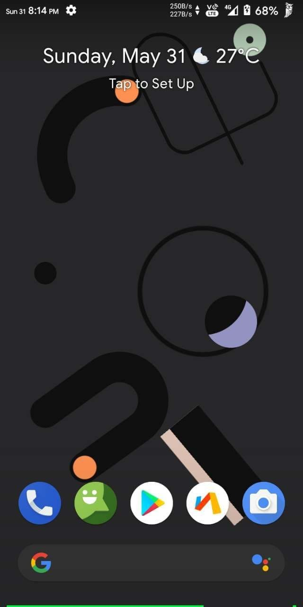
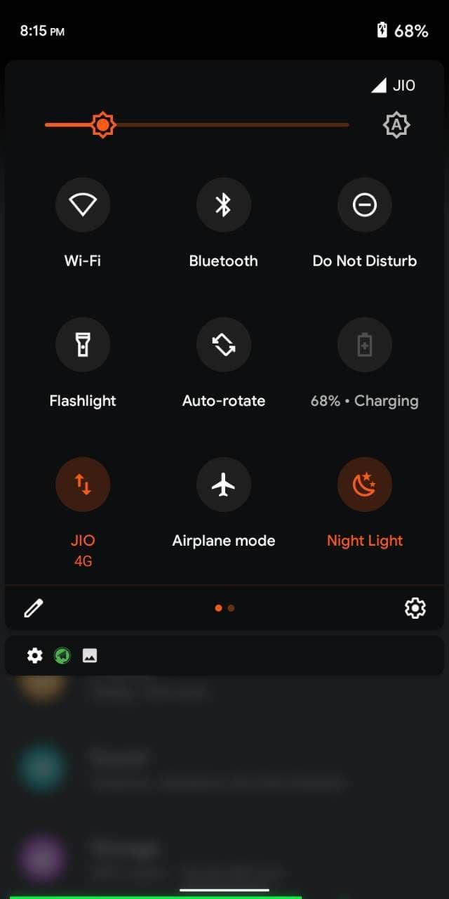
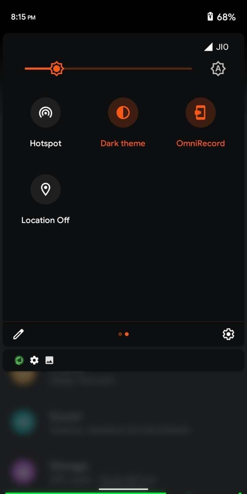
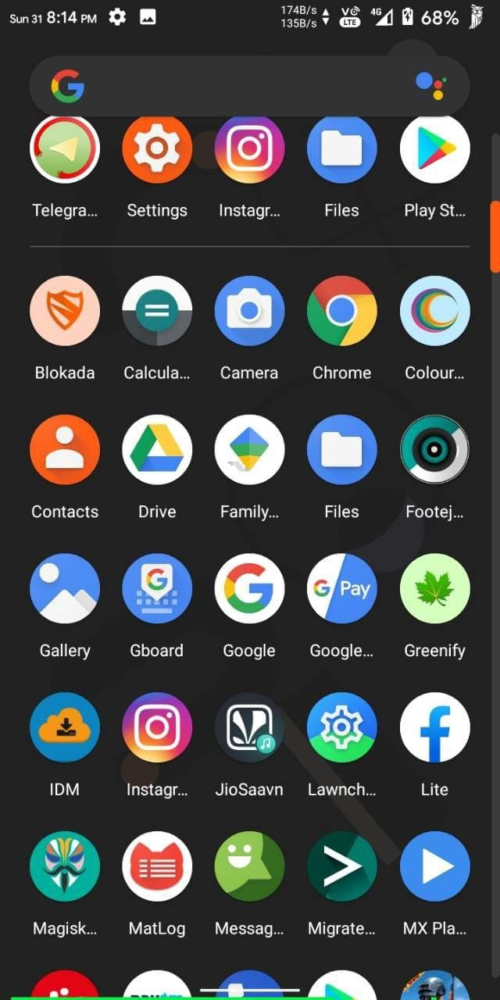
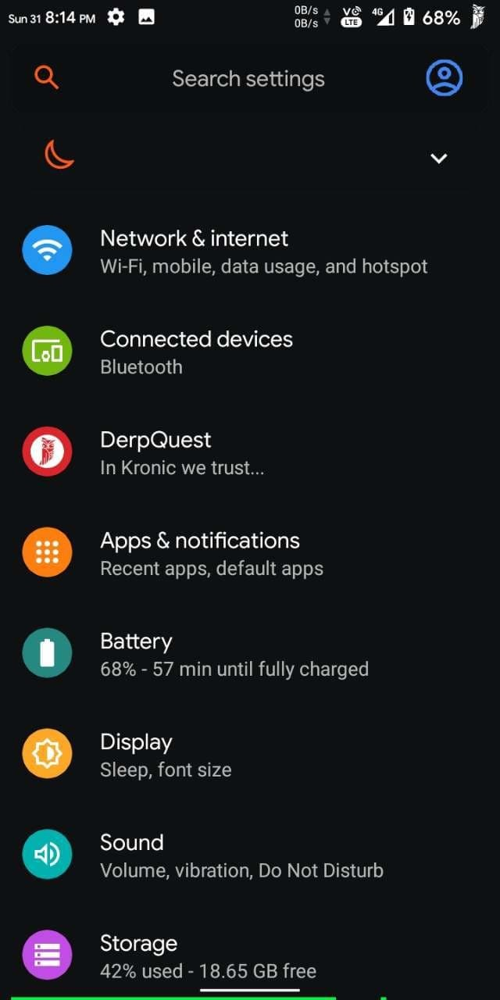
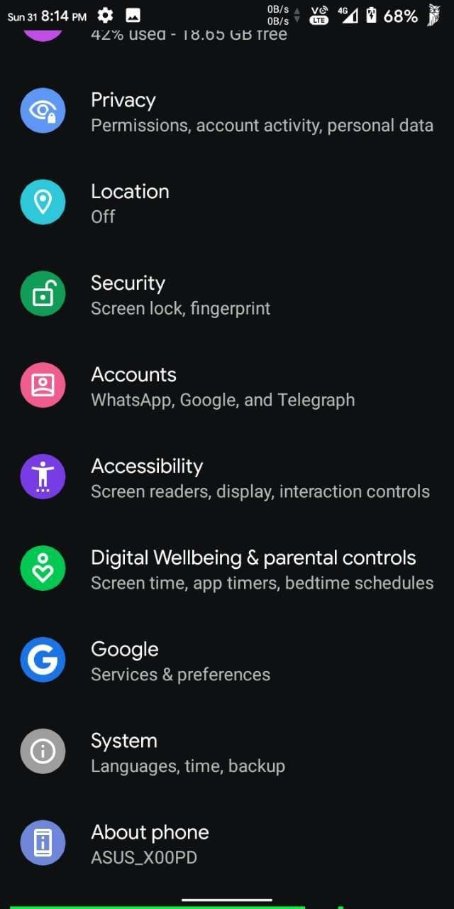
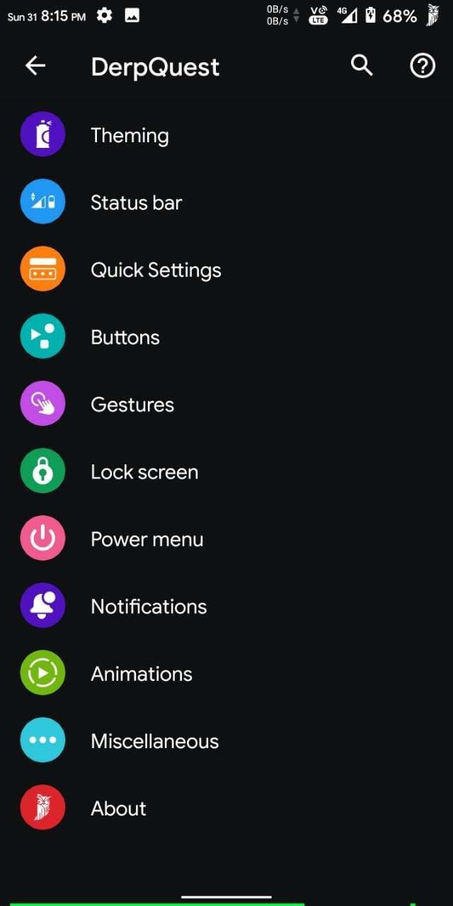
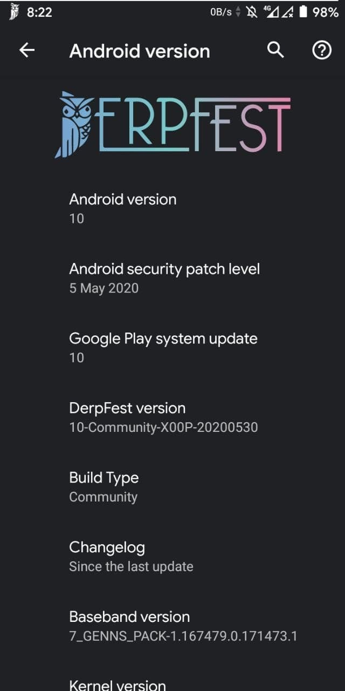

# DerpFest for ASUS Zenfone Max M1 (X00P/X00PD)

> ***Disclaimer***
>
> *Your warranty is now void. We're not responsible for bricked devices, dead SD cards, thermonuclear war, or you getting fired because the alarm app failed. Please do some research if you have any concerns about features included in this ROM before flashing it! YOU are choosing to make these modifications, and if you point the finger at us for messing up your device, we will laugh at you.*

## Introduction

We are an AOSP based custom ROM, twisted with the latest features from all over the Android development community. Quality and stability is our first priority as we are dedicated to bringing you the best Android has to offer.

## Installation Instructions
- Wipe System, Vendor, Data, Cache and Dalvik. Also, Format Data.
- Flash ROM
- Reboot

## Downloads
### Android 10
| Version | Build Date | Status     | Maintainer                         | Downloads |
| :------ | :--------- | :--------- | :--------------------------------- | :-------- |
| 10      | 02/06/2020 | UNOFFICIAL | [@Inder864](https://t.me/Inder864) | [Internet Archive](https://archive.org/download/x00p-archive/roms/derp/DERPFEST_X00P-COMMUNITY_VANILLA.zip)

<strong>Changelog</strong>

- Add BT fix
- And new boot animation
- Fully Derpfest based UI

<strong>Notes</strong>

- USE LATEST TWRP ONLY
- If you faced any issue or Bug, report it in main group with a logcat attached ( go to google and search matlog or adb and learn how to take logs)
- ROM does not have GAPPS, so flash Nano or Pico ARM64 Android 10 gapps.
- After booting into system, go to Developer Options > Feature Flags and enable every flag which can be enabled for a better network and performance.

<strong>Screenshot</strong>

<table>
  <tr>
    <td colspan="1"></td>
    <td colspan="1"></td>
    <td colspan="1"></td>
    <td colspan="1"></td>
  </tr>
  <tr>
    <td colspan="1"></td>
    <td colspan="1"></td>
    <td colspan="1"></td>
    <td colspan="1"></td>
  </tr>
</table>

## Credits

Special thanks to [@Inder864](https://t.me/Inder864) as maintainer and contributor of [DerpFest](https://github.com/DerpFest-AOSP) who helped the ASUS Zenfone Max M1 alive throughout the Android development community.

This archive simply preserves their work for future.