# Havoc-OS for ASUS Zenfone Max M1 (X00P/X00PD)

> ***Disclaimer***
>
> *Your warranty is now void. We're not responsible for bricked devices, dead SD cards, thermonuclear war, or you getting fired because the alarm app failed. Please do some research if you have any concerns about features included in this ROM before flashing it! YOU are choosing to make these modifications, and if you point the finger at us for messing up your device, we will laugh at you.*

## Introduction

Havoc-OS is an after-market firmware based on Android Open Source Project, inspired by Google Pixel with a refined Material Design UI. We offer a smooth and stable experience for your device with a selected set of amazing features that provide an exceptional user experience.

## Installation Instructions
- Wipe System, Vendor, Data, Cache and Dalvik. Also, Format Data.
- Flash ROM
- Flash Gapps (*Optional*)
- Reboot

## Downloads
### Android 10
| Version | Build Date | Status     | Maintainer                                   | Downloads |
| :------ | :--------- | :--------- | :------------------------------------------- | :-------- |
| 3.5     | 11/05/2020 | UNOFFICIAL | [@sairam1411](https://github.com/sairam1411) | [Google Drive](https://drive.google.com/file/d/13CYDMqptsfKO1ZyqAdmawxd-5h1i1wjt/view) [Internet Archive](https://archive.org/download/x00p-archive/roms/havoc/Havoc-OS-v3.5-20200508-X00P-Unofficial.zip)

<strong>Changelog</strong>

- Initial build

<strong>Notes</strong>

- USE LATEST TWRP ONLY
- If you faced any issue or Bug, report it in main group with a logcat attached ( go to google and search matlog or adb and learn how to take logs)
- ROM doesn't have GAPPS, so flash ARM64 Android 10 based Pico or Nano Gapps only.

<strong>Screenshot</strong>

<table>
  <tr>
    <td colspan="1"></td>
    <td colspan="1"><a href="assets/img/11052020/2.jpg">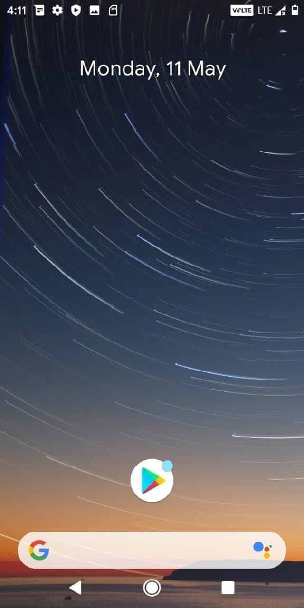</a></td>
    <td colspan="1"><a href="assets/img/11052020/3.jpg">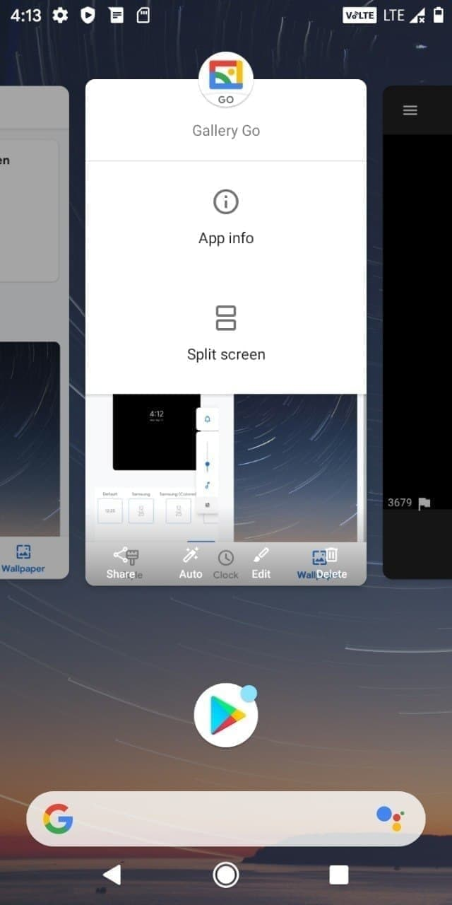</a></td>
    <td colspan="1"><a href="assets/img/11052020/4.jpg">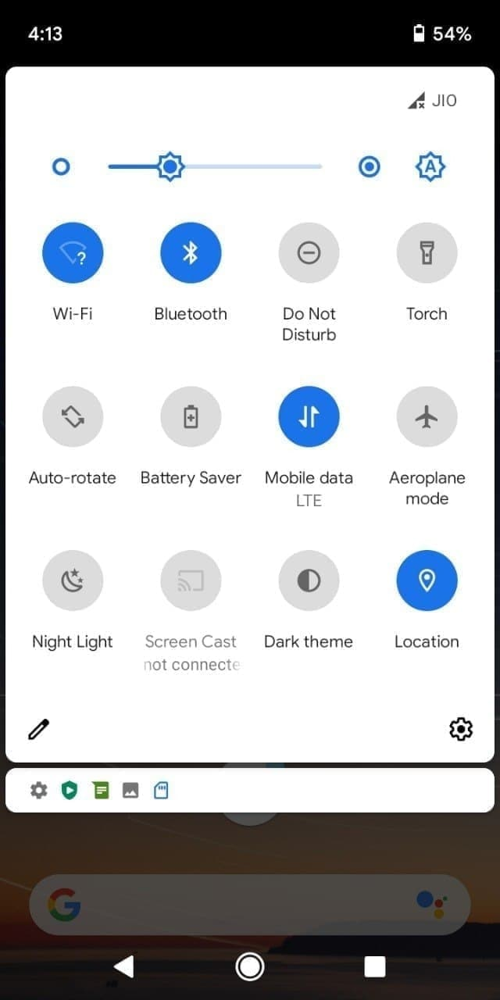</a></td>
    <td colspan="1"><a href="assets/img/11052020/5.jpg">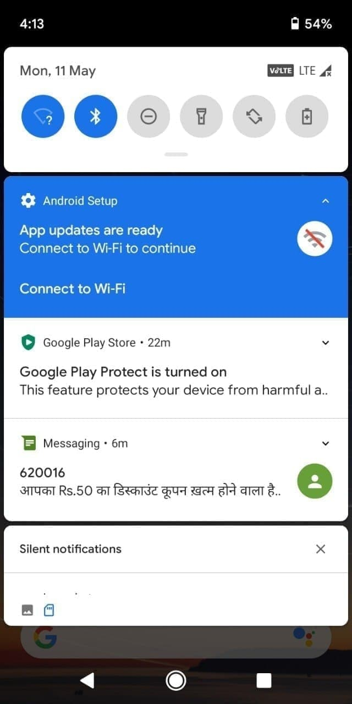</a></td>
  </tr>
  <tr>
    <td colspan="1"><a href="assets/img/11052020/6.jpg">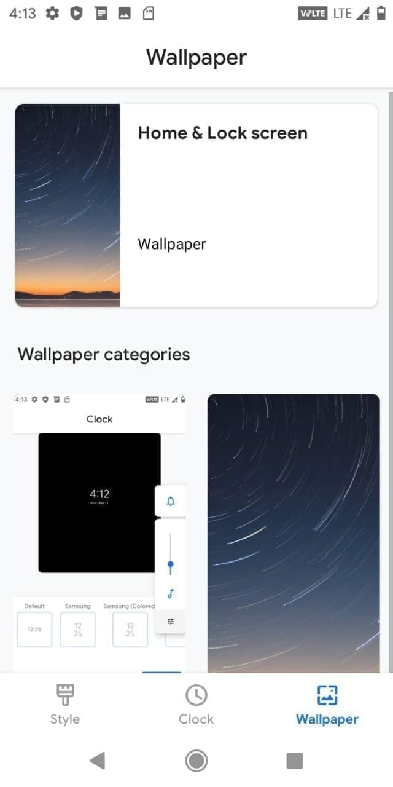</a></td>
    <td colspan="1"><a href="assets/img/11052020/7.jpg">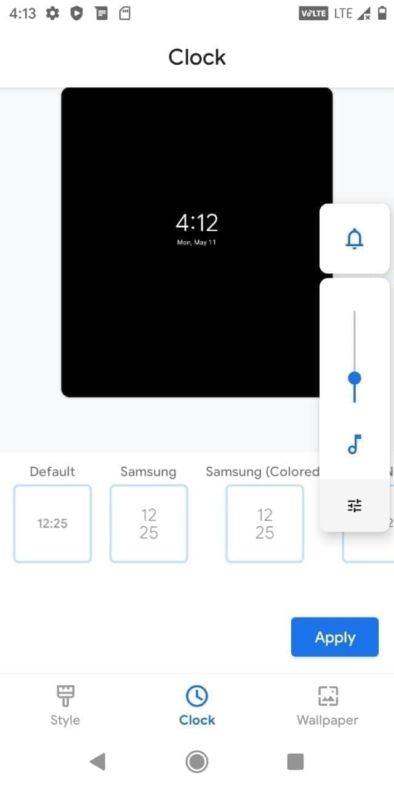</a></td>
    <td colspan="1"><a href="assets/img/11052020/8.jpg">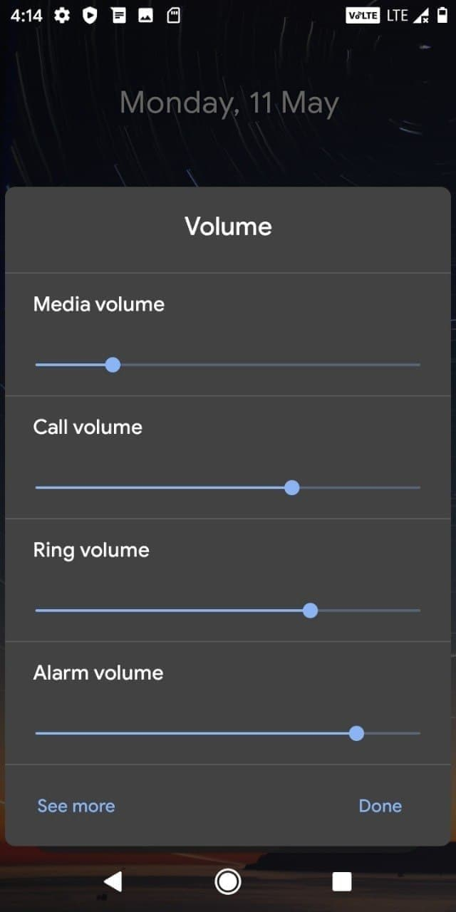</a></td>
    <td colspan="1"><a href="assets/img/11052020/9.jpg">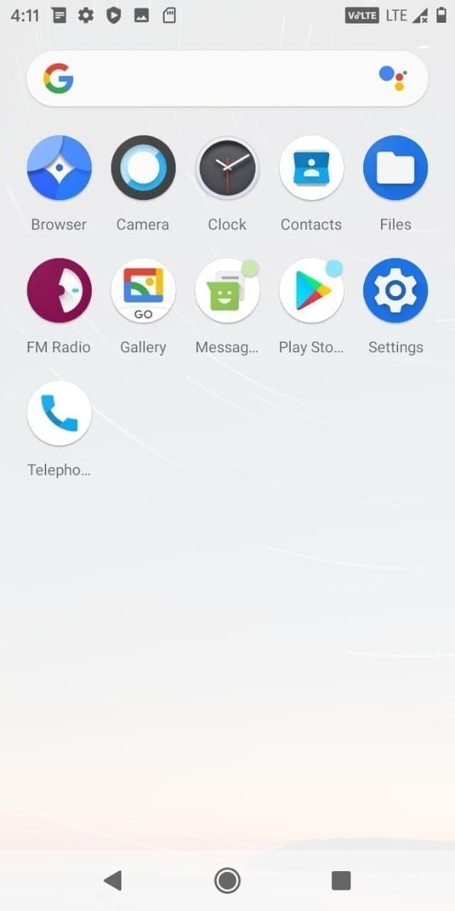</a></td>
    <td colspan="1"><a href="assets/img/11052020/10.jpg">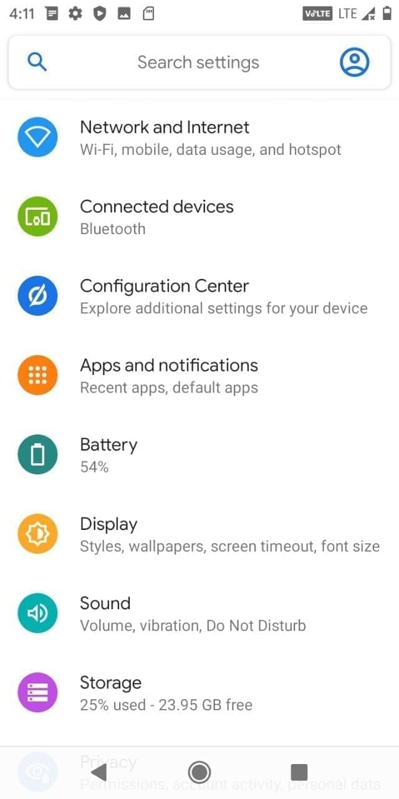</a></td>
  </tr>
  <tr>
    <td colspan="1"><a href="assets/img/11052020/11.jpg">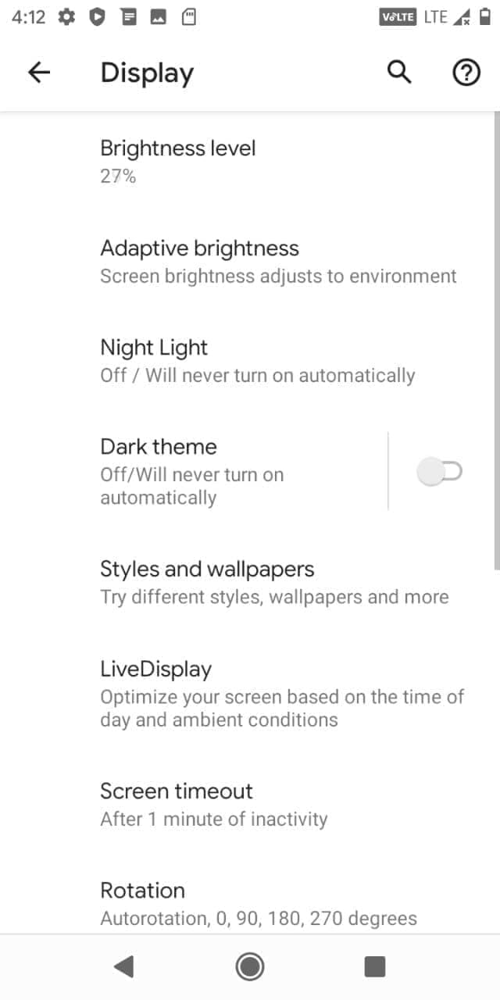</a></td>
    <td colspan="1"><a href="assets/img/11052020/12.jpg">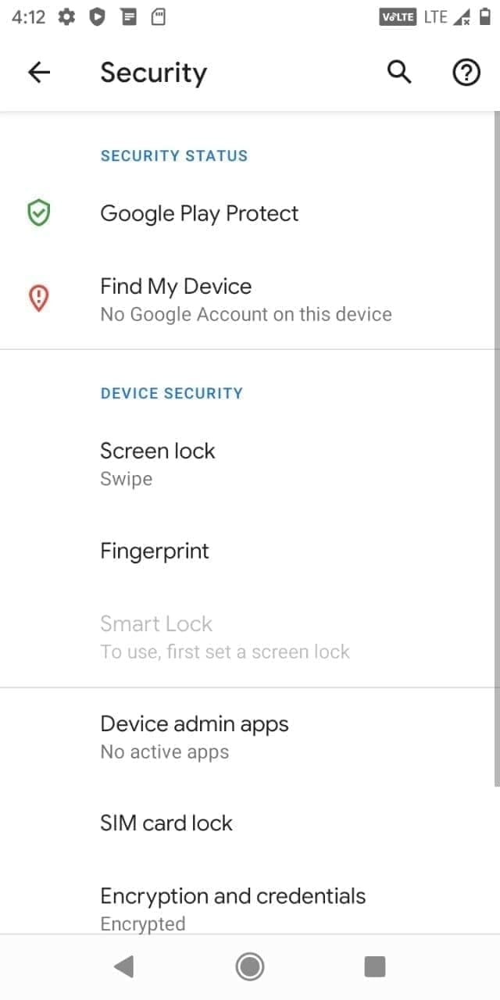</a></td>
    <td colspan="1"><a href="assets/img/11052020/13.jpg">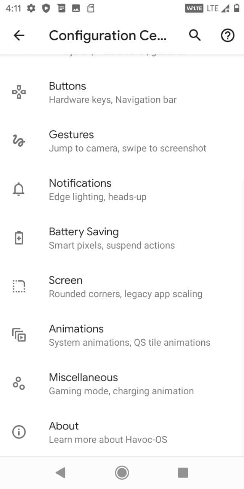</a></td>
    <td colspan="1"><a href="assets/img/11052020/14.jpg">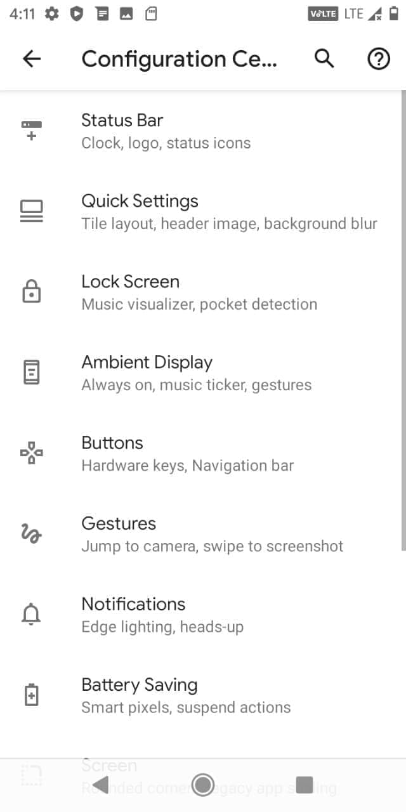</a></td>
    <td colspan="1"><a href="assets/img/11052020/15.jpg">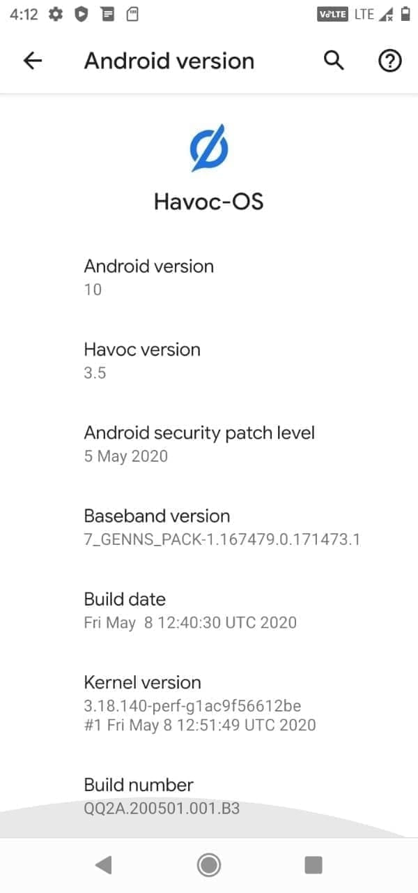</a></td>
  </tr>
</table>

## Credits

Special thanks to [@sairam1411](https://github.com/sairam1411) as maintainer and contributor of [Havoc-OS](https://github.com/Havoc-OS) who helped the ASUS Zenfone Max M1 alive throughout the Android development community.

This archive simply preserves their work for future.