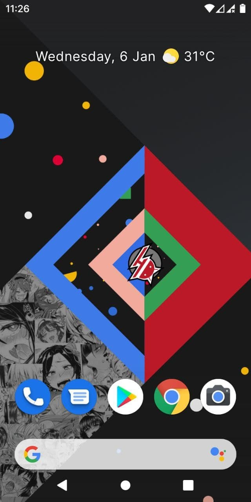
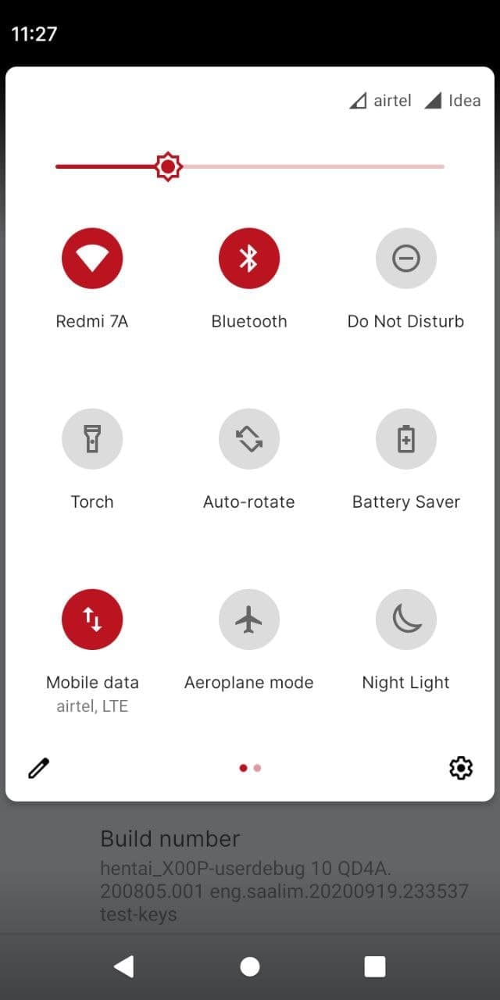
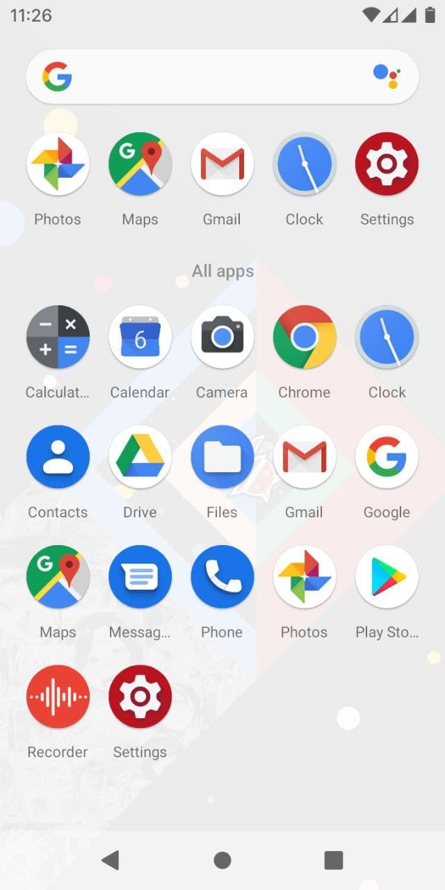
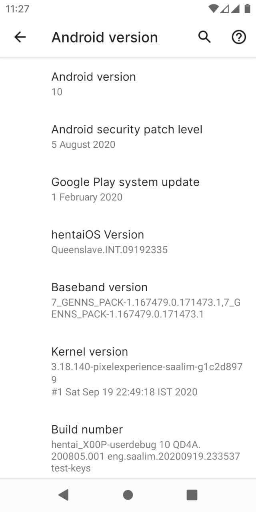

# hentaiOS for ASUS Zenfone Max M1 (X00P/X00PD)

> ***Disclaimer***
>
> *Your warranty is now void. We're not responsible for bricked devices, dead SD cards, thermonuclear war, or you getting fired because the alarm app failed. Please do some research if you have any concerns about features included in this ROM before flashing it! YOU are choosing to make these modifications, and if you point the finger at us for messing up your device, we will laugh at you.*

## Introduction

hentaiOS, a ROM with a questionable name that provides a better Pixel experience, bringing Pixel-exclusive features to you before anyone else. We're also the ROM running on that fake Pixel XE. It's more of a Pixel ROM than PE is.

Despite the name, there's no actual NSFW content in the OS (the only thing that comes close is the default wallpaper, which can always be changed). So no need to worry.

## Installation Instructions
- Wipe System, Vendor, Data, Cache and Dalvik. Also, Format Data.
- Flash ROM
- Reboot

## Downloads
### Android 10
| Version           | Build Date | Status     | Maintainer                                 | Downloads |
| :---------------- | :--------- | :--------- | :----------------------------------------- | :-------- |
| 10 (Queenslave)   | 05/01/2021 | UNOFFICIAL | [@danascape](https://github.com/danascape) | [Internet Archive](https://archive.org/download/x00p-archive/roms/hios/hiOS-Queenslave-X00P-ota.zip)

<strong>Changelog</strong>

- Initial Build

<strong>Notes</strong>

- USE LATEST TWRP ONLY
- CLEAN FLASH NECESSARY
- If you faced any issue or Bug, report it in main group with a logcat attached (go to Google and search Matlog or ADB and learn how to take logs)
- ROM does have GAPPS, so don't flash any Gapps

<strong>Screenshot</strong>

<table>
  <tr>
    <td colspan="1"></td>
    <td colspan="1"></td>
    <td colspan="1"></td>
    <td colspan="1"></td>
  </tr>
</table>

## Credits

Special thanks to [@danascape](https://github.com/danascape) as maintainer and contributor of [hentaiOS](https://gitlab.hentaios.com/hentaios) who helped the ASUS Zenfone Max M1 alive throughout the Android development community.

This archive simply preserves their work for future.