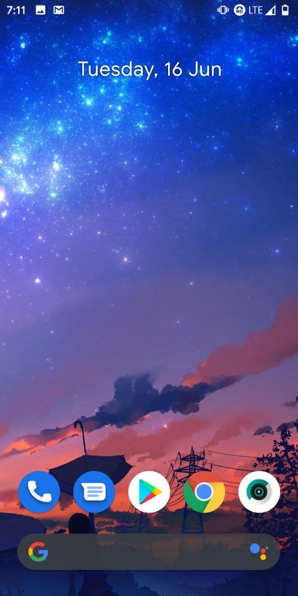
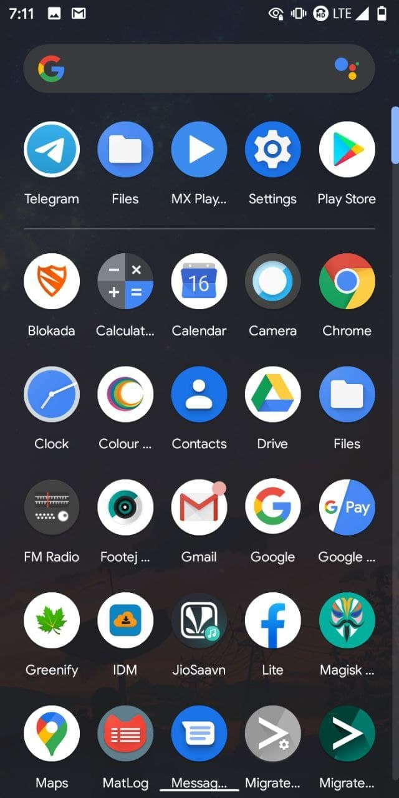
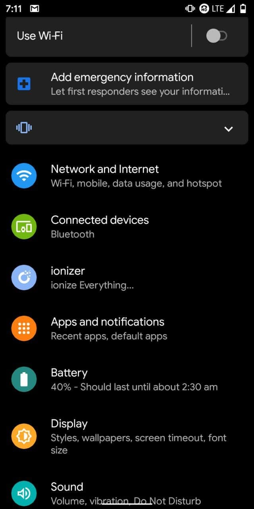
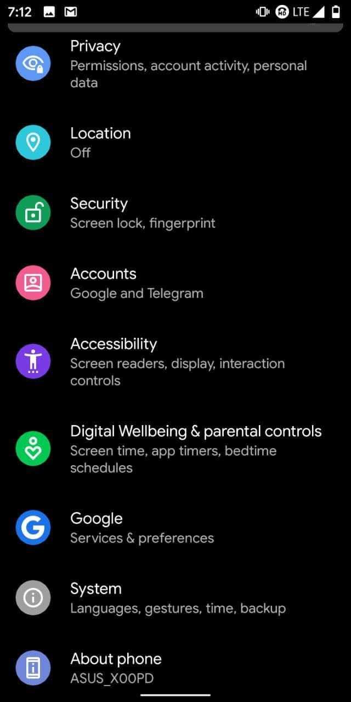
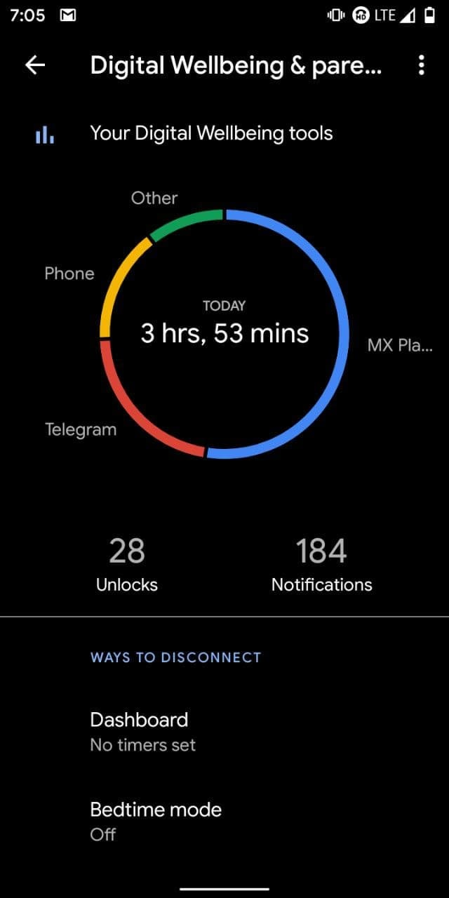
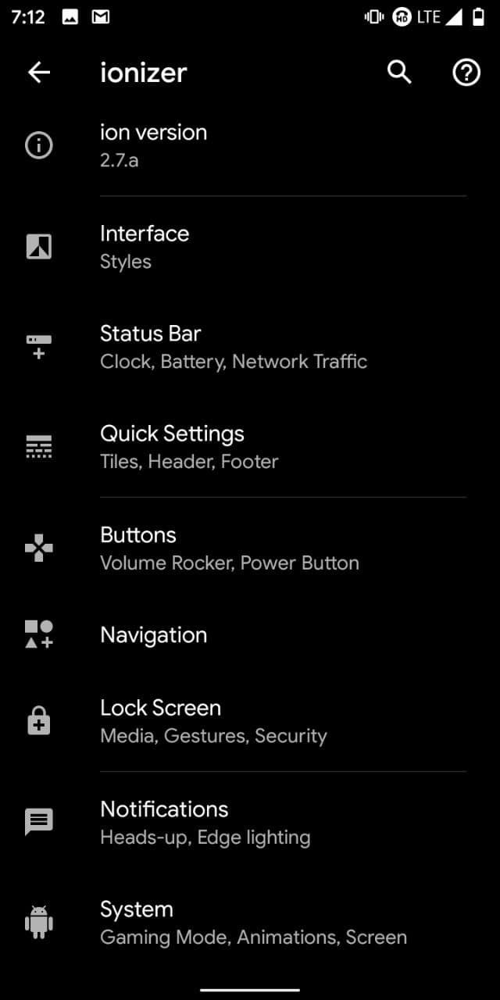
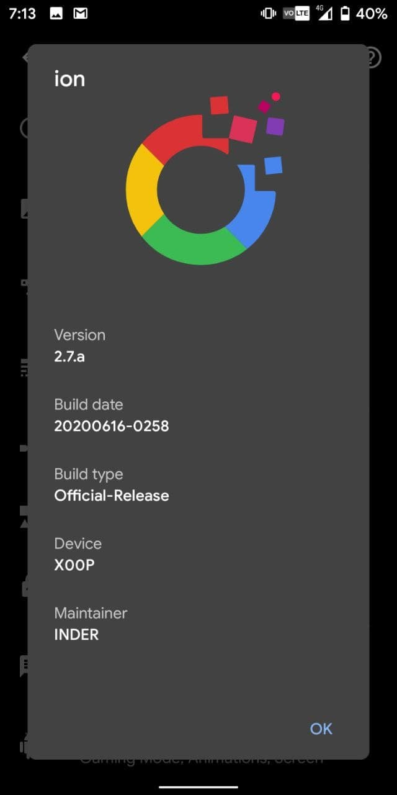
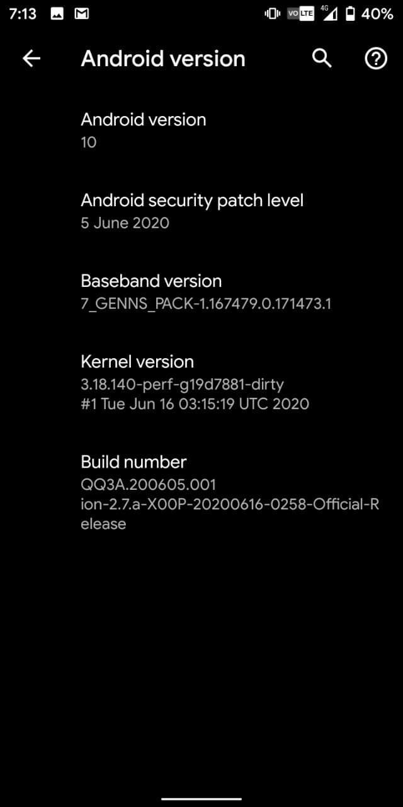
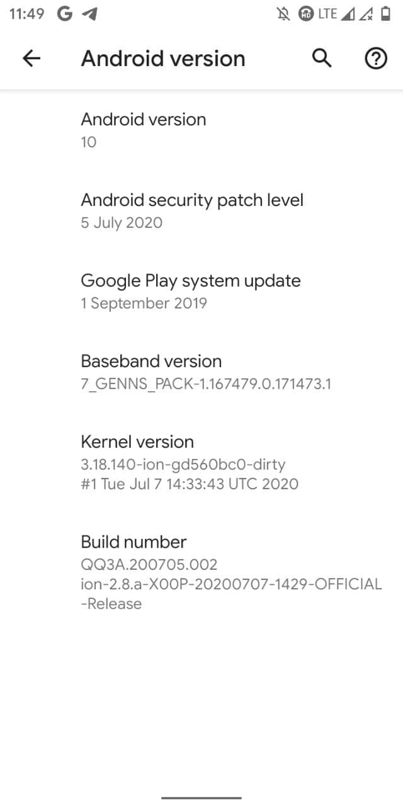

# ion OS for ASUS Zenfone Max M1 (X00P/X00PD)

> ***Disclaimer***
>
> *Your warranty is now void. We're not responsible for bricked devices, dead SD cards, thermonuclear war, or you getting fired because the alarm app failed. Please do some research if you have any concerns about features included in this ROM before flashing it! YOU are choosing to make these modifications, and if you point the finger at us for messing up your device, we will laugh at you.*

## Introduction

ion is based on AOSP including Pixel Goodies & lots of customizations.

## Installation Instructions
- Wipe Dalvik, Cache, Data, System and Vendor from Advanced Wipe in TWRP
- Flash ROM
- Reboot

## Downloads
### Android 10
| Version | Build Date | Status   | Maintainer                         | Downloads |
| :------ | :--------- | :------- | :--------------------------------- | :-------- |
| 2.7.a   | 20/06/2020 | OFFICIAL | [@Inder864](https://t.me/Inder864) | [Internet Archive](https://archive.org/download/x00p-archive/roms/ion/ion-2.7.a-X00P-20200617-0439-OFFICIAL-Release.zip)

<strong>Changelog</strong>

- Initial build

<strong>Bugs</strong>

- Screen Recorder doesn't work

<strong>Notes</strong>

- USE LATEST TWRP ONLY
- If you faced any issue or Bug, report it in main group with a logcat attached ( go to google and search matlog or adb and learn how to take logs)
- ROM have GAPPS, so no need to flash any Gapps.
- Face unlock, Flash and LED Works
- **[ModuleMetadata_0.apk](./assets/20062020/ModuleMetadata_0.apk)** **>** For better performance, install this apk after booting into Ion but make sure to save it to Downloads before flashing Ion. And after installing reboot your phone.

<strong>Screenshot</strong>

<table>
  <tr>
    <td colspan="1"></td>
    <td colspan="1"></td>
    <td colspan="1"></td>
    <td colspan="1"></td>
  </tr>
  <tr>
    <td colspan="1"></td>
    <td colspan="1"></td>
    <td colspan="1"></td>
    <td colspan="1"></td>
  </tr>
</table>

 

| Version | Build Date | Status   | Maintainer                         | Downloads |
| :------ | :--------- | :------- | :--------------------------------- | :-------- |
| 2.7.a   | 29/06/2020 | OFFICIAL | [@Inder864](https://t.me/Inder864) | [Internet Archive](https://archive.org/download/x00p-archive/roms/ion/ion-2.7.a-X00P-20200629-0810-OFFICIAL-Release.zip)

<strong>Changelog</strong>

- Setting crashes fixed
- Added Snapdragon camera

<strong>Bugs</strong>

- Screen Recorder

<strong>Notes</strong>

- USE LATEST TWRP ONLY
- If you faced any issue or Bug, report it in main group with a logcat attached ( go to google and search matlog or adb and learn how to take logs)
- ROM does have GAPPS, so don't flash any Gapps.

 

| Version | Build Date | Status   | Maintainer                         | Downloads |
| :------ | :--------- | :------- | :--------------------------------- | :-------- |
| 2.8.a   | 08/07/2020 | OFFICIAL | [@Inder864](https://t.me/Inder864) | [Internet Archive](https://archive.org/download/x00p-archive/roms/ion/ion-2.8.a-X00P-20200707-1429-OFFICIAL-Release.zip)

<strong>Changelog</strong>

- July Security Patch
- Added per-app sensor blocker
- Adapt screenshot sound to ringer mode
- Added option to change navbar handle thickness
- Added slim recent
- Improve QS header data usage
- Fixed QS blur when no notificaions are showing
- Updated GApps
- Updated to July security patch
- EAS implementation in ROM
- Introduce libperfmgr from Pixel 3 XL (crosshatch)
- Updated perf blobs from Pixel 3 (blueline)
- Converted to binderized light HAL
- Built with full vndk support
- Boosted audio output

<strong>Bugs</strong>

- Screen Recorder

<strong>Notes</strong>

- USE LATEST TWRP ONLY
- If you faced any issue or Bug, report it in main group with a logcat attached (go to Google and search Matlog or ADB and learn how to take logs)
- ROM does have GAPPS, so don't flash any Gapps.

<strong>Screenshot</strong>

<table>
  <tr>
    <td colspan="1"></td>
  </tr>
</table>

## Credits

Special thanks to [@Inder864](https://t.me/Inder864) as maintainer and contributor of [ion OS](https://github.com/i-o-n) who helped the ASUS Zenfone Max M1 alive throughout the Android development community.

This archive simply preserves their work for future.