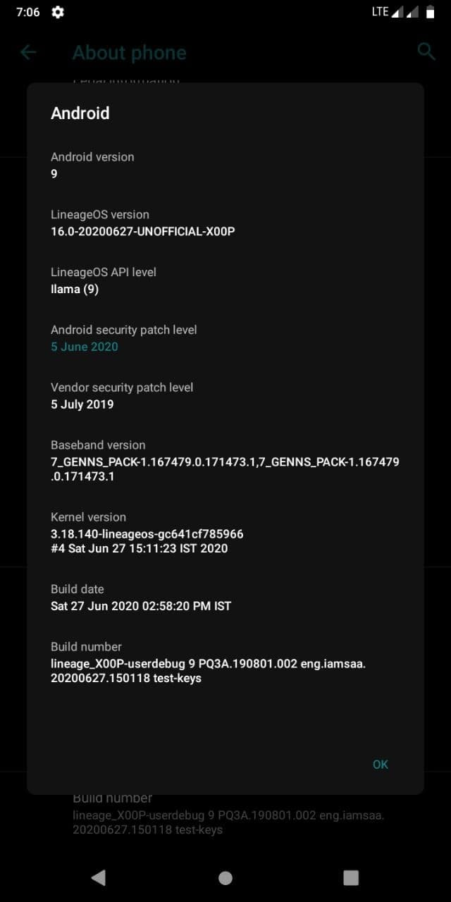
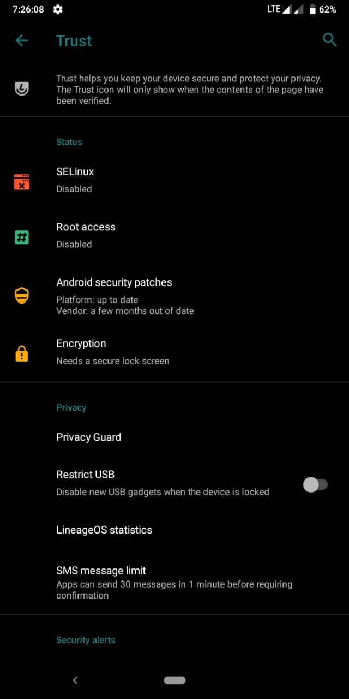
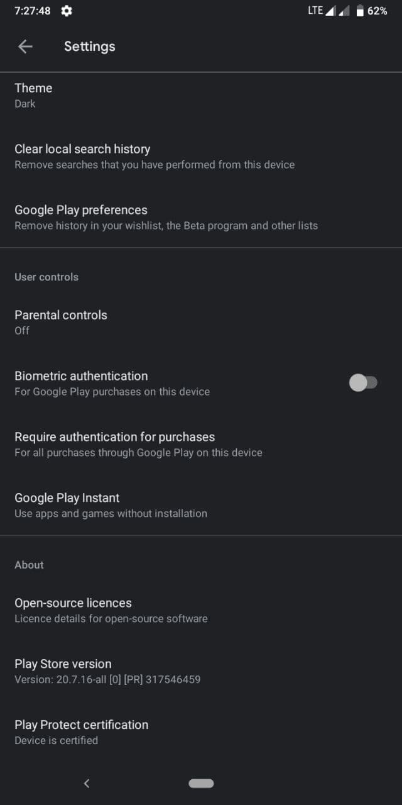

# LineageOS for ASUS Zenfone Max M1 (X00P/X00PD)

> ***Disclaimer***
>
> *Your warranty is now void. We're not responsible for bricked devices, dead SD cards, thermonuclear war, or you getting fired because the alarm app failed. Please do some research if you have any concerns about features included in this ROM before flashing it! YOU are choosing to make these modifications, and if you point the finger at us for messing up your device, we will laugh at you.*

## Introduction

LineageOS is a free, community built, aftermarket firmware distribution of Android, which is designed to increase performance and reliability over stock Android for your device.

LineageOS is based on the Android Open Source Project with extra contributions from many people within the Android community. It can be used without any need to have any Google application installed. Linked below is a package that has come from another Android project that restore the Google parts. LineageOS does still include various hardware-specific code, which is also slowly being open-sourced anyway.

All the source code for LineageOS is available in the LineageOS Github repo. And if you would like to contribute to LineageOS, please visit out Gerrit Code Review.

## What's Working
- Boots
- RIL
- Fingerprint
- Wi-Fi
- Bluetooth
- Camera
- Audio
- Sensors
- Flash
- GPS

## Installation Instructions
- Download the latest build.
- Reboot to recovery
- Wipe System, Vendor
- Format Data (type yes)
- Flash the build
- Flash Gapps (*Optional*)
- Reboot

## Downloads
### Android 9
| Version | Build Date | Status     | Maintainer                                 | Downloads |
| :------ | :--------- | :--------- | :----------------------------------------- | :-------- |
| 16.0    | 27/06/2020 | UNOFFICIAL | [@danascape](https://github.com/danascape) | [Sourceforge](https://sourceforge.net/projects/zenfone-max-m1-files/files/lineage/lineage-16.0-20200627-UNOFFICIAL-X00P.zip/download)  [Internet Archive](https://archive.org/download/x00p-archive/roms/los/lineage-16.0-20200627-UNOFFICIAL-X00P.zip)

<strong>Changelog</strong>

- N/A

<strong>Notes</strong>

- USE LATEST TWRP ONLY
- If you faced any issue or Bug, report it in main group with a logcat attached ( go to google and search matlog or adb and learn how to take logs)
- ROM doesn't have GAPPS, so flash Nano or Pico gapps.

<strong>Screenshot</strong>

<table>
  <tr>
    <td colspan="1"></td>
    <td colspan="1"></td>
    <td colspan="1"></td>
  </tr>
</table>

### Android 10
| Version | Build Date | Status     | Maintainer                                   | Downloads |
| :------ | :--------- | :--------- | :------------------------------------------- | :-------- |
| 17.1    | 23/04/2020 | UNOFFICIAL | [@RazaDroid](https://github.com/DelightReza) | [Sourceforge](https://sourceforge.net/projects/razadroidproject/files/X00P/lineageos/lineage-17.1-20200423-UNOFFICIAL-X00P.zip/download)  [Internet Archive](https://archive.org/download/x00p-archive/roms/los/lineage-17.1-20200423-UNOFFICIAL-X00P.zip)

<strong>Changelog</strong>

- Lineage 17.1
- Update blobs from LA.UM.8.6.2.r1-06600-89xx.0
- Pass Safety Net
- More I forgot

<strong>Notes</strong>

- USE LATEST TWRP ONLY
- If you faced any issue or Bug, report it in main group with a logcat attached ( go to google and search matlog or adb and learn how to take logs)
- ROM doesn't have GAPPS, so flash Nano or Pico gapps.

 

| Version | Build Date | Status     | Maintainer                                 | Downloads |
| :------ | :--------- | :--------- | :----------------------------------------- | :-------- |
| 17.1    | 19/06/2020 | UNOFFICIAL | [@althafvly](https://github.com/althafvly) | [Internet Archive](https://archive.org/download/x00p-archive/roms/los/lineage-17.1-20200619-UNOFFICIAL-X00P.zip)

<strong>Changelog</strong>

- Thermal fixes (might improve battery backup)
- RIL fixes

<strong>Notes</strong>

- USE LATEST TWRP ONLY
- If you faced any issue or Bug, report it in main group with a logcat attached ( go to google and search matlog or adb and learn how to take logs)
- ROM doesn't have GAPPS, so flash Nano or Pico gapps.

## Credits

Special thanks to [@RazaDroid](https://github.com/DelightReza), [@althafvly](https://github.com/althafvly), [@danascape](https://github.com/danascape) as maintainer and contributor of [LineageOS](https://github.com/lineageos) who helped the ASUS Zenfone Max M1 alive throughout the Android development community.

This archive simply preserves their work for future.