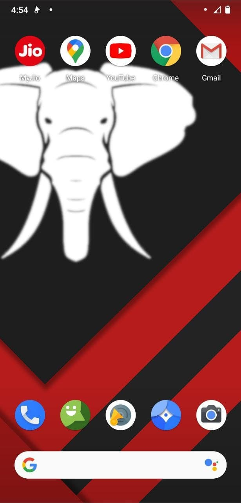
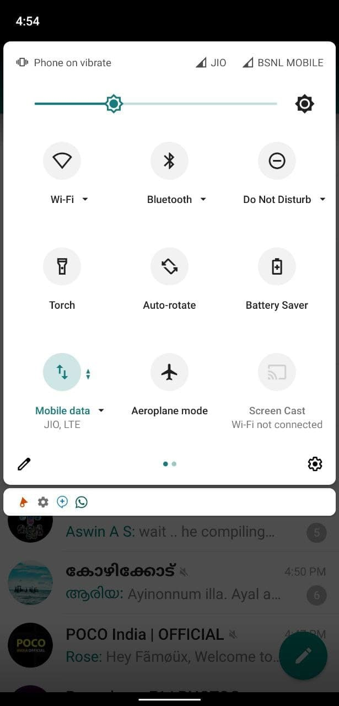
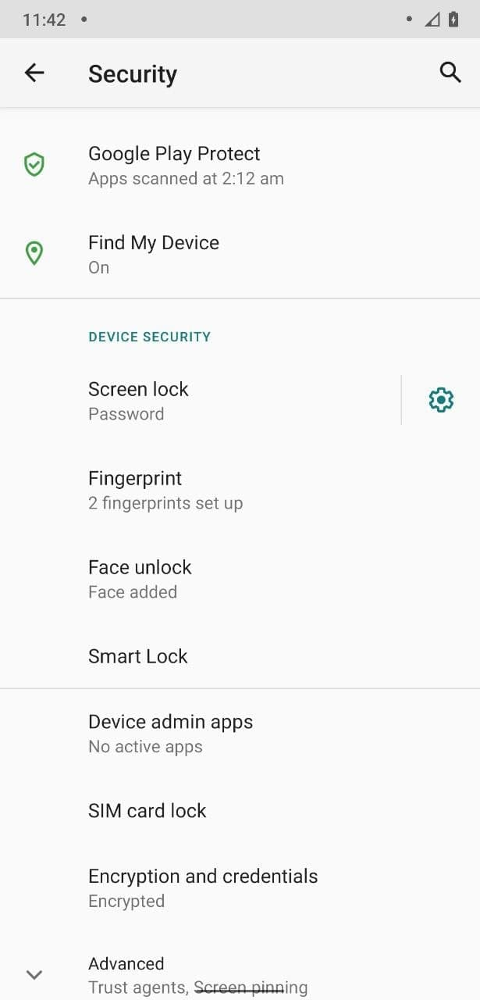
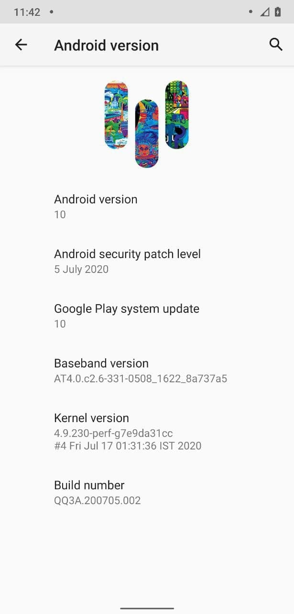

# MalluOS for ASUS Zenfone Max M1 (X00P/X00PD)

> ***Disclaimer***
>
> *Your warranty is now void. We're not responsible for bricked devices, dead SD cards, thermonuclear war, or you getting fired because the alarm app failed. Please do some research if you have any concerns about features included in this ROM before flashing it! YOU are choosing to make these modifications, and if you point the finger at us for messing up your device, we will laugh at you.*

## Introduction

MalluOS is a free, community built, aftermarket firmware distribution of Android 10 (Q), which is designed to increase performance and reliability over stock Android for your device.

MalluOS is based on the LineageOS Project with extra contributions from many people within the Mallu Android community. It can be used without any need to have any Google application installed. You will need to provide your own Google Applications package (gapps). LineageOS does still include various hardware-specific code, which is also slowly being open-sourced anyway.

## Installation Instructions
- Wipe Dalvik, Cache, Data, System and Vendor from Advanced Wipe in TWRP
- Flash ROM and GApps
- Reboot

## Downloads
### Android 10
| Version | Build Date | Status   | Maintainer                                 | Downloads |
| :------ | :--------- | :------- | :----------------------------------------- | :-------- |
| 10.0    | 17/07/2020 | OFFICIAL | [@althafvly](https://github.com/althafvly) | [Internet Archive](https://archive.org/download/x00p-archive/roms/mallu/MalluOS-10.0-20200717-X00P-OFFICIAL.zip)

<strong>Changelog</strong>

- Initial Build

<strong>Notes</strong>

- USE LATEST TWRP ONLY
- If you faced any issue or Bug, report it in main group with a logcat attached (go to Google and search Matlog or ADB and learn how to take logs)
- ROM doesn't have GAPPS, so do flash Nano or Pico OpenGapps.

<strong>Screenshot</strong>

_(Screenshots from other device)_
<table>
  <tr>
    <td colspan="1"></td>
    <td colspan="1"></td>
    <td colspan="1"></td>
    <td colspan="1"></td>
  </tr>
</table>

## Credits

Special thanks to [@althafvly](https://github.com/althafvly) as maintainer and contributor of [MalluOS](https://github.com/MalluOS) who helped the ASUS Zenfone Max M1 alive throughout the Android development community.

This archive simply preserves their work for future.