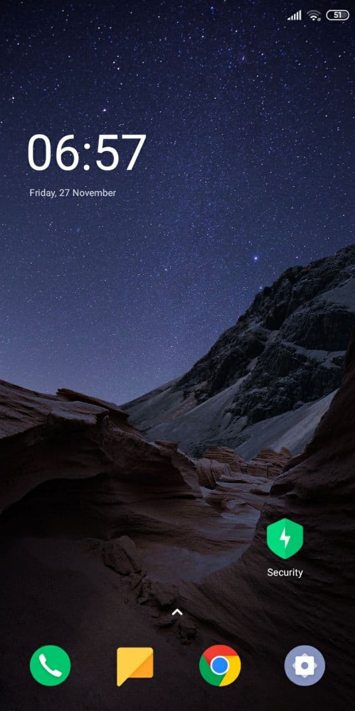
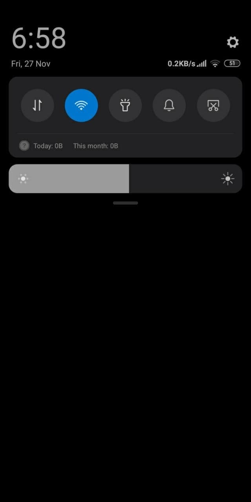
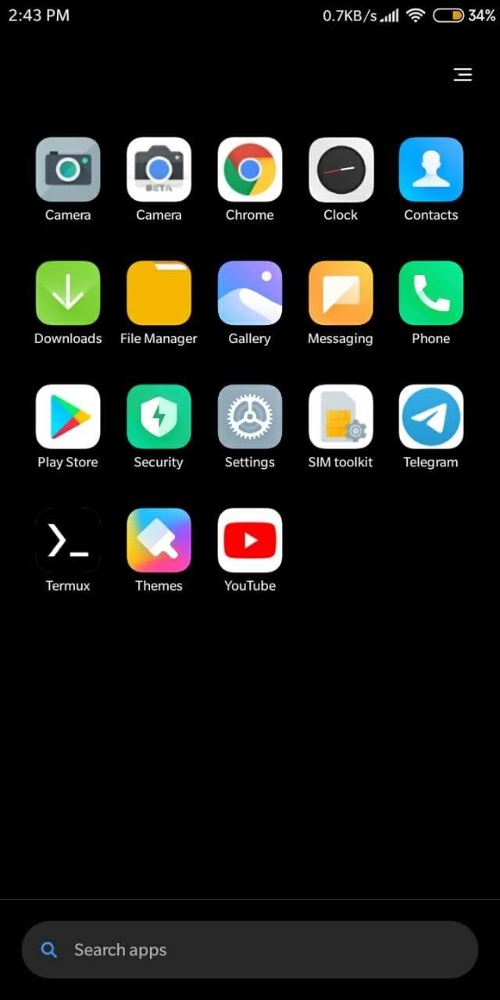
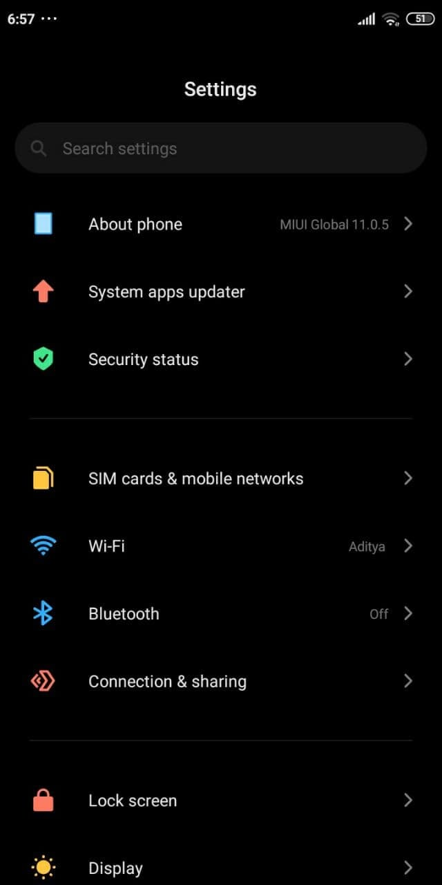
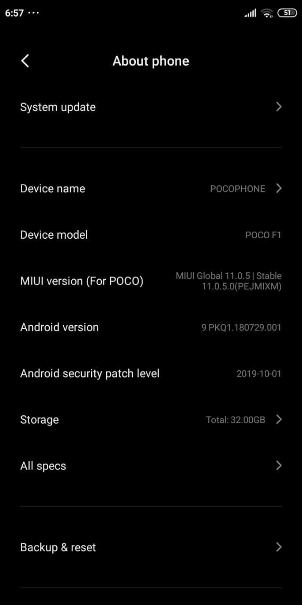
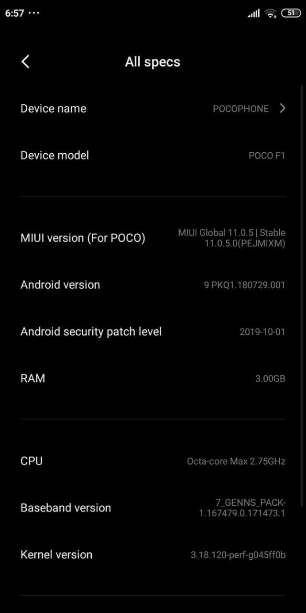

# MIUI for ASUS Zenfone Max M1 (X00P/X00PD)

> ***Disclaimer***
>
> *Your warranty is now void. We're not responsible for bricked devices, dead SD cards, thermonuclear war, or you getting fired because the alarm app failed. Please do some research if you have any concerns about features included in this ROM before flashing it! YOU are choosing to make these modifications, and if you point the finger at us for messing up your device, we will laugh at you.*

## Introduction

Ported ROM based on MIUI by Xiaomi.

## Installation Instructions
-  Wipe Dalvik, Cache, Data, System and Vendor from Advanced Wipe in TWRP
-  Flash Firmware 9 (Pie), **[HERE](./assets/27112020/Firmware_Pie_Only_X00P.zip)**
-  Flash ROM
-  Flash Permissiver v5, **[HERE](./assets/27112020/Permissiver_v5.zip)**
-  Reboot system

## Downloads
### Android 9
| Version  | Build Date | Status           | Maintainer                                        | Downloads |
| :------- | :--------- | :--------------- | :------------------------------------------------ | :-------- |
| 11.0.5.0 | 27/11/2020 | UNOFFICIAL(PORT) | [@NewbieDeveloper](https://t.me/NewbieDevProject) | [Internet Archive](https://archive.org/download/x00p-archive/roms/miui/MIUI-11-X00P-20202611-UNOFFICIAL.zip)

<strong>Changelog</strong>

- Initial release
- 2019 Sec Patch

<strong>Bugs</strong>

- Reading mode off
- Hotspot off

<strong>Notes</strong>

- Cam empty, so use gcam
- After first booting, screen is giant, go to developer option and set screen dpi to 400-480
- After first booting, install play services for updates manually
- Gap status bar?, Go to developer option, and set simulate cutout to Notch Killer

<strong>Screenshot</strong>

<table>
  <tr>
    <td colspan="1"></td>
    <td colspan="1"></td>
    <td colspan="1"></td>
  </tr>
    <td colspan="1"></td>
    <td colspan="1"></td>
    <td colspan="1"></td>
  <tr>
  </tr>
</table>

## Credits

Special thanks to [@NewbieDeveloper](https://t.me/NewbieDevProject) as maintainer and contributor of MIUI who helped the ASUS Zenfone Max M1 alive throughout the Android development community.

This archive simply preserves their work for future.