# Paranoid Android for ASUS Zenfone Max M1 (X00P/X00PD)

> ***Disclaimer***
>
> *Your warranty is now void. We're not responsible for bricked devices, dead SD cards, thermonuclear war, or you getting fired because the alarm app failed. Please do some research if you have any concerns about features included in this ROM before flashing it! YOU are choosing to make these modifications, and if you point the finger at us for messing up your device, we will laugh at you.*

## Introduction

Paranoid Android is a custom ROM aiming to extend the system, working on enhancing the already existing beauty of Android and following the same design philosophies that were set forward by Google for Android Open Source Project.

We try and provide a fluid experience, with enhancements, rather than features. This is a minimalist’s rom. Everything added fits with the feel Android provides. In use, you will feel right at home and grow attached to the small additions added into this project.

## Installation Instructions
-  Wipe Dalvik, Cache, Data, System and Vendor from Advanced Wipe in TWRP
-  Flash ROM
-  Reboot

## Downloads
### Android 10
| Version  | Build Date | Status     | Maintainer                                                                                    | Downloads |
| :------- | :--------- | :--------- | :-------------------------------------------------------------------------------------------- | :-------- |
| Quartz 5 | 23/08/2020 | UNOFFICIAL | [@flamefusion](https://github.com/Flamefusion) [@danascape](https://github.com/danascape) | [Internet Archive](https://archive.org/download/x00p-archive/roms/pa/pa-quartz-5-X00P-20200822-dev.zip)

<strong>Changelog</strong>

- Initial Build

<strong>Notes</strong>

- USE LATEST TWRP ONLY
- If you faced any issue or Bug, report it in main group with a logcat attached (go to Google and search Matlog or ADB and learn how to take logs)
- ROM doesn't have GAPPS, so do flash Nano or Pico OpenGapps.

<strong>Screenshot</strong>

<table>
  <tr>
    <td colspan="1"><a href="assets/img/23082020/1.jpg">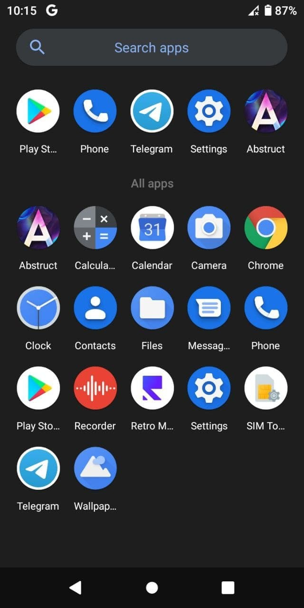</a></td>
    <td colspan="1"><a href="assets/img/23082020/2.jpg">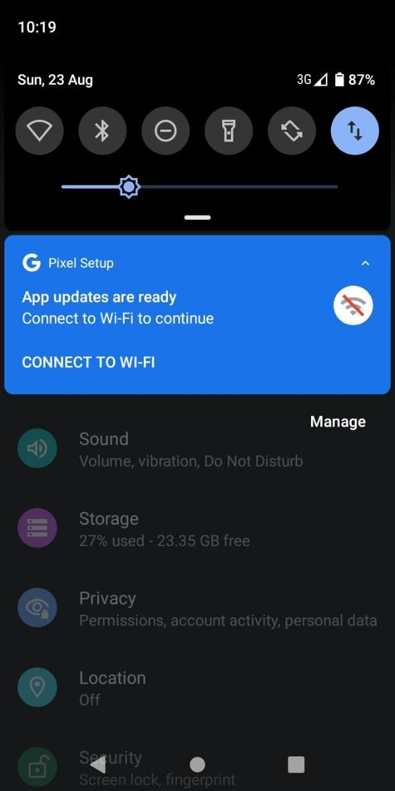</a></td>
    <td colspan="1"><a href="assets/img/23082020/3.jpg">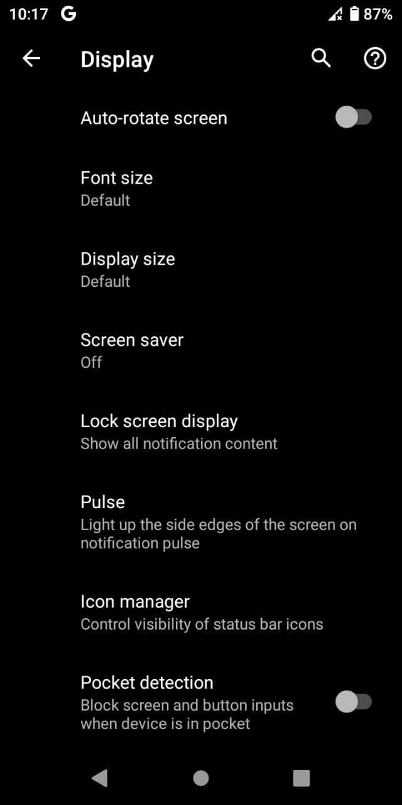</a></td>
    <td colspan="1"><a href="assets/img/23082020/4.jpg">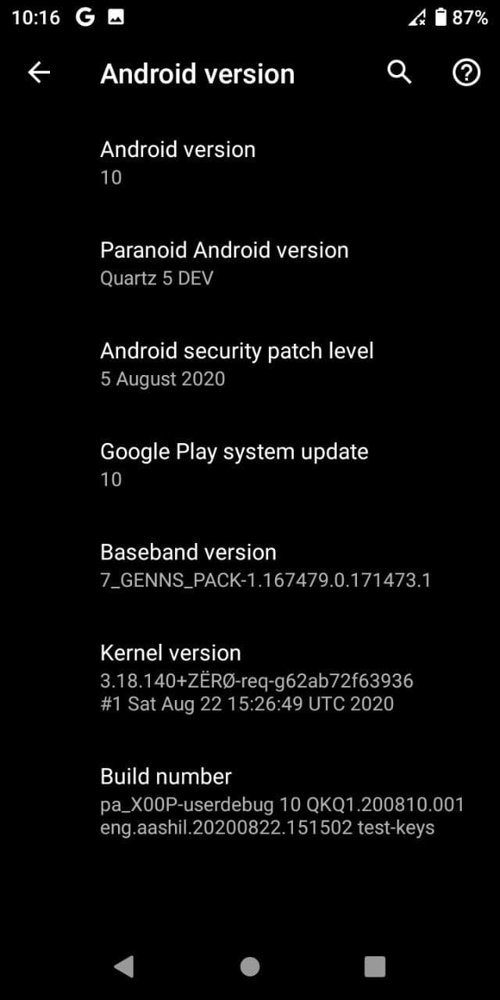</a></td>
  </tr>
</table>

 

| Version  | Build Date | Status     | Maintainer                                                                                    | Downloads |
| :------- | :--------- | :--------- | :-------------------------------------------------------------------------------------------- | :-------- |
| Quartz 5 | 22/09/2020 | UNOFFICIAL | [@flamefusion](https://github.com/Flamefusion) [@danascape](https://github.com/danascape) | [Internet Archive](https://archive.org/download/x00p-archive/roms/pa/pa-quartz-5-X00P-20200922-dev.zip)

<strong>Changelog</strong>

- Fix night light
- Performance improvement

<strong>Bugs</strong>

- Flash dead in default camera, so use Gcam for now

<strong>Notes</strong>

- USE LATEST TWRP ONLY
- CLEAN FLASH NECESSARY
- If you faced any issue or Bug, report it in main group with a logcat attached (go to Google and search Matlog or ADB and learn how to take logs)
- ROM does have GAPPS, so don't flash any Gapps

<strong>Screenshot</strong>

<table>
  <tr>
    <td colspan="1"><a href="assets/img/22092020/1.jpg">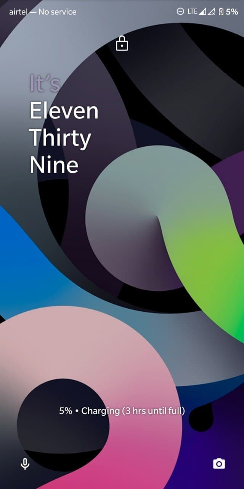</a></td>
    <td colspan="1"><a href="assets/img/22092020/2.jpg">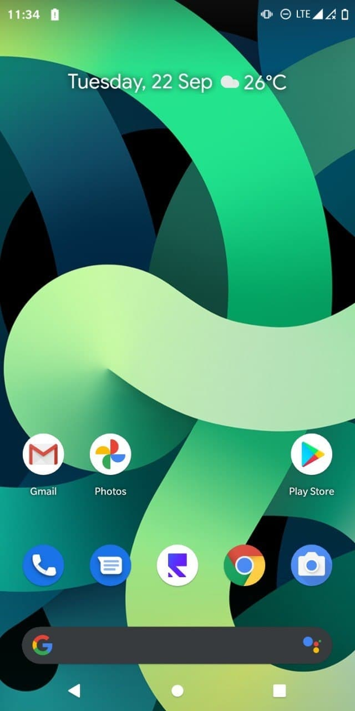</a></td>
    <td colspan="1"><a href="assets/img/22092020/3.jpg">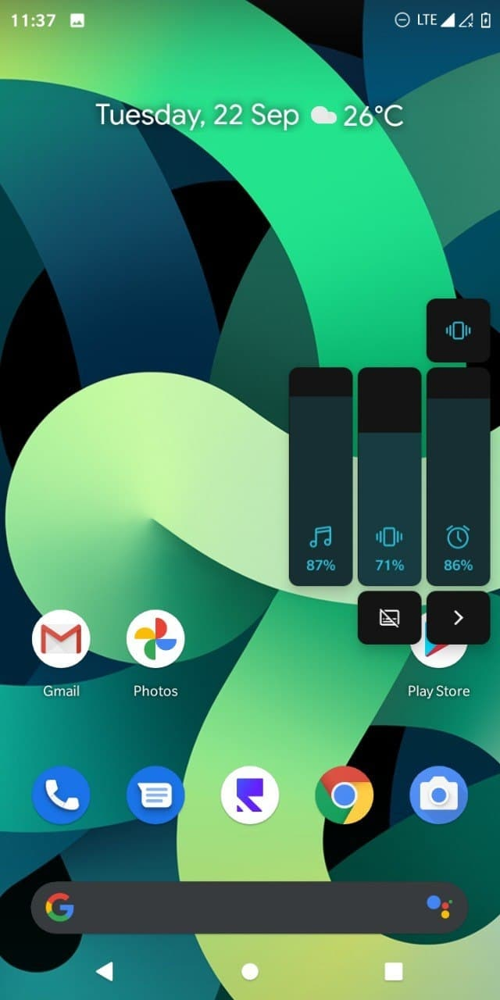</a></td>
    <td colspan="1"><a href="assets/img/22092020/4.jpg">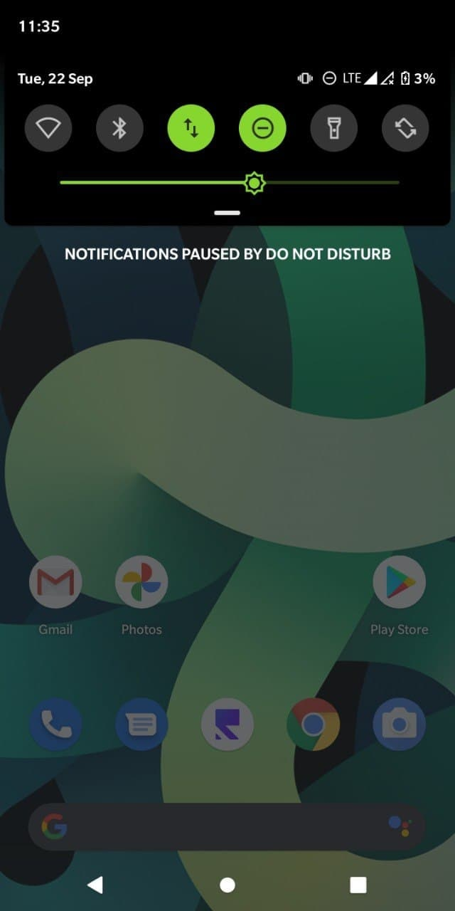</a></td>
    <td colspan="1"><a href="assets/img/22092020/5.jpg">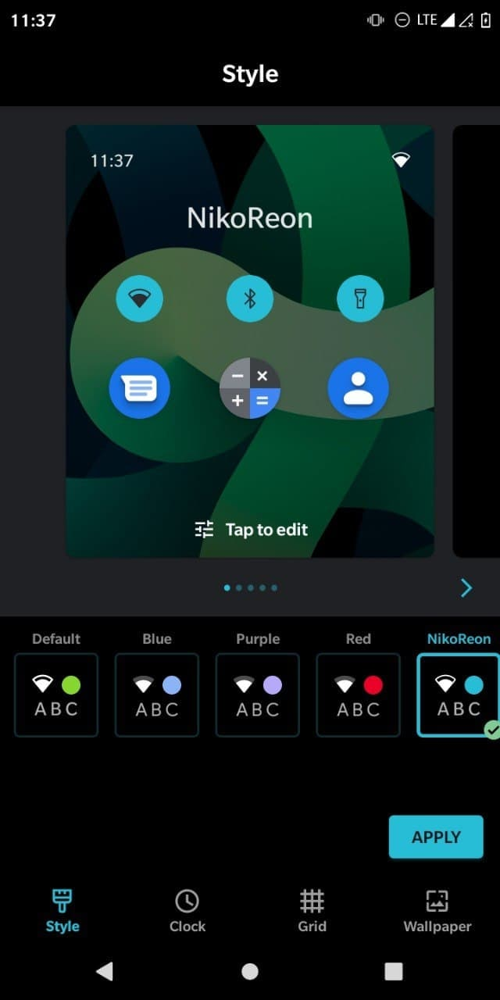</a></td>
  </tr>
    <td colspan="1"><a href="assets/img/22092020/6.jpg">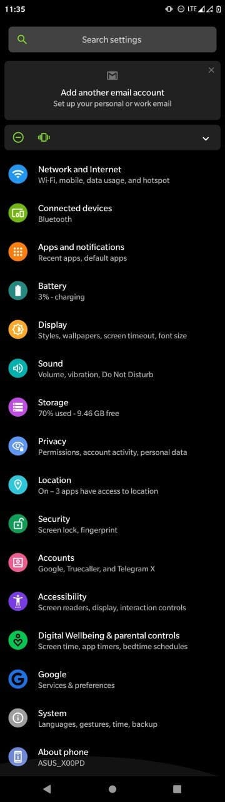</a></td>
    <td colspan="1"><a href="assets/img/22092020/7.jpg">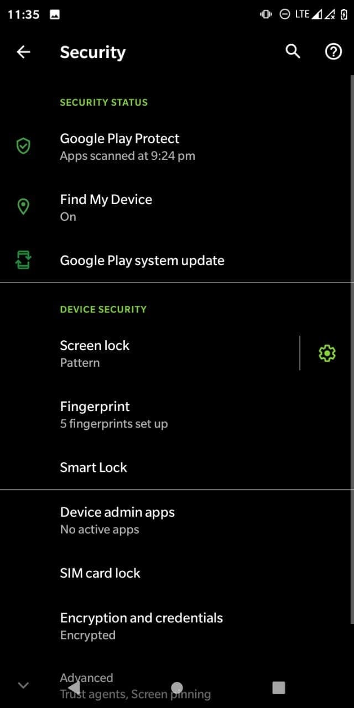</a></td>
    <td colspan="1"><a href="assets/img/22092020/8.jpg">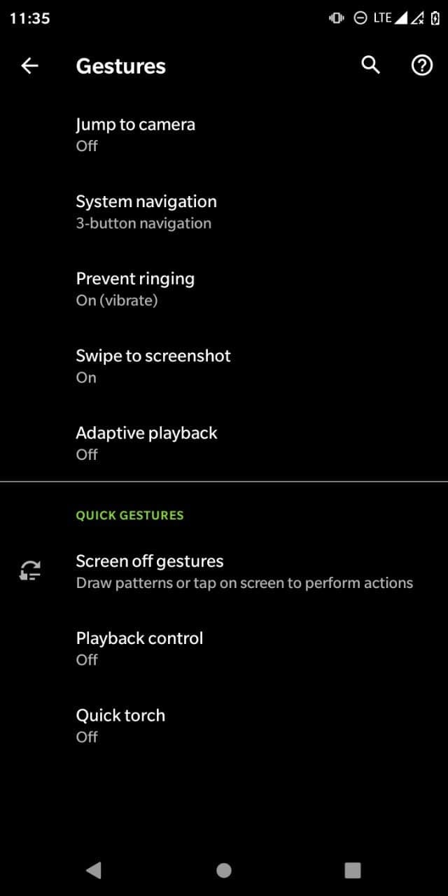</a></td>
    <td colspan="1"><a href="assets/img/22092020/9.jpg">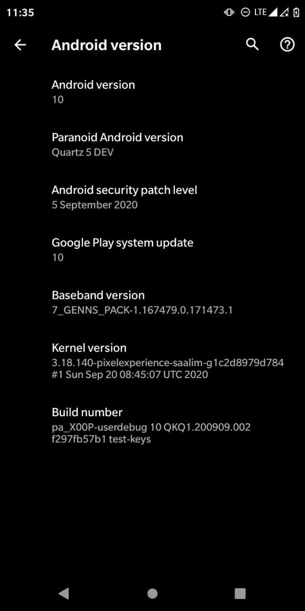</a></td>
  </tr>
</table>

## Credits

Special thanks to [@flamefusion](https://github.com/Flamefusion), [@danascape](https://github.com/danascape) as maintainer and contributor of [Paranoid Android](https://github.com/AOSPA) who helped the ASUS Zenfone Max M1 alive throughout the Android development community.

This archive simply preserves their work for future.