# Resurrection Remix OS for ASUS Zenfone Max M1 (X00P/X00PD)

> ***Disclaimer***
>
> *Your warranty is now void. We're not responsible for bricked devices, dead SD cards, thermonuclear war, or you getting fired because the alarm app failed. Please do some research if you have any concerns about features included in this ROM before flashing it! YOU are choosing to make these modifications, and if you point the finger at us for messing up your device, we will laugh at you.*

## Introduction

Resurrection Remix the ROM has been based on LineageOS, SlimRoms, Omni and original Remix ROM builds, this creates an awesome combination of performance, customization, power and the most new features, brought directly to your Device.

Many things that in previous versions were tweaked with mods, are now included by default in the ROM so, please enjoy! Special thanks to the LineageOS team, Omni team, SlimRoms and of course to all the supporters.

## Installation Instructions
-  Make sure you have a custom recovery installed(TWRP is the preferred recovery)
-  Download the latest Resurrection Remix Rom & the latest GApps package
-  Boot into recovery
-  Perform wipe/system and dalvik cache as a precaution
-  Flash Resurrection Remix Rom
-  Flash Google Apps package (_Optional_)
-  Flash Magisk Root (_Optional_)
-  First boot may take up to 10 minutes.

## Downloads
### Android 10
| Version | Build Date | Status   | Maintainer                                     | Downloads |
| :------ | :--------- | :------- | :--------------------------------------------- | :-------- |
| 8.5.8   | 16/08/2020 | OFFICIAL | [@flamefusion](https://github.com/Flamefusion) | [Internet Archive](https://archive.org/download/x00p-archive/roms/rr/RROS-Q-8.5.8-20200815-X00P-Official.zip)

<strong>Changelog</strong>

- Initial OFFICIAL build

<strong>Bugs</strong>

- Charging LED

<strong>Notes</strong>

- USE LATEST TWRP ONLY
- If you faced any issue or Bug, report it in main group with a logcat attached (go to Google and search Matlog or ADB and learn how to take logs)
- ROM doesn't have GAPPS, so do flash Nano or Pico OpenGapps.

<strong>Screenshot</strong>

<table>
  <tr>
    <td colspan="1"></td>
    <td colspan="1"><a href="assets/img/16082020/2.jpg">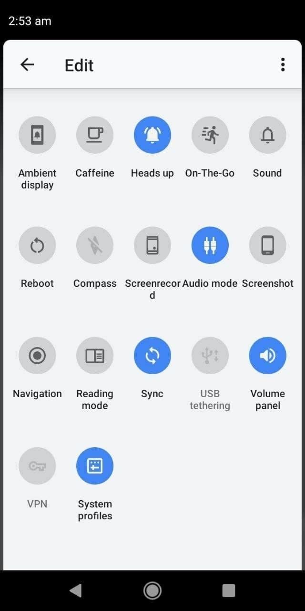</a></td>
    <td colspan="1"><a href="assets/img/16082020/3.jpg">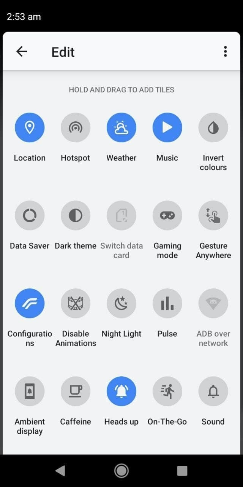</a></td>
    <td colspan="1"><a href="assets/img/16082020/4.jpg">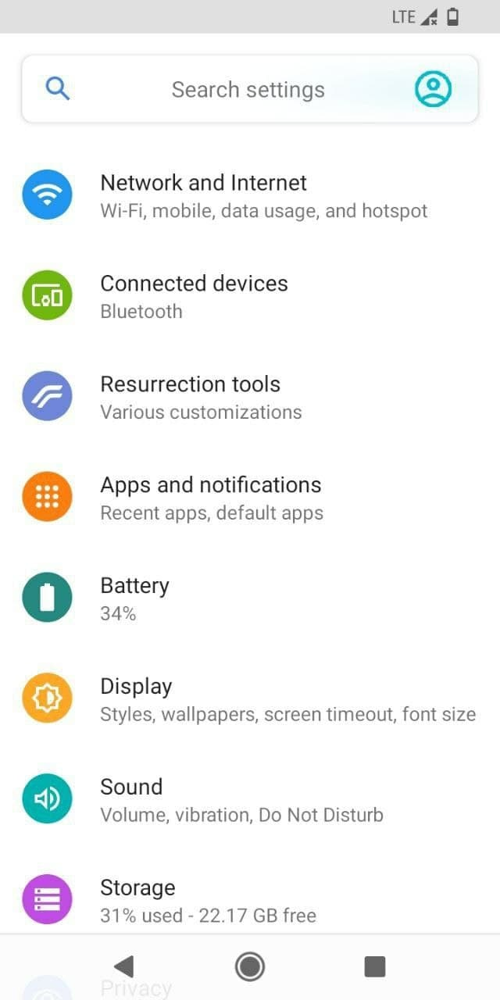</a></td>
    <td colspan="1"><a href="assets/img/16082020/5.jpg">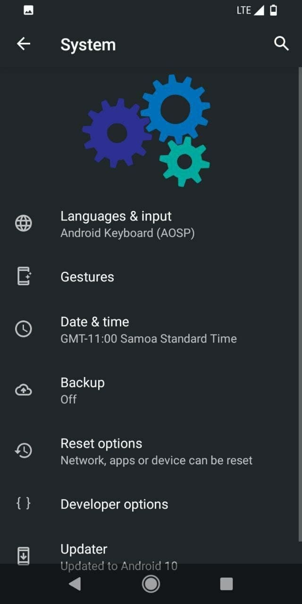</a></td>
  </tr>
  <tr>
    <td colspan="1"><a href="assets/img/16082020/6.jpg">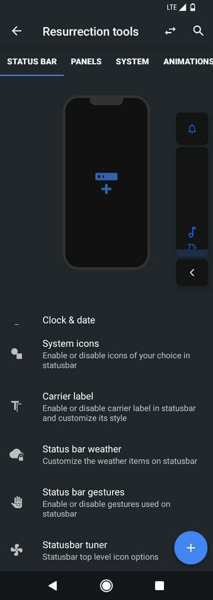</a></td>
    <td colspan="1"><a href="assets/img/16082020/7.jpg">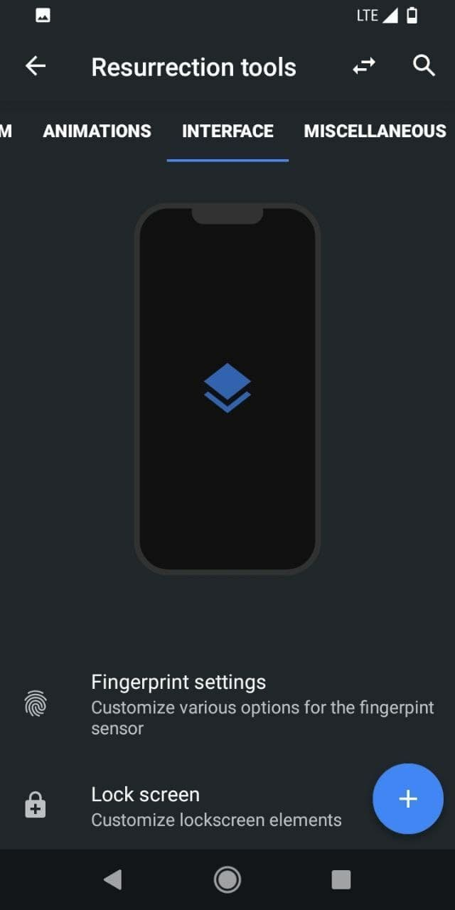</a></td>
    <td colspan="1"><a href="assets/img/16082020/8.jpg">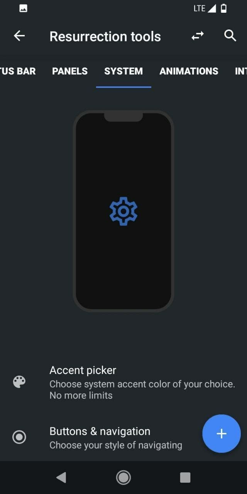</a></td>
    <td colspan="1"><a href="assets/img/16082020/9.jpg">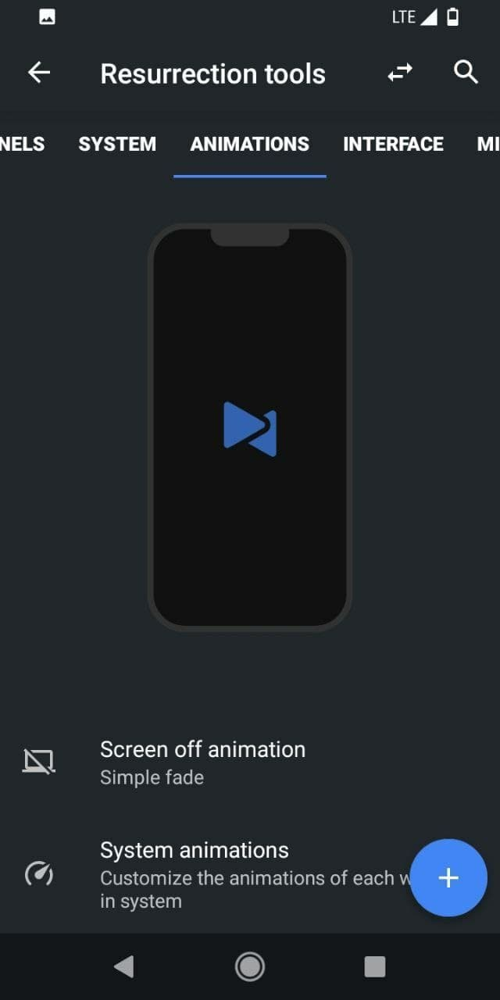</a></td>
    <td colspan="1"><a href="assets/img/16082020/10.jpg">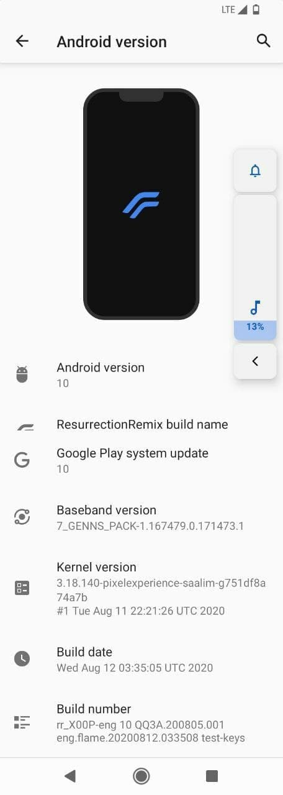</a></td>
  </tr>
</table>

 

| Version | Build Date | Status   | Maintainer                                     | Downloads |
| :------ | :--------- | :------- | :--------------------------------------------- | :-------- |
| 8.6.0   | 20/09/2020 | OFFICIAL | [@flamefusion](https://github.com/Flamefusion) | [Sourceforge](https://sourceforge.net/projects/resurrectionremix-ten/files/X00P/RROS-Q-8.6.0-20200920-X00P-Official.zip/download) [Internet Archive](https://archive.org/download/x00p-archive/roms/rr/RROS-Q-8.6.0-20200920-X00P-Official.zip)

<strong>Changelog</strong>

- Fixed LED light 
- Rebased over LOS tree so Clean Flash is must

<strong>Notes</strong>

- USE LATEST TWRP ONLY
- CLEAN FLASH NECESSARY
- If you faced any issue or Bug, report it in main group with a logcat attached (go to Google and search Matlog or ADB and learn how to take logs)
- ROM doesn't have GAPPS, so do flash Nano or Pico OpenGapps

 

| Version | Build Date | Status     | Maintainer                                         | Downloads |
| :------ | :--------- | :--------- | :------------------------------------------------- | :-------- |
| 8.6.7   | 16/03/2021 | UNOFFICIAL | [@dhimanparas20](https://github.com/dhimanparas20) | [Internet Archive](https://archive.org/download/x00p-archive/roms/rr/RROS-Q-8.6.7-20210316-X00P-Unofficial-VANILLA.zip)

<strong>Changelog</strong>

- Initial build

<strong>Bugs</strong>

- LED ded

<strong>Steps to flash (Important)</strong>

1. Download [Pixel Experience 10](/roms/pe/README.md) rom
2. Download CherishOs
3. Reboot to recovery
4. Wipe 5 partions except internal storage and external storage
5. Flash pixel experience 10 rom  (Most important)
6. After flashing manually reboot To recovery again (don't reboot To system)
7. Then hit on backup and take Backup of vendor image
8. Wipe 5 partions again as point (4)
9. Flash CherishOs zip
10. After flashing hit on home  Button and hit on restore
11. Restore your backed-up vendor  Image
12. Now reboot to system
13. After first boot flash magisk Version 21.4 or above if u want Root access.

<strong>Notes</strong>

- USE LATEST TWRP ONLY
- If you faced any issue or Bug, report it in main group with a logcat attached (go to Google and search Matlog or ADB and learn how to take logs)
- ROM doesn't have GAPPS, so do flash Nano or Pico OpenGapps.

<strong>Screenshot</strong>

<table>
  <tr>
    <td colspan="1"><a href="assets/img/16032021/1.jpg">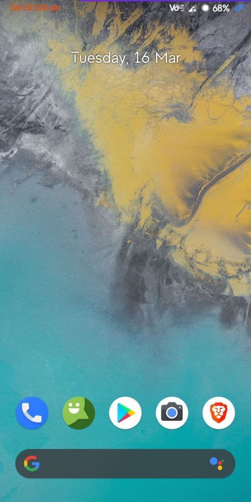</a></td>
    <td colspan="1"><a href="assets/img/16032021/2.jpg">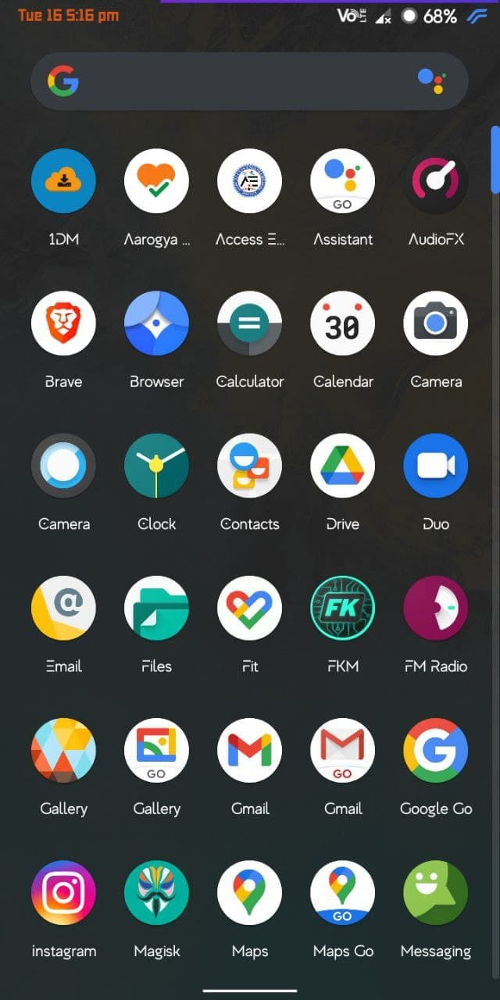</a></td>
    <td colspan="1"><a href="assets/img/16032021/3.jpg">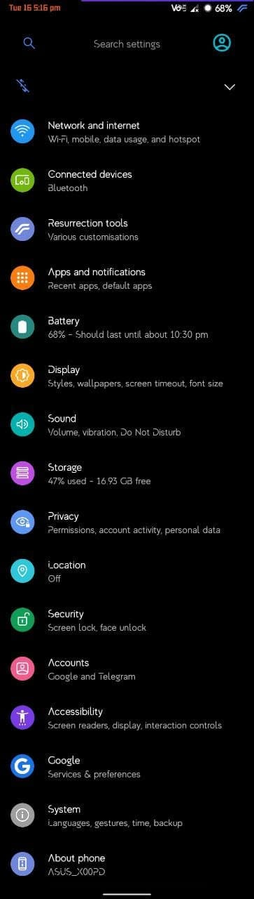</a></td>
    <td colspan="1"><a href="assets/img/16032021/4.jpg">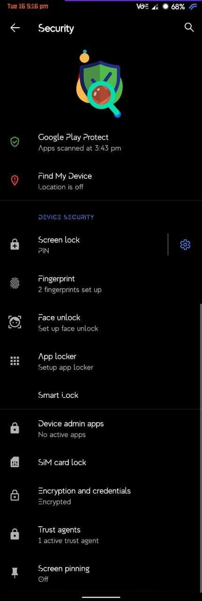</a></td>
    <td colspan="1"><a href="assets/img/16032021/5.jpg">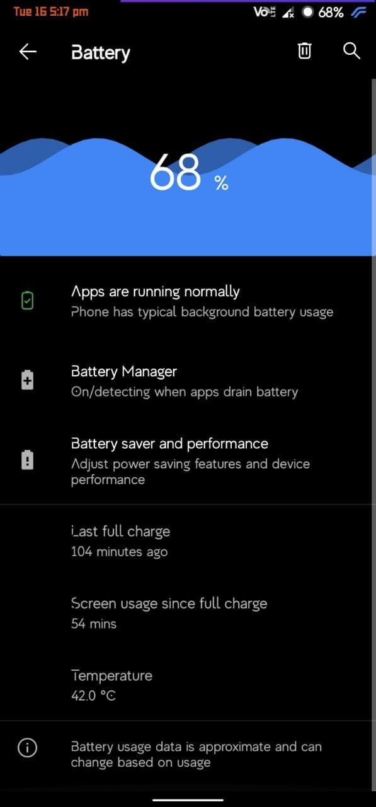</a></td>
  </tr>
    <td colspan="1"><a href="assets/img/16032021/6.jpg">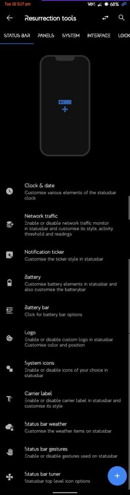</a></td>
    <td colspan="1"><a href="assets/img/16032021/7.jpg">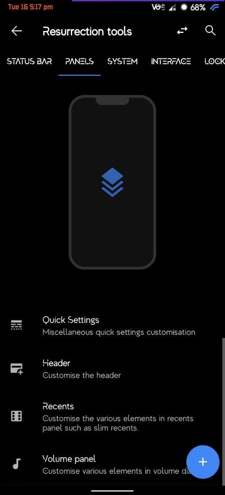</a></td>
    <td colspan="1"><a href="assets/img/16032021/8.jpg">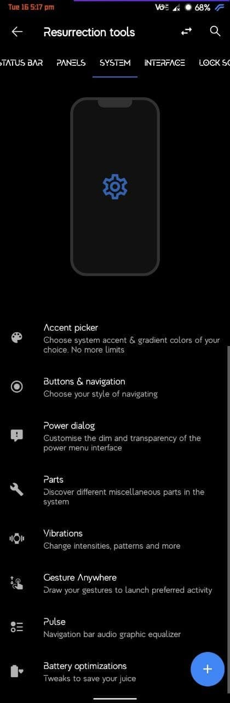</a></td>
    <td colspan="1"><a href="assets/img/16032021/9.jpg">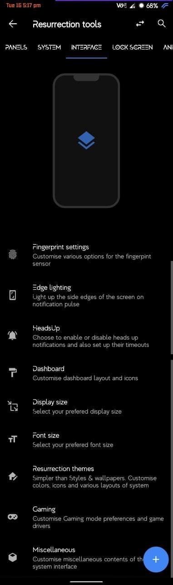</a></td>
    <td colspan="1"><a href="assets/img/16032021/10.jpg">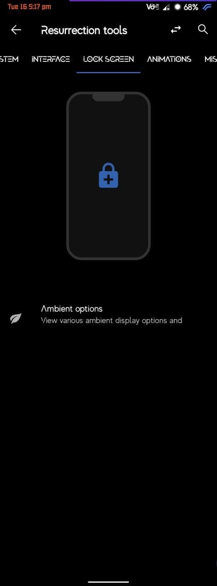</a></td>
  </tr>
    <td colspan="1"><a href="assets/img/16032021/11.jpg">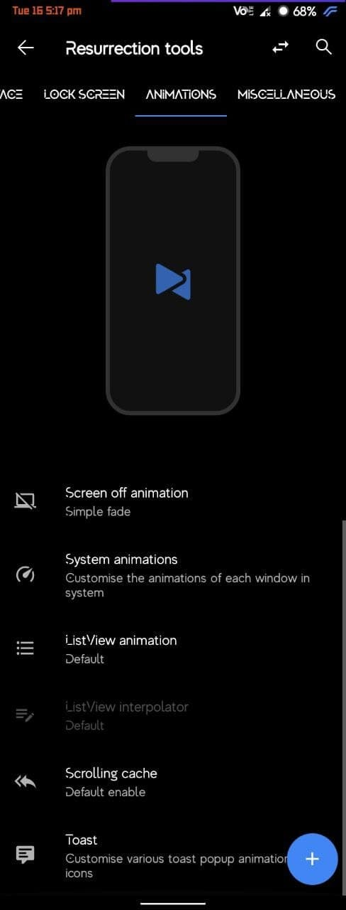</a></td>
    <td colspan="1"><a href="assets/img/16032021/12.jpg">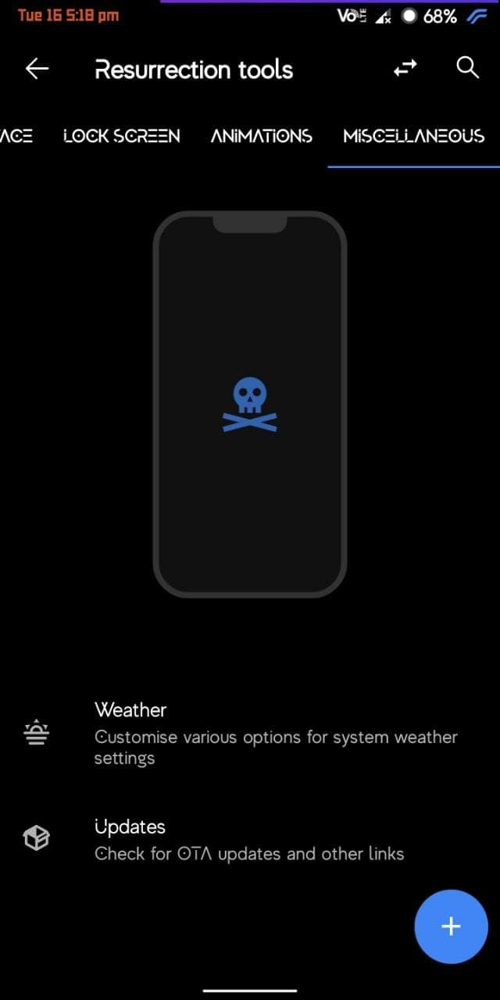</a></td>
    <td colspan="1"><a href="assets/img/16032021/13.jpg">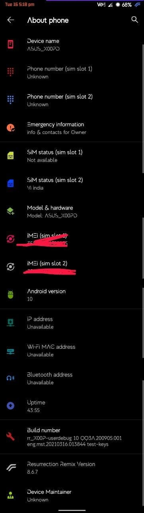</a></td>
    <td colspan="1"><a href="assets/img/16032021/14.jpg">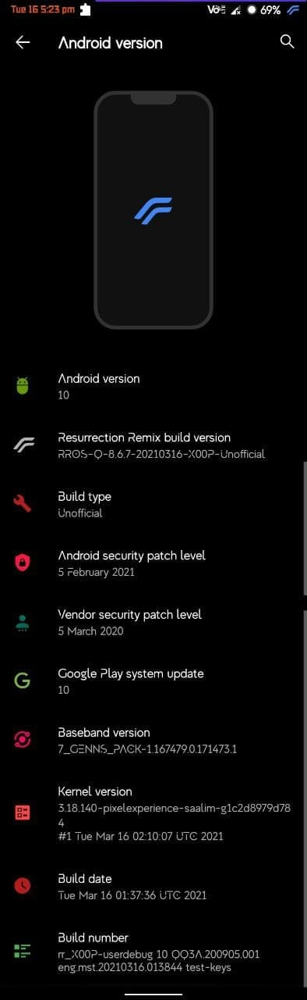</a></td>
  </tr>
</table>

## Credits

Special thanks to [@flamefusion](https://github.com/Flamefusion), [@dhimanparas20](https://github.com/dhimanparas20) as maintainer and contributor of [Resurrection Remix OS](https://github.com/ResurrectionRemix) who helped the ASUS Zenfone Max M1 alive throughout the Android development community.

This archive simply preserves their work for future.